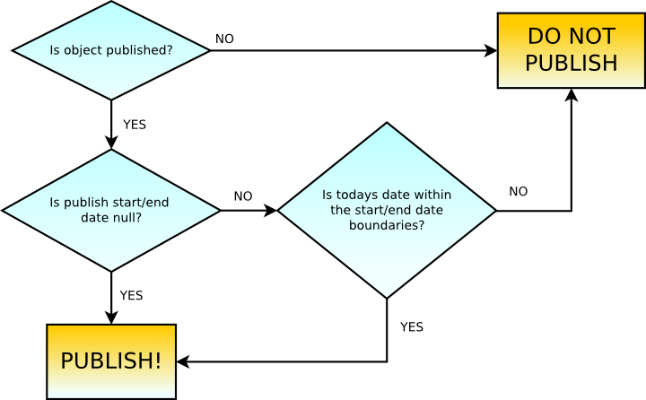

.. index::
    single: Core; Bundles; publish workflow

Publish Workflow
----------------

The publish workflow system allows to control what content is available on the
site. This is similar to the `Symfony2 Security component`_. But contrary to the
security context, the publish check can be executed even when no firewall is in
place and the security context thus has no token (see `Symfony2 Authorization`_).

The publish workflow is also tied into the security workflow: The CoreBundle
registers a security voter that forwards security checks to the publish
workflow. This means that if you always have a firewall, you can just use
the normal security context and the Twig function ``is_granted`` to check for
publication.

.. tip::

    A good introduction to the Symfony core security can be found in the
    `Security Chapter`_ of the Symfony2 book.

The default publish workflow corresponds to the following diagram:

The return values for ``getPublishStartDate`` and ``getPublishEndDate`` can be ``null``,
in which case the start or end date is unbounded. For example, if the end date
is ``null`` and the start date is ``2013-09-29`` then the object will be
published on the start date and will never be "unpublished".

Check if Content is Published
~~~~~~~~~~~~~~~~~~~~~~~~~~~~~

The Bundle provides the ``cmf_core.publish_workflow.checker`` service, which
implements the :class:`Symfony\\Component\\Security\\Core\\SecurityContextInterface`
of the Symfony Security component. The method to check publication is
:method:`Symfony\\Component\\Security\\Core\\SecurityContextInterface::isGranted`,
same as with the security context.

This method is used as when doing `ACL checks`_: The first argument is the
desired action, the second the content object you want to do the action on.

Currently the only actions supported by the default voters are ``VIEW`` and
``VIEW_ANONYMOUS``. Having the right to view means that the current user is
allowed to see this content either because it is published or because of their
specific permissions. In some contexts, your application might not want to
show unpublished content even to a privileged user so as not to confuse them.
For this, the "view anonymous" permission is used.

The workflow checker is configured with a role that is allowed to bypass
publication checks so that it can see unpublished content. This role should be
given to editors. The default name of the role is ``ROLE_CAN_VIEW_NON_PUBLISHED``.

.. configuration-block::

    .. code-block:: yaml

        # app/config/security.yml
        security:
            role_hierarchy:
                ROLE_EDITOR: ROLE_CAN_VIEW_NON_PUBLISHED

    .. code-block:: xml

        <!-- app/config/security.xml -->
        <?xml version="1.0" encoding="UTF-8" ?>
        <srv:container xmlns="http://symfony.com/schema/dic/security"
            xmlns:srv="http://symfony.com/schema/dic/services">

            <config>
                <role id="ROLE_EDITOR">ROLE_CAN_VIEW_NON_PUBLISHED</role>
            </config>

        </srv:container>

    .. code-block:: php

        // app/config/security.php
        $container->loadFromExtension('security', array(
            'role_hierarchy' => array(
                'ROLE_EDITOR' => 'ROLE_CAN_VIEW_NON_PUBLISHED',
            ),
        ));

Once a user with ``ROLE_EDITOR`` is logged in - meaning there is a firewall in place for
the path in question - they will have the permission to view unpublished content as well::

    use Symfony\Cmf\Bundle\CoreBundle\PublishWorkflow\PublishWorkflowChecker;

    // check if current user is allowed to see this document
    $publishWorkflowChecker = $container->get('cmf_core.publish_workflow.checker');
    if ($publishWorkflowChecker->isGranted(
            PublishWorkflowChecker::VIEW_ATTRIBUTE,
            $document
        )
    ) {
        // ...
    }

    // check if the document is published. even if the current role would allow
    // to see the document, this will still return false if the documet is not
    // published
    if ($publishWorkflowChecker->isGranted(
            PublishWorkflowChecker::VIEW_ANONYMOUS_ATTRIBUTE,
            $document
        )
    ) {
        // ...
    }

.. _bundle-core-publish-workflow-twig_function:

To check publication in a template, use the Twig function ``cmf_is_published``
or the ``$view['cmf']->isPublished`` method:

.. configuration-block::

    .. code-block:: jinja

        {# check if document is published, regardless of current users role #}
        
            {# ... output the document #}
        

        {#
            check if current logged in user is allowed to view the document either
            because it is published or because the current user may view unpublished
            documents.
        #}
        
            {# ... output the document #}
        

    .. code-block:: html+php

        <!-- check if document is published, regardless of current users role -->
        <?php if ($view['cmf']->isPublished($page)) : ?>
            <!-- ... output the document -->
        <?php endif ?>

        <!--
            check if current logged in user is allowed to view the document either
            because it is published or because the current user may view unpublished
            documents.
        -->
        <?php if ($view['security']->isGranted('VIEW', $page)) : ?>
            <!-- ... output the document -->
        <?php endif ?>

.. note::

    :doc:`templating` explains all templating helper functions provided by the
    CMF. Those helpers already use the publish workflow where applicable.

Code that loads content should do the publish checks. Thanks to a
:ref:`request listener <bundle-core-workflow-request_listener>`, routes and
the main content provided by the
:doc:`DynamicRouter <../routing/dynamic>` are checked automatically
as well.

It is possible to set the security token explicitly on the workflow checker.
But by default, the checker will acquire the token from the default security
context, and if there is none (typically when there is no firewall in place for
that URL), an
:class:`Symfony\\Component\\Security\\Core\\Authentication\\Token\\AnonymousToken`
is created on the fly.

If you check for ``VIEW`` and not ``VIEW_ANONYMOUS``, the first check is
whether the security context knows the current user and if that user is granted
the bypass role. If so, access is granted, otherwise the decision is delegated to a
:class:`Symfony\\Component\\Security\\Core\\Authorization\\AccessDecisionManager`
which calls all voters with the requested attributes, the object and the token.

The decision manager is configured for an unanimous vote with "allow if all
abstain". This means a single voter saying ``ACCESS_DENIED`` is enough for
the content to be considered not published. If all voters abstain (for example
when the content in question does not implement any workflow features) the
content is still considered published.

Making Documents Publish Workflow Aware
~~~~~~~~~~~~~~~~~~~~~~~~~~~~~~~~~~~~~~~

The publish workflow component features 4 interfaces:
``PublishableInterface``, ``PublishTimePeriodInterface`` and corresponding
read-only interfaces.

The read-only interfaces should be used when modifying the information is not
desired.

Below is an example publish workflow implementation::

    namespace Acme\BlogBundle\Document;

    use Symfony\Cmf\Bundle\CoreBundle\PublishWorkflow\PublishableInterface;
    use Symfony\Cmf\Bundle\CoreBundle\PublishWorkflow\PublishTimePeriodInterface;

    class Post implements PublishableInterface, PublishTimePeriodInterface
    {
        // ... properties and methods

        /**
         * @var \DateTime
         */
        protected $publishStartDate;

        /**
         * @var \DateTime
         */
        protected $publishEndDate;

        /**
         * @var boolean
         */
        protected $isPublishable;

        public function setPublishStartDate(\DateTime $startDate = null)
        {
            $this->publishStartDate = $startDate;
        }

        public function getPublishStartDate()
        {
            return $this->publishStartDate;
        }

        public function setPublishEndDate(\DateTime $endDate = null)
        {
            $this->publishEndDate = $endDate;
        }

        public function getPublishEndDate()
        {
            return $this->publishEndDate;
        }

        public function isPublishable()
        {
            return $this->isPublishable;
        }

        public function setIsPublishable($boolean)
        {
            $this->isPublishable = $boolean;
        }
    }

Publish Voters
~~~~~~~~~~~~~~

A voter must implement the
:class:`Symfony\\Component\\Security\\Core\\Authorization\\Voter\\VoterInterface`.
A content object will be passed and it has to decide whether it is published
according to its rules. The CoreBundle provides a couple of generic voters
(`PublishableVoter`_ and `TimePeriodVoter`_) that check the content for having
an interface exposing the methods they need.  If the content implements the
interface, they check the parameter and return ``ACCESS_GRANTED`` or
``ACCESS_DENIED``, otherwise they return ``ACCESS_ABSTAIN``.

As voting is unanimous, each voter returns ``ACCESS_GRANTED`` if its criteria
is met, but if a single voter returns ``ACCESS_DENIED``, the content is
considered not published.

You can also implement your :ref:`own voters <bundle-core-workflow-custom-voters>`
for additional publication behaviour.

PublishableVoter
................

This voter checks on the ``PublishableReadInterface`` which simply has a method to
return a boolean value.

* **isPublishable**: If the object should be considered for publication or not.

TimePeriodVoter
...............

This voter checks on the ``PublishTimePeriodReadInterface`` which defines a start
and end date. A date may be null to indicate "always started" resp.
"never ending".

* **getPublishStartDate**: If non-null, the date from which the document
  should start being published;
* **getPublishEndDate**: If non-null, the date from which the document
  should stop being published.

.. _bundle-core-workflow-custom-voters:

Custom Voters
.............

To build voters with custom logic, you need to implement
:class:`Symfony\\Component\\Security\\Core\\Authentication\\Voter\\VoterInterface`
and define a service with the tag ``cmf_published_voter``. This is similar
to the ``security.voter`` tag, but adds your voter to the publish workflow. As
with the security voters, you can specify a priority, though it is of limited
use as the access decision must be unanimous. If you have more expensive checks,
you can lower the priority of those voters.

.. configuration-block::

    .. code-block:: yaml

        services:
            acme.security.publishable_voter:
                class: "%my_namespace.security.publishable_voter.class%"
                tags:
                    - { name: cmf_published_voter, priority: 30 }

    .. code-block:: xml

        <?xml version="1.0" encoding="UTF-8" ?>
        <container xmlns="http://symfony.com/schema/dic/services">
            <service id="acme.security.publishable_voter"
                class="%acme.security.publishable_voter.class%">

                <tag name="cmf_published_voter" priority="30"/>
            </service>
        </container>

    .. code-block:: php

        use Symfony\Component\DependencyInjection\Definition;

        $container
            ->register(
                'acme.security.publishable_voter',
                '%acme.security.publishable_voter.class%'
            )
            ->addTag('cmf_published_voter', array('priority' => 30))
        ;

The workflow checker will create an
:class:`Symfony\\Component\\Security\\Core\\Authentication\\Token\\AnonymousToken` on
the fly if the security context has none. This means that voters must be able
to handle this situation when accessing the user. Also when accessing the
security context, they first must check if it has a token and otherwise they
should not call it to avoid triggering an exception. If a voter only gives
access if the current user fulfills some requirement, it simply has to return
``ACCESS_DENIED`` if there is no current user.

.. _bundle-core-workflow-request_listener:

Publication Request Listener
~~~~~~~~~~~~~~~~~~~~~~~~~~~~

The :doc:`DynamicRouter <../routing/dynamic>` places the route
object and the main content - if the route has a main content - into the
request attributes. Unless you disable the
``cmf_core.publish_workflow.request_listener``, this listener will listen
on all requests and check publication of both the route object and the main
content object.

This means that custom templates for ``templates_by_class`` and the controllers
of ``controllers_by_class`` need not check for publication explicitly as its
already done.

.. _bundle-core-workflow-admin-extensions:

Editing publication information: Publish Workflow Sonata Admin Extension
~~~~~~~~~~~~~~~~~~~~~~~~~~~~~~~~~~~~~~~~~~~~~~~~~~~~~~~~~~~~~~~~~~~~~~~~

There is a write interface for each publish workflow too, defining setter
methods. The core bundle provides extensions for SonataAdminBundle to easily
add editing of the publish workflow fields to all or selected admins.

Instead of implementing ``PublishableReadInterface`` resp.
``PublishTimePeriodReadInterface`` you models instead need to implement the
``PublishableInterface`` and / or ``PublishTimePeriodInterface``.

To enable the extensions in your admin classes, simply define the extension
configuration in the ``sonata_admin`` section of your project configuration:

.. configuration-block::

    .. code-block:: yaml

        # app/config/config.yml
        sonata_admin:
            # ...
            extensions:
                cmf_core.admin_extension.publish_workflow.publishable:
                    implements:
                        - Symfony\Cmf\Bundle\CoreBundle\PublishWorkflow\PublishableInterface
                cmf_core.admin_extension.publish_workflow.time_period:
                    implements:
                        - Symfony\Cmf\Bundle\CoreBundle\PublishWorkflow\PublishTimePeriodInterface

    .. code-block:: xml

        <!-- app/config/config.xml -->
        <?xml version="1.0" encoding="UTF-8" ?>
        <container xmlns="http://symfony.com/schema/dic/services">
            <config xmlns="http://sonata-project.org/schema/dic/admin">
                <!-- ... -->
                <extension id="cmf_core.admin_extension.publish_workflow.publishable">
                    <implement>
                        Symfony\Cmf\Bundle\CoreBundle\PublishWorkflow\PublishableInterface
                    </implement>
                </extension>

                <extension id="cmf_core.admin_extension.publish_workflow.time_period">
                    <implement>
                        Symfony\Cmf\Bundle\CoreBundle\PublishWorkflow\PublishTimePeriodInterface
                    </implement>
                </extension>
            </config>
        </container>

    .. code-block:: php

        // app/config/config.php
        $container->loadFromExtension('sonata_admin', array(
            // ...
            'extensions' => array(
                'cmf_core.admin_extension.publish_workflow.publishable' => array(
                    'implements' => array(
                        'Symfony\Cmf\Bundle\CoreBundle\PublishWorkflow\PublishableInterface',
                    ),
                ),
                'cmf_core.admin_extension.publish_workflow.time_period' => array(
                    'implements' => array(
                        'Symfony\Cmf\Bundle\CoreBundle\PublishWorkflow\PublishTimePeriodInterface',
                    ),
                ),
            ),
        ));

See the `Sonata Admin extension documentation`_ for more information.

.. _`Symfony2 security component`: http://symfony.com/doc/current/components/security/index.html
.. _`Symfony2 Authorization`: http://symfony.com/doc/current/components/security/authorization.html
.. _`Security Chapter`: http://symfony.com/doc/current/book/security.html
.. _`ACL checks`: http://symfony.com/doc/current/cookbook/security/acl.html
.. _`Sonata Admin extension documentation`: http://sonata-project.org/bundles/admin/master/doc/reference/extensions.html
