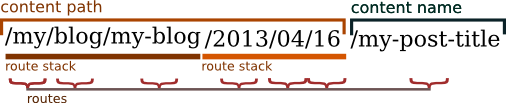

.. index::
    single: RoutingAuto; Bundles
    single: RoutingAutoBundle

RoutingAutoBundle
=================

    The RoutingAutoBundle allows you to define automatically created routes for
    documents.

.. include:: ../_not-stable-caution.rst.inc

This implies a separation of the ``Route`` and ``Content`` documents. If your
needs are simple this bundle may not be for you and you should have a look at
:doc:`the SimpleCmsBundle <../simple_cms/introduction>`.

Installation
------------

You can install this bundle `with composer`_ using the
`symfony-cmf/routing-auto-bundle`_ package.

This bundle is based on the :doc:`../routing/index`, and you need to
instantiate both bundles::

    // app/AppKernel.php

    // ...
    class AppKernel extends Kernel
    {
        public function registerBundles()
        {
            $bundles = array(
                // ...
                new Symfony\Cmf\Bundle\RoutingBundle\CmfRoutingBundle(),
                new Symfony\Cmf\Bundle\RoutingAutoBundle\CmfRoutingAutoBundle(),
            );

            // ...
        }

        // ...
    }

Features
--------

Imagine you are going to create a forum application that has two routeable
content documents - a category and the topics. These documents are called
``Category`` and ``Topic``, and they are called *content documents*.

If you create a new category with the title "My New Category", the
RoutingAutoBundle will automatically create the route
``/forum/my-new-cateogry``. For each new ``Topic`` it could create a route
like ``/forum/my-new-category/my-new-topic``. This URL resolves to a special
type of route that is called an *auto route*.

By default, when you update a content document that has an auto route, the
corresponding auto route will also be updated. When deleting a content
document, the corresponding auto route will also be deleted.

If required, the bundle can also be configured to do extra stuff, like, for
example, leaving a ``RedirectRoute`` when the location of a content document
changes or automatically displaying an index page when an unconfigured
intermediate path is accessed (for example, listing all the children when requesting
``/forum`` instead of returning a ``404``).

Why not Simply Use a Single Route?
----------------------------------

Of course, our fictional forum application could use a single route with a
pattern ``/forum/my-new-forum/{topic}``, which could be handled by a controller.
Why not just do that?

#. By having a route for each page in the system, the application has a
   knowledge of which URLs are accessible. This can be very useful, for
   example, when specifying endpoints for menu items that are used when generating
   a site map;
#. By separating the route from the content you allow the route to be
   customized independently of the content, for example, a topic may have
   the same title as another topic but might need a different URL;
#. Separate route documents are translateable - this means you can have a URL
   for *each language*, "/welcome" and "/bienvenue" would each reference the
   same document in English and French respectively. This would be difficult
   if the slug was embedded in the content document;
#. By decoupling route and content the application doesn't care *what* is
   referenced in the route document. This means that you can easily replace the
   class of the document referenced.

Usage
-----

The diagram below shows a fictional URL for a forum topic. The first 6 elements
of the URL are called the *content path*. The last element is called the *content name*.

The content path is further broken down into *path units* and *path elements*. A
path unit is a group of path elements and path elements are simply documents
in the PHPCR tree.

.. note::

    Although path elements can be of any document class in this case, only
    objects which extend the :class:`Symfony\\Component\\Routing\\Route`
    object will be considered when matching a URL.

    The default behavior is to use ``Generic`` documents when generating a content
    path, and these documents will result in a 404 when accessed directly.

Internally, each path unit is built up by a *builder unit*. Builder units
contain one *path provider* class and two actions classes - one action to take
if the provided path exists in the PHPCR tree, the other if it does not. The
goal of each builder unit is to generate a path and then provide a route
object for each element in that path.

The configuration for the example above could be as follows:

.. configuration-block::

    .. code-block:: yaml

        # app/config/config.yml
        cmf_routing_auto:
            mappings:

                Acme\ForumBundle\Document\Topic
                    content_path:
                        # corresponds first path unit in diagram: my-forum
                        forum_path:
                            provider: [specified, { path: my-form }]
                            exists_action: use
                            not_exists_action: create

                        # corresponds second path unit in diagram: my-category
                        category_path:
                            provider: [content_object, { method: getCategory }]
                            exists_action: use
                            not_exists_action: throw_exception

                    # corresponds to the content name: my-new-topic
                    content_name:
                        provider: [content_method, { method: getTitle }]
                        exists_action: [auto_increment, { pattern: -%d }]
                        not_exists_action: create

    .. code-block:: xml

        <!-- app/config/config.xml -->
        <?xml version="1.0" encoding="UTF-8" ?>
        <container xmlns="http://symfony.com/schema/dic/services">

            <config xmlns="http://cmf.symfony.com/schema/dic/routing_auto">

                <mapping class="Acme\ForumBundle\Document\Topic">

                    <content-path>
                        <!-- corresponds first path unit in diagram: my-forum -->
                        <path-unit name="forum_path">
                            <provider name="specified">
                                <option name="path" value="my-forum" />
                            </provider>
                        </path-unit>

                        <!-- corresponds second path unit in diagram: my-category -->
                        <path-unit name="category_path">
                            <provider name="content_object">
                                <option name="method" value="getCategory" />
                            </provider>
                            <exists-action strategy="use" />
                            <not-exists-action strategy="throw_exception" />
                        </path-unit>
                    </content-path>

                    <!-- corresponds to the content name: my-new-topic -->
                    <content-name>
                        <provider name="content_method">
                            <option name="method" value="getTitle" />
                        </provider>
                        <exists-action strategy="auto_increment">
                            <option name="pattern" value="-%d" />
                        </exists-action>
                        <not-exists-action strategy="create" />
                    </content-name>
                </mapping>
            </config>
        </container>

    .. code-block:: php

        // app/config/config.php
        $container->loadFromExtension('cmf_routing_auto', array(
            'mappings' => array(
                'Acme\ForumBundle\Document\Topic' => array(
                    'content_path' => array(
                        // corresponds first path unit in diagram: my-forum
                        'forum_path' => array(
                            'provider' => array('specified', array(
                                'path' => 'my-forum',
                            )),
                            'exists_action' => 'use',
                            'not_exists_action' => 'create',
                        ),

                        // corresponds second path unit in diagram: my-category
                        'category_path' => array(
                            'provider' => array('content_object', array(
                                'method' => 'getCategory',
                            )),
                            'exists_action' => 'use',
                            'not_exists_action' => 'throw_exception',
                        ),
                    ),

                    // corresponds to the content name: my-new-topic
                    'content_name' => array(
                        'provider' => array('content_method', array(
                            'method' => 'getTitle',
                        )),
                        'exists_action' => array('auto_increment', array(
                            'pattern' => '-%d',
                        )),
                        'not_exists_action' => 'create',
                    ),
                ),
            ),
        ));

The ``Topic`` document would then need to implement the methods named above as
follows::

    // src/Acme/ForumBundle/Document/Topic.php
    namespace Acme\ForumBundle\Document;

    class Topic
    {
        /**
         * Returns the category object associated with the topic.
         */
        public function getCategory()
        {
            return $this->category;
        }

        public function getPublishedDate()
        {
            return new \DateTime('2013/04/06');
        }

        public function getTitle()
        {
            return "My Topic Title";
        }
    }

After persisting this object, the route will be created. Of course, you need to make
the properties editable and then you have a fully working routing system.

.. note::

    Any mapping applied to an object will also apply to subclasses of that
    object. Imagine you have 2 documents, ``ContactPage`` and ``Page``, which
    both extend ``AbstractPage``. When you map the ``AbstractPage`` class, it
    will be applied to both documents.

Provided Providers and Action
-----------------------------

The RoutingAutoBundle comes with a couple path providers and actions by
default. Read more about them in the other sections:

* :doc:`providers`
* :doc:`exists_actions`
* :doc:`not_exists_actions`

Customization
-------------

Besides the default providers and actions, you can also create your own. Read more about
that in :doc:`customization`.

.. _`with composer`: http://getcomposer.org/
.. _`symfony-cmf/routing-auto-bundle`: https:/packagist.org/packages/symfony-cmf/routing-auto-bundle
