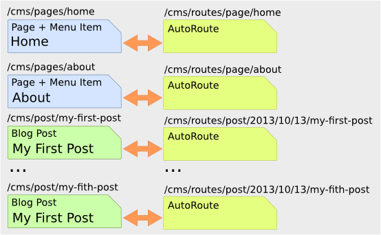

.. index::
    single: Tutorial, Creating a CMS, RoutingAuto, PHPCR-ODM
    single: MenuBundle, SonataAdmin, SonataDoctrineAdminBundle

Creating a Basic CMS Using the RoutingAutoBundle
================================================

This three part article will show you how to create a basic CMS from scratch
using the following bundles:

* :doc:`../bundles/routing_auto`;
* :doc:`../bundles/phpcr_odm`;
* :doc:`../bundles/menu/index`;
* `SonataDoctrinePhpcrAdminBundle`_.

It is assumed that you have:

* A working knowledge of the Symfony 2 framework;
* Basic knowledge of PHPCR-ODM.

The CMS will have two types of content:

* **Pages**: HTML content accessed at, for example ``/page/home``, ``/page/about``, etc.
* **Posts**: Blog posts accessed as ``/blog/2012/10/23/my-blog-post``.

The auto routing integration will automatically create and update the routes
(effectively the URLs with which you can access the content) for the page and
post content documents. In addition each page content document will double up
as a menu item.

.. image:: ../_images/cookbook/basic-cms-intro-sketch.png

.. note::

    There exists a bundle called :doc:`../bundles/simple_cms/index` which
    provides a similar solution to the one proposed in this tutorial. It
    combines the route, menu and content into a single document and uses a
    custom router. The approach taken in this tutorial will combine only the menu
    and content into a single document, the routes will be managed
    automatically and the native CMF ``DynamicRouter`` will be used.

Part 1 - Getting Started
------------------------

Initializing the Project
~~~~~~~~~~~~~~~~~~~~~~~~

First, follow the generic steps in :doc:`create_new_project_phpcr_odm` to create a new project using
the PHPCR-ODM.

Install Additional Bundles
..........................

This tutorial requires the following packages:

* `symfony-cmf/routing-auto-bundle`_;
* `sonata-project/doctrine-phpcr-admin-bundle`_;
* `doctrine/data-fixtures`_;
* `symfony-cmf/menu-bundle`_.

Update ``composer.json`` to require them:

.. code-block:: javascript

    {
        ...
        require: {
            ...
            "symfony-cmf/routing-auto-bundle": "dev-master",
            "symfony-cmf/menu-bundle": "1.0",
            "sonata-project/doctrine-phpcr-admin-bundle": "dev-master",
            "doctrine/data-fixtures": "1.0.0"
        },
        ...
    }

And add the packages to the kernel::

    class AppKernel extends Kernel
    {
        public function registerBundles()
        {
            $bundles = array(
                // ...
                new Symfony\Cmf\Bundle\RoutingBundle\CmfRoutingBundle(),
                new Symfony\Cmf\Bundle\RoutingAutoBundle\CmfRoutingAutoBundle(),
            );

            // ...
        }
    }

Initialize the Database
.......................

If you have followed the main instructions in
:doc:`create_new_project_phpcr_odm` then you are using the `Doctrine DBAL
Jackalope`_ PHPCR backend with MySQL and you will need to create the MySQL
database:

.. code-block:: bash

    $ mysqladmin create symfony -u root

This will create a new database called ``symfony`` - this is the name used by
default in the Symfony Standard Edition, change as might be necessary.

The Doctrine DBAL backend needs to be initialized, the following command
will create the MySQL schema required to store the hierarchical
node content of the PHPCR content repository:

.. code-block:: bash

    $ php app/console doctrine:phpcr:init:dbal

.. note::

    The `Apache Jackrabbit`_ implementation is the reference java based
    backend and does not require such initialization. It does however require
    the use of Java.

Now you can generate the bundle in which you will write most of your code:

.. code-block:: bash

    $ php app/console generate:bundle --namespace=Acme/BasicCmsBundle --dir=src --no-interaction

The Documents
.............

You will create two document classes, one for the pages and one for the posts.
These two documents share much of the same logic, so you create a ``trait``
to reduce code duplication::

    // src/Acme/BasicCmsBundle/Document/ContentTrait.php
    namespace Acme\BasicCmsBundle\Document;

    trait ContentTrait
    {
        /**
         * @PHPCR\Id()
         */
        protected $id;

        /**
         * @PHPCR\ParentDocument()
         */
        protected $parent;

        /**
         * @PHPCR\NodeName()
         */
        protected $title;

        /**
         * @PHPCR\String(nullable=true)
         */
        protected $content;

        /**
         * @PHPCR\Referrers(
         *     referringDocument="Symfony\Cmf\Bundle\RoutingBundle\Doctrine\Phpcr\Route",
         *     referencedBy="content"
         * )
         */
        protected $routes;

        public function getId()
        {
            return $this->id;
        }

        public function getParent() 
        {
            return $this->parent;
        }
        
        public function setParent($parent)
        {
            $this->parent = $parent;
        }
        
        public function getTitle() 
        {
            return $this->title;
        }
        
        public function setTitle($title)
        {
            $this->title = $title;
        }

        public function getContent() 
        {
            return $this->content;
        }
        
        public function setContent($content)
        {
            $this->content = $content;
        }

        public function getRoutes()
        {
            return $this->routes;
        }
    }

.. note::

    Traits are only available as of PHP 5.4. If you are running a lesser
    version of PHP you may copy the above code into each class to have the
    same effect. You may not, however, ``extend`` one class from another, as
    this will cause unintended behavior in the admin integration later on.

The ``Page`` class is therefore nice and simple::

    // src/Acme/BasicCmsBundle/Document/Page.php
    namespace Acme\BasicCmsBundle\Document;

    use Doctrine\ODM\PHPCR\Mapping\Annotations as PHPCR;
    use Symfony\Cmf\Component\Routing\RouteReferrersReadInterface;

    /**
     * @PHPCR\Document(referenceable=true)
     */
    class Page implements RouteReferrersReadInterface
    {
        use ContentTrait;
    }

Note that the page documet should be ``referenceable``.  This will enable
other documents to hold a reference to the page. The ``Post`` class will also
be referenceable and in addition the ``Post`` class will automatically set the
date if it has not been explicitly set using the `pre persist lifecycle
event`_::

    // src/Acme/BasicCms/Document/Post.php
    namespace Acme\BasicCmsBundle\Document;

    use Doctrine\ODM\PHPCR\Mapping\Annotations as PHPCR;
    use Symfony\Cmf\Component\Routing\RouteReferrersReadInterface;

    /**
     * @PHPCR\Document(referenceable=true)
     */
    class Post implements RouteReferrersReadInterface
    {
        use ContentTrait;

        /**
         * @PHPCR\Date()
         */
        protected $date;

        /**
         * @PHPCR\PrePersist()
         */
        public function updateDate()
        {
            if (!$this->date) {
                $this->date = new \DateTime();
            }
        }

        public function getDate()
        {
            return $this->date;
        }

        public function setDate($date)
        {
            $this->date = $date;
        }
    }

Both the ``Post`` and ``Page`` classes implement the
``RouteReferrersReadInterface`` which enables the
`DynamicRouter to generate URLs`_. (for example with ``{{ path(content) }}``
in Twig).

Repository Initializer
~~~~~~~~~~~~~~~~~~~~~~

`Repository initializers`_ enable you to establish and maintain PHPCR nodes
required by your application, for example you will need the paths
``/cms/pages``, ``/cms/posts`` and ``/cms/routes``. The ``GenericInitializer``
class can be used easily initialize a list of paths. Add the following to your
service container configuration:

.. configuration-block::

    .. code-block:: yaml

        # src/Acme/BasicCmsBundle/Resources/config/services.yml
        services:
            acme.basic_cms.phpcr.initializer:
                class: Doctrine\Bundle\PHPCRBundle\Initializer\GenericInitializer
                arguments: 
                    - [ "/cms/pages", "/cms/posts", "/cms/routes" ]
                tags:
                    - { name: doctrine_phpcr.initializer }

    .. code-block:: xml

        <!-- src/Acme\BasicCmsBundle\Resources\services.xml -->
        <?xml version="1.0" encoding="UTF-8" ?>
        <container xmlns="http://symfony.com/schema/dic/services"
            xmlns:xsi="http://www.w3.org/2001/XMLSchema-instance"
            xmlns:acme_demo="http://www.example.com/symfony/schema/"
            xsi:schemaLocation="http://symfony.com/schema/dic/services 
                http://symfony.com/schema/dic/services/services-1.0.xsd">

            <!-- ... -->
            <services>
                <!-- ... -->

                <service id="acme.basic_cms.phpcr.initializer"
                    class="Doctrine\Bundle\PHPCRBundle\Initializer\GenericInitializer">

                    <argument type="collection">
                        <argument>/cms/pages</argument>
                        <argument>/cms/posts</argument>
                        <argument>/cms/routes</argument>
                    </argument>

                    <tag name="doctrine_phpcr.initializer"/>
                </service>
            </services>
        </container>

    .. code-block:: php

        // src/Acme/BasicCmsBundle/Resources/config/services.php
        $container
            ->register(
                'acme.basic_cms.phpcr.initializer',
                'Doctrine\Bundle\PHPCRBundle\Initializer\GenericInitializer'
            )
            ->addArgument(array('/cms/pages', '/cms/posts', '/cms/routes'))
            ->addTag('doctrine_phpcr.initializer')
        ;

.. note::

    The initializers operate at the PHPCR level, not the PHPCR-ODM level - this
    means that you are dealing with nodes and not documents.

The initalizers will be executed automatically when you load your data
fixtures (as detailed in the next section) or alternatively you can execute
them manually using the following command:

.. code-block:: bash

    $ php app/console doctrine:phpcr:repository:init

.. note::

    It is the responsiblity of the developer to ensure that each initializer
    is  `idempotent`_ - that is to say initializers must be capable of being
    run multiple times without data-loss even in a production environment.

Create Data Fixtures
~~~~~~~~~~~~~~~~~~~~

Create a page for your CMS::

    // src/Acme/BasicCmsBundle/DataFixtures/PHPCR/LoadPageData.php
    namespace Acme\BasicCmsBundle\DataFixtures\PHPCR;

    use Doctrine\Common\DataFixtures\FixtureInterface;
    use Doctrine\Common\Persistence\ObjectManager;
    use Acme\BasicCmsBundle\Document\Page;
    use PHPCR\Util\NodeHelper;

    class LoadPageData implements FixtureInterface
    {
        public function load(ObjectManager $dm)
        {
            // When using PHPCR-ODM 1.0, we need to create the root path
            // manually. Not needed with PHPCR-ODM 1.1
            NodeHelper::createPath($dm->getPhpcrSession(), '/cms/pages');

            $parent = $dm->find(null, '/cms/pages');

            $page = new Page();
            $page->setTitle('Home');
            $page->setParent($parent);
            $page->setContent(<<<HERE
    Welcome to the homepage of this really basic CMS.
    HERE
            );

            $dm->persist($page);
            $dm->flush();
        }
    }

and add some posts::

    // src/Acme/BasicCmsBundle/DataFixtures/PHPCR/LoadPostData.php
    namespace Acme\BasicCmsBundle\DataFixtures\Phpcr;

    use Doctrine\Common\DataFixtures\FixtureInterface;
    use Doctrine\Common\Persistence\ObjectManager;
    use Acme\BasicCmsBundle\Document\Post;
    use PHPCR\Util\NodeHelper;

    class LoadPostData implements FixtureInterface
    {
        public function load(ObjectManager $dm)
        {
            // When using PHPCR-ODM 1.0, we need to create the root path
            // manually. Not needed with PHPCR-ODM 1.1
            NodeHelper::createPath($dm->getPhpcrSession(), '/cms/posts');

            $parent = $dm->find(null, '/cms/posts');

            foreach (array('First', 'Second', 'Third', 'Forth') as $title) {
                $post = new Post();
                $post->setTitle(sprintf('My %s Post', $title));
                $post->setParent($parent);
                $post->setContent(<<<HERE
    This is the content of my post.
    HERE
                );

                $dm->persist($post);
            }

            $dm->flush();
        }
    }

and load the fixtures:

.. code-block:: bash

    $ php app/console doctrine:phpcr:fixtures:load

You should now have some data in your content repository.

Part 2: Automatic Routing
-------------------------

The routes (URLs) to your content will be automatically created and updated
using the RoutingAutoBundle. This bundle is powerful and somewhat complicated.
For a full a full explanation refer to the `RoutingAutoBundle documentation`_.

In summary, you will configure the auto routing system to create a new auto
routing document in the routing tree for every post or content created. The
new route will be linked back to the target content:

The paths above represent the path in the PHPCR-ODM document tree. In the next
section you will define ``/cms/routes`` as the base path for routes, and subsequently
the contents will be avilable at the following URLs:

* **Home**: ``http://localhost:8000/page/home``
* **About**: ``http://localhost:8000/page/about``
* etc.

Enable the Dynamic Router
~~~~~~~~~~~~~~~~~~~~~~~~~

The RoutingAutoBundle uses the CMFs `RoutingBundle`_ which enables routes to
be provided from a database (as opposed to being provided from
``routing.[yml|xml|php]`` files for example).

Add the following to your application configuration:

.. configuration-block::

    .. code-block:: yaml

        # /app/config/config.yml
        cmf_routing:
            chain:
                routers_by_id:
                    cmf_routing.dynamic_router: 20
                    router.default: 100
            dynamic:
                enabled: true
                persistence:
                    phpcr:
                        route_basepath: /cms/routes

    .. code-block:: xml

        <!-- app/config/config.xml -->
        <container xmlns="http://symfony.com/schema/dic/services">
            <config xmlns="http://cmf.symfony.com/schema/dic/routing">
                <chain>
                    <router-by-id id="cmf_routing.dynamic_router">20</router-by-id>
                    <router-by-id id="router.default">100</router-by-id>
                </chain>
                <dynamic>
                    <persistence>
                        <phpcr route-basepath="/cms/routes" />
                    </persistence>
                </dynamic>
            </config>
       </container>

    .. code-block:: php

        // app/config/config.php
        $container->loadFromExtension('cmf_routing', array(
            'dynamic' => array(
                'persistence' => array(
                    'phpcr' => array(
                        'enabled' => true,
                        'route_basepath' => '/cms/routes',
                    ),
                ),
            ),
        ));

This will:

#. Cause the default Symfony router to be replaced by the chain router.  The
   chain router enables you to have multiple routers in your application. You
   add the dynamic router (which can retrieve routes from the database) and
   the default Symfony router (which retrieves routes from configuration
   files).  The number indicates the order of precedence - the router with the
   lowest number will be called first.;
#. Configure the **dynamic** router which you have added to the router chain.
   You specify that it should use the PHPCR backend and that the *root* route
   can be found at ``/cms/routes``.

Auto Routing Configuration
~~~~~~~~~~~~~~~~~~~~~~~~~~

Create the following file in your applications configuration directory:

.. configuration-block::

    .. code-block:: yaml

        # app/config/routing_auto.yml
        cmf_routing_auto:
            mappings:
                Acme\BasicCmsBundle\Document\Page:
                    content_path:
                        pages:
                            provider: [specified, { path: /cms/routes/page }]
                            exists_action: use
                            not_exists_action: create
                    content_name:
                        provider: [content_method, { method: getTitle }]
                        exists_action: [auto_increment, { pattern: -%d }]
                        not_exists_action: create

                Acme\BasicCmsBundle\Document\Post:
                    content_path:
                        blog_path:
                            provider: [specified, { path: /cms/routes/post }]
                            exists_action: use
                            not_exists_action: create
                        date:
                            provider: [content_datetime, { method: getDate}]
                            exists_action: use
                            not_exists_action: create
                    content_name:
                        provider: [content_method, { method: getTitle }]
                        exists_action: [auto_increment, { pattern: -%d }]
                        not_exists_action: create

    .. code-block:: xml

        <!-- app/config/routing_auto.xml -->
        <?xml version="1.0" encoding="UTF-8" ?>
        <container xmlns="http://symfony.com/schema/dic/services">

            <config xmlns="http://cmf.symfony.com/schema/dic/routing_auto">

                <mapping class="Acme\BasicCmsBundle\Document\Page">

                    <content-path>
                        <path-unit name="pages">
                            <provider name="specified">
                                <option name="path" value="/cms/routes/page" />
                            </provider>
                            <exists-action strategy="use" />
                            <not-exists-action strategy="create" />
                        </path-unit>
                    </content-path>

                    <content-name>
                        <provider name="content_method">
                            <option name="method" value="getTitle" />
                        </provider>
                        <exists-action strategy="auto_increment">
                            <option name="pattern" value="-%d" />
                        </exists-action>
                        <not-exists-action strategy="create" />
                    </content-name>
                </mapping>

                <mapping class="Acme\BasicCmsBundle\Document\Post">
                    <content-path>
                        <path-unit name="blog_path">
                            <provider name="specified">
                                <option name="path" value="/cms/routes/post" />
                            </provider>
                            <exists-action name="use" />
                            <not-exists-action name="create" />
                        </path-unit>

                        <path-unit name="date">
                            <provider name="content_datetime">
                                <option name="method" value="getDate" />
                            </provider>
                            <exists-action name="use" />
                            <not-exists-action name="create" />
                        </path-unit>
                    </content-path>

                    <content-name>
                        <provider name="content_method">
                            <option name="method" value="getTitle" />
                        </provider>
                        <exists-action name="auto_increment">
                            <option name="pattern" value="-%d" />
                        </exists-action>
                        <not-exists-action name="create" />
                    </content-name>
                </mapping>
            </config>
        </container>

    .. code-block:: php

        // app/config/routing_auto.php
        $container->loadFromExtension('cmf_routing_auto', array(
            'mappings' => array(
                'Acme\BasicCmsBundle\Document\Page' => array(
                    'content_path' => array(
                        'pages' => array(
                            'provider' => array('specified', array('path' => '/cms/routes/page')),
                            'exists_action' => 'use',
                            'not_exists_action' => 'create',
                        ),
                    ),
                    'content_name' => array(
                        'provider' => array('content_method', array('method' => 'getTitle')),
                        'exists_action' => array('auto_increment', array('pattern' => -%d)),
                        'not_exists_action' => 'create',
                    ),
                ),

                'Acme\BasicCmsBundle\Document\Post' => array(
                    'content_path' => array(
                        'blog_path' => array(
                            'provider' => array('specified', array('path' => '/cms/routes/post')),
                            'exists_action' => 'use',
                            'not_exists_action' => 'create',
                        'date' => array(
                            'provider' => array('content_datetime', array('method' => 'getDate')),
                            'exists_action' => 'use',
                            'not_exists_action' => 'create',
                        ),
                    ),
                    'content_name' => array(
                        'provider' => array('content_method', array('method' => 'getTitle')),
                        'exists_action' => array('auto_increment', array('pattern' => -%d')),
                        'not_exists_action' => 'create',
                    ),
                ),
            ),
        ));

This will configure the routing auto system to automatically create and update
route documents for both the ``Page`` and ``Post`` documents. 

In summary:

* The ``content_path`` key represents the parent path of the content, e.g.
  ``/if/this/is/a/path`` then the ``content_path``
  represents ``/if/this/is/a``;
* Each element under ``content_path`` represents a section of the URL;
* The first element ``blog_path`` uses a *provider* which *specifies* a
  path. If that path exists then it will do nothing;
* The second element uses the ``content_datetime`` provider, which will
  use a ``DateTime`` object returned from the specified method on the
  content object (the ``Post``) and create a path from it, e.g.
  ``2013/10/13``;
* The ``content_name`` key represents the last part of the path, e.g. ``path``
  from ``/if/this/is/a/path``.

Now you will need to include this configuration:

.. configuration-block::
    
    .. code-block:: yaml

        # app/config/config.yml
        imports:
            // ...
            - { resource: routing_auto.yml }

    .. code-block:: xml

        <!-- src/Acme/BasicCmsBUndle/Resources/config/config.yml -->
        ?xml version="1.0" encoding="UTF-8" ?>
        <container 
            xmlns="http://symfony.com/schema/dic/services" 
            xmlns:xsi="http://www.w3.org/2001/XMLSchema-instance" 
            xsi:schemaLocation="http://symfony.com/schema/dic/services 
                http://symfony.com/schema/dic/services/services-1.0.xsd">

            <import resource="routing_auto.xml" />
        </container>
    
    .. code-block:: php

        // src/Acme/BasicCmsBundle/Resources/config/config.php

        // ...
        $this->import('routing_auto.php');

and reload the fixtures:

.. code-block:: bash

    $ php app/console doctrine:phpcr:fixtures:load

Have a look at what you have:

.. code-block:: bash

    $ php app/console doctrine:phpcr:node:dump
    ROOT:
      cms:
        pages:
          Home:
        routes:
          page:
            home:
          post:
            2013:
              10:
                12:
                  my-first-post:
                  my-second-post:
                  my-third-post:
                  my-forth-post:
        posts:
          My First Post:
          My Second Post:
          My Third Post:
          My Forth Post:

The routes have been automatically created!

Part 3 - The Backend
--------------------

The `SonataAdminBundle`_ bundle will provide our administration interface.

Configure Sonata
~~~~~~~~~~~~~~~~

Enable the Sonata related bundles to your kernel::

    // app/AppKernel.php
    class AppKernel extends Kernel
    {
        public function registerBundles()
        {
            $bundles = array(
                // ...
                new Sonata\CoreBundle\SonataCoreBundle(),
                new Sonata\BlockBundle\SonataBlockBundle(),
                new Sonata\jQueryBundle\SonatajQueryBundle(),
                new Knp\Bundle\MenuBundle\KnpMenuBundle(),
                new Sonata\DoctrinePHPCRAdminBundle\SonataDoctrinePHPCRAdminBundle(),
                new Sonata\AdminBundle\SonataAdminBundle(),
            );

            // ...
        }
    }

Sonata requires the ``sonata_block`` bundle to be configured in your main configuration:

.. configuration-block::

    .. code-block:: yaml

        # app/config/config.yml
        # ...
        sonata_block:
            default_contexts: [cms]
            blocks:
                # Enable the SonataAdminBundle block
                sonata.admin.block.admin_list:
                    contexts:   [admin]

    .. code-block:: xml

        <!-- app/config/config.xml -->
        <?xml version="1.0" encoding="UTF-8" ?>
        <container xmlns="htp://symfony.com/schema/dic/services">
            <config xmlns="http://sonata-project.org/schema/dic/block">
                <default-context>cms</default-context>

                <block id="sonata.admin.block.admin_list">
                    <context>admin</context>
                </block>
            </config>
        </container>

    .. code-block:: php

        // app/config/config.php
        $container->loadFromExtension('sonata_block', array(
            'default_contexts' => array('cms'),
            'blocks' => array(
                'sonata.admin.block.admin_list' => array(
                    'contexts' => array('admin'),
                ),
            ),
        ));

and it requires the following entries in your routing file:

.. configuration-block::

    .. code-block:: yaml

        # app/config/routing.yml
        admin:
            resource: '@SonataAdminBundle/Resources/config/routing/sonata_admin.xml'
            prefix: /admin

        _sonata_admin:
            resource: .
            type: sonata_admin
            prefix: /admin

    .. code-block:: xml

        <!-- app/config/routing.xml -->
        <?xml version="1.0" encoding="UTF-8" ?>
        <routes xmlns="http://symfony.com/schema/routing"
            xmlns:xsi="http://www.w3.org/2001/XMLSchema-instance"
            xsi:schemaLocation="http://symfony.com/schema/routing
                http://symfony.com/schema/routing/routing-1.0.xsd">

            <import 
                resource="@SonataAdminBundle/Resources/config/sonata_admin.xml" 
                prefix="/admin"
            />

            <import
                resource="."
                type="sonata_admin"
                prefix="/admin"
            />

        </routes>

    .. code-block:: php

        // app/config/routing.php
        use Symfony\Component\Routing\RouteCollection;

        $collection = new RouteCollection();
        $routing = $loader->import(
            "@SonataAdminBundle/Resources/config/sonata_admin.xml"
        );
        $routing->setPrefix('/admin');
        $collection->addCollection($routing);

        $_sonataAdmin = $loader->import('.', 'sonata_admin');
        $_sonataAdmin->addPrefix('/admin');
        $collection->addCollection($_sonataAdmin);

        return $collection;

and publish your assets (remove ``--symlink`` if you use Windows!):

.. code-block:: bash

    $ php app/console assets:install --symlink web/

Great, now have a look at http://localhost:8000/admin/dashboard

No translations? Uncomment the translator in the configuration file:

.. configuration-block::

    .. code-block:: yaml

        # ...
        framework:
            # ...
            translator:      { fallback: "%locale%" }

    .. code-block:: xml

        <!-- app/config/config.xml -->
        <?xml version="1.0" encoding="UTF-8" ?>
        <container xmlns="http://symfony.com/schema/dic/services"
            xmlns:xsi="http://www.w3.org/2001/XMLSchema-instance"
            xmlns:framework="http://symfony.com/schema/dic/symfony"
            xsi:schemaLocation="http://symfony.com/schema/dic/services http://symfony.com/schema/dic/services/services-1.0.xsd
                                http://symfony.com/schema/dic/symfony http://symfony.com/schema/dic/symfony/symfony-1.0.xsd">

            <config xmlns="http://symfony.com/schema/dic/symfony">
                <!-- ... -->
                <translator fallback="%locale%" />
            </config>
        </container>

    .. code-block:: php

        // app/config/config.php
        $container->loadFromExtension('framework', array(
            // ...
            'translator' => array(
                'fallback' => '%locale%',
            ),
        ));

Notice that the adminstration class of the RoutingBundle has been automatically
registered. However, this interface is not required in your application as the routes
are managed by the RoutingAutoBundle and not the administrator. You can disable
the RoutingBundle admin as follows:

.. configuration-block::

    .. code-block:: yaml

        # app/config/config.yml
        cmf_routing:
            # ...
            dynamic:
                # ...
                persistence:
                    phpcr:
                        # ...
                        use_sonata_admin: false

    .. code-block:: xml

        <!-- app/config/config.xml -->
        <?xml version="1.0" encoding="UTF-8" ?>
        <container xmlns="http://symfony.com/schema/dic/services">
            <config xmlns="http://cmf.symfony.com/schema/dic/routing">
                <dynamic>
                    <!-- ... -->
                    <persistence>
                        <phpcr use-sonata-admin="false"/>
                    </persistence>
                </dynamic>
            </config>
        </container>

    .. code-block:: php

        // app/config/config.php
        $container->loadFromExtension('cmf_routing', array(
            // ...
            'dynamic' => array(
                'persistence' => array(
                    'phpcr' => array(
                        // ...
                        'use_sonata_admin' => false,
                    ),
                ),
            ),
        ));

.. note:: 

    All Sonata Admin aware CMF bundles have such a configuration option and it
    prevents the admin class (or classes) from being registered.

Creating the Admin Classes
~~~~~~~~~~~~~~~~~~~~~~~~~~

Create the following admin classes, first for the ``Page`` document::

    // src/Acme/BasicCmsBundle/Admin/PageAdmin.php
    namespace Acme\BasicCmsBundle\Admin;

    use Sonata\DoctrinePHPCRAdminBundle\Admin\Admin;
    use Sonata\AdminBundle\Datagrid\DatagridMapper;
    use Sonata\AdminBundle\Datagrid\ListMapper;
    use Sonata\AdminBundle\Form\FormMapper;

    class PageAdmin extends Admin
    {
        protected function configureListFields(ListMapper $listMapper)
        {
            $listMapper
                ->addIdentifier('title', 'text')
            ;
        }

        protected function configureFormFields(FormMapper $formMapper)
        {
            $formMapper
                ->with('form.group_general')
                ->add('title', 'text')
                ->add('content', 'textarea')
            ->end();
        }

        public function prePersist($document)
        {
            $parent = $this->getModelManager()->find(null, '/cms/pages');
            $document->setParent($parent);
        }

        protected function configureDatagridFilters(DatagridMapper $datagridMapper)
        {
            $datagridMapper->add('title', 'doctrine_phpcr_string');
        }

        public function getExportFormats()
        {
            return array();
        }
    }

and then for the ``Post`` document - as you have already seen this document is
almost identical to the ``Page`` document, so extend the ``PageAdmin`` class
to avoid code duplication::

    // src/Acme/BasicCmsBundle/Admin/PostAdmin.php
    namespace Acme\BasicCmsBundle\Admin;

    use Sonata\DoctrinePHPCRAdminBundle\Admin\Admin;
    use Sonata\AdminBundle\Datagrid\DatagridMapper;
    use Sonata\AdminBundle\Datagrid\ListMapper;
    use Sonata\AdminBundle\Form\FormMapper;

    class PostAdmin extends PageAdmin
    {
        protected function configureFormFields(FormMapper $formMapper)
        {
            parent::configureFormFields($formMapper);

            $formMapper
                ->with('form.group_general')
                ->add('date', 'date')
            ->end();
        }
    }

Now you just need to register these classes in the dependency injection
container configuration:

.. configuration-block::
    
    .. code-block:: yaml

            # src/Acme/BasicCmsBundle/Resources/config/config.yml
            services:
                acme.basic_cms.admin.page:
                    class: Acme\BasicCmsBundle\Admin\PageAdmin
                    arguments:
                        - ''
                        - Acme\BasicCmsBundle\Document\Page
                        - 'SonataAdminBundle:CRUD'
                    tags:
                        - { name: sonata.admin, manager_type: doctrine_phpcr, group: 'Basic CMS', label: Page }
                    calls:
                        - [setRouteBuilder, ['@sonata.admin.route.path_info_slashes']]
                acme.basic_cms.admin.post:
                    class: Acme\BasicCmsBundle\Admin\PostAdmin
                    arguments:
                        - ''
                        - Acme\BasicCmsBundle\Document\Post
                        - 'SonataAdminBundle:CRUD'
                    tags:
                        - { name: sonata.admin, manager_type: doctrine_phpcr, group: 'Basic CMS', label: 'Blog Posts' }
                    calls:
                        - [setRouteBuilder, ['@sonata.admin.route.path_info_slashes']]

    .. code-block:: xml

        <!-- src/Acme/BasicCmsBundle/Resources/config/config.yml -->
        <?xml version="1.0" encoding="UTF-8" ?>
        <container xmlns="http://symfony.com/schema/dic/services"
            xmlns:xsi="http://www.w3.org/2001/XMLSchema-instance"
            xsi:schemaLocation="http://symfony.com/schema/dic/services 
                http://symfony.com/schema/dic/services/services-1.0.xsd">

            <!-- ... -->
            <services>
                <!-- ... -->
                <service id="acme.basic_cms.admin.page" 
                    class="Acme\BasicCmsBundle\Admin\PageAdmin">
        
                    <call method="setRouteBuilder">
                        <argument type="service" id="sonata.admin.route.path_info_slashes" />
                    </call>
        
                    <tag
                        name="sonata.admin"
                        manager_type="doctrine_phpcr"
                        group="Basic CMS"
                        label="Page"
                    />
                    <argument/>
                    <argument>Acme\BasicCmsBundle\Document\Page</argument>
                    <argument>SonataAdminBundle:CRUD</argument>
                </service>
        
                <service id="acme.basic_cms.admin.post" 
                    class="Acme\BasicCmsBundle\Admin\PostAdmin">
        
                    <call method="setRouteBuilder">
                        <argument type="service" id="sonata.admin.route.path_info_slashes" />
                    </call>
        
                    <tag
                        name="sonata.admin"
                        manager_type="doctrine_phpcr"
                        group="Basic CMS"
                        label="Blog Posts"
                    />
                    <argument/>
                    <argument>Acme\BasicCmsBundle\Document\Post</argument>
                    <argument>SonataAdminBundle:CRUD</argument>
                </service>
            </services>
        </container>

    .. code-block:: php

            // src/Acme/BasicCmsBundle/Resources/config/config.php
            use Symfony\Component\DependencyInjection\Reference;
            // ...
            
            $container->register('acme.basic_cms.admin.page', 'Acme\BasicCmsBundle\Admin\PageAdmin')
              ->addArgument('')
              ->addArgument('Acme\BasicCmsBundle\Document\Page')
              ->addArgument('SonataAdminBundle:CRUD')
              ->addTag('sonata.admin', array(
                  'manager_type' => 'doctrine_phpcr', 
                  'group' => 'Basic CMS', 
                  'label' => 'Page'
              )
              ->addMethodCall('setRouteBuilder', array(
                  new Reference('sonata.admin.route.path_info_slashes'),
              ))
            ;
            $container->register('acme.basic_cms.admin.post', 'Acme\BasicCmsBundle\Admin\PostAdmin')
              ->addArgument('')
              ->addArgument('Acme\BasicCmsBundle\Document\Post')
              ->addArgument('SonataAdminBundle:CRUD')
              ->addTag('sonata.admin', array(
                   'manager_type' => 'doctrine_phpcr', 
                   'group' => 'Basic CMS', 
                   'label' => 'Blog Posts'
              )
              ->addMethodCall('setRouteBuilder', array(
                  new Reference('sonata.admin.route.path_info_slashes'),
              ))
            ;

.. note::

    In the XML version of the above configuration you specify ``manager_type``
    (with an underscore). This should be `manager-type` (with a hypen) and
    will be fixed in Symfony version 2.4.

Check it out at http://localhost:8000/admin/dashboard

.. image:: ../_images/cookbook/basic-cms-sonata-admin.png

Part 4 - The Frontend
---------------------

Mapping Content to Controllers
~~~~~~~~~~~~~~~~~~~~~~~~~~~~~~

Go to the URL http://localhost:8000/page/home in your browser - this should be
your page, but it says that it cannot find a controller. In other words it has
found the *page referencing route* for your page but Symfony does not know what
to do with it.

You can map a default controller for all instances of ``Page``:

.. configuration-block::

    .. code-block:: yaml

        # app/config/config.yml
        cmf_routing:
            dynamic:
                # ...
                controllers_by_class:
                    Acme\BasicCmsBundle\Document\Page: Acme\BasicCmsBundle\Controller\DefaultController::pageAction

    .. code-block:: xml

        <!-- app/config/config.xml -->
        <?xml version="1.0" encoding="UTF-8" ?>

        <container xmlns="http://cmf.symfony.com/schema/dic/services"
            xmlns:xsi="http://www.w3.org/2001/XMLSchema-instance">

            <config xmlns="http://cmf.symfony.com/schema/dic/routing">
                <dynamic generic-controller="cmf_content.controller:indexAction">
                    <!-- ... -->
                    <controllers-by-class
                        class="Acme\BasicCmsBundle\Document\Page"
                    >
                        Acme\BasicCmsBundle\Controller\DefaultController::pageAction
                    </controllers-by-class>
                </dynamic>
            </config>
        </container>

    .. code-block:: php

        // app/config/config.php
        $container->loadFromExtension('cmf_routing', array(
            'dynamic' => array(
                // ...
                'controllers_by_class' => array(
                    'Acme\BasicCmsBundle\Document\Page' => 'Acme\BasicCmsBundle\Controller\DefaultController::pageAction',
                ),
            ),
        ));

This will cause requests to be forwarded to this controller when the route
which matches the incoming request is provided by the dynamic router **and**
the content document that that route references is of class
``Acme\BasicCmsBundle\Document\Page``

Now create the action in the default controller - you can pass the ``Page``
object and all the ``Posts`` to the view::

    // src/Acme/BasicCmsBundle/Controller/DefaultController.php
    //..
    class DefaultController extends Controller
    {
        // ...

        /**
         * @Template()
         */
        public function pageAction($contentDocument)
        {
            $dm = $this->get('doctrine_phpcr')->getManager();
            $posts = $dm->getRepository('Acme\BasicCmsBundle\Document\Post')->findAll();

            return array(
                'page' => $contentDocument,
                'posts' => $posts,
            );
        }
    }

The ``Page`` object is passed automatically as ``$contentDocument``.

Add a corresponding twig template (note that this works because you use the
``@Template`` annotation):

.. configuration-block::

    .. code-block:: html+jinja

        {# src/Acme/BasicCmsBundle/Resources/views/Default/page.html.twig #}
        <h1>{{ page.title }}</h1>
        
{{ page.content|raw }}

        <h2>Our Blog Posts</h2>
        <ul>
            
                <li><a href="{{ path(post) }}">{{ post.title }}</a></li>
            
        </ul>

    .. code-block:: html+php

        <!-- src/Acme/BasicCmsBundle/Resources/views/Default/page.html.twig -->
        <h1><?php echo $page->getTitle() ?></h1>
        
<?php echo $page->content ?>

        <h2>Our Blog Posts</h2>
        <ul>
            <?php foreach($posts as $post) : ?>
                <li>
                    <a href="<?php echo $view['router']->generate($post) ?>">
                        <?php echo $post->getTitle() ?>
                    </a>
                </li>
            <?php endforeach ?>
        </ul>

Now have another look at: http://localhost:8000/page/home

Notice what is happening with the post object and the ``path`` function  - you
pass the ``Post`` object and the ``path`` function will pass the object to the
router and because it implements the ``RouteReferrersReadInterface`` the
``DynamicRouter`` will be able to generate the URL for the post.

Click on a ``Post`` and you will have the same error that you had before when
viewing the page at ``/home`` and you can resolve it in the same way.

Creating a Menu
~~~~~~~~~~~~~~~

In this section you will modify your application so that ``Page``
documents act as menu nodes. The root page document can then be rendered
using the twig helper of the `KnpMenuBundle`_.

Modify the Page Document
........................

The menu document has to implement the ``NodeInterface`` provided by the
KnpMenuBundle::

    // src/Acme/BasicCmsBundle/Document/Page.php
    namespace Acme\BasicCmsBundle\Document;

    // ...
    use Knp\Menu\NodeInterface;

    class Page implements RouteReferrersReadInterface, NodeInterface
    {
        // ...

        /**
         * @PHPCR\Children()
         */
        protected $children;

        public function getName()
        {
            return $this->title;
        }

        public function getChildren()
        {
            return $this->children;
        }

        public function getOptions()
        {
            return array(
                'label' => $this->title,
                'content' => $this,

                'attributes' => array(),
                'childrenAttributes' => array(),
                'displayChildren' => true,
                'linkAttributes' => array(),
                'labelAttributes' => array(),
            );
        }
    }

.. note::

    Don't forget to add the ``Knp\Menu\NodeInterface`` use statement!

Menus are hierarchical, PHPCR-ODM is also hierarchical and so lends itself
well to this use case. 

Here you add an additional mapping, ``@Children``, which will cause PHPCR-ODM
to populate the annotated property instance ``$children`` with the child
documents of this document.

The options are the options used by KnpMenu system when rendering the menu.
The menu URL is inferred from the ``content`` option (note that you added the
``RouteReferrersReadInterface`` to ``Page`` earlier). 

The attributes apply to the HTML elements. See the `KnpMenu`_ documentation
for more information.

Modify the Data Fixtures
........................

The menu system expects to be able to find a root item which contains the
first level of child items. Modify your fixtures to declare a root element
to which you will add the existing ``Home`` page and an additional ``About`` page::

    // src/Acme/BasicCmsBundle/DataFixtures/Phpcr/LoadPageData.php

    // ...
    class LoadPageData implements FixtureInterface
    {
        public function load(ObjectManager $dm)
        {
            // ...
            $rootPage = new Page();
            $rootPage->setTitle('main');
            $rootPage->setParent($parent);
            $dm->persist($rootPage);

            $page = new Page();
            $page->setTitle('Home');
            $page->setParent($rootPage);
            $page->setContent(<<<HERE
    Welcome to the homepage of this really basic CMS.
    HERE
            );
            $dm->persist($page);

            $page = new Page();
            $page->setTitle('About');
            $page->setParent($rootPage);
            $page->setContent(<<<HERE
    This page explains what its all about.
    HERE
            );
            $dm->persist($page);

            $dm->flush();
        }
    }

Load the fixtures again:

.. code-block:: bash

    $ php app/console doctrine:phpcr:fixtures:load

Register the Menu Provider
..........................

First you will need to add the CMF `MenuBundle`_ and its dependency, `CoreBundle`_, to your
applications kernel::

    class AppKernel extends Kernel
    {
        public function registerBundles()
        {
            $bundles = array(
                // ...
                new Symfony\Cmf\Bundle\CoreBundle\CmfCoreBundle(),
                new Symfony\Cmf\Bundle\MenuBundle\CmfMenuBundle(),
            );

            // ...
        }
    }

Now you can register the PhpcrMenuProvider from the menu bundle in the service container
configuration:

.. configuration-block::
    
    .. code-block:: yaml

         # src/Acme/BasicCmsBundle/Resources/config/config.yml
         services:
             acme.basic_cms.menu_provider:
                 class: Symfony\Cmf\Bundle\MenuBundle\Provider\PhpcrMenuProvider
                 arguments:
                     - '@cmf_menu.factory'
                     - '@doctrine_phpcr'
                     - /cms/pages
                 tags:
                     - { name: knp_menu.provider }
                     - { name: cmf_request_aware }

    .. code-block:: xml

        <?xml version="1.0" encoding="UTF-8" ?>
        <container xmlns="http://symfony.com/schema/dic/services"
            xmlns:xsi="http://www.w3.org/2001/XMLSchema-instance"
            xmlns:acme_demo="http://www.example.com/symfony/schema/"
            xsi:schemaLocation="http://symfony.com/schema/dic/services 
                http://symfony.com/schema/dic/services/services-1.0.xsd">

            <!-- ... -->
            <services>
                <!-- ... -->
                <service
                    id="acme.basic_cms.menu_provider"
                    class="Symfony\Cmf\Bundle\MenuBundle\Provider\PhpcrMenuProvider">
                    <argument type="service" id="cmf_menu.factory"/>
                    <argument type="service" id="doctrine_phpcr"/>
                    <argument>/cms/pages</argument>
                    <tag name="knp_menu.provider" />
                    <tag name="cmf_request_aware"/>
                </service>
            </services>
        </container>
        
    .. code-block:: php

        // src/Acme/BasicCmsBundle/Resources/config/config.php
        use Symfony\Component\DependencyInjection\Reference;
        // ...
        
        $container
            ->register(
                'acme.basic_cms.menu_provider',
                'Symfony\Cmf\Bundle\MenuBundle\Provider\PhpcrMenuProvider'
            )
            ->addArgument(new Reference('cmf_menu.factory'))
            ->addArgument(new Reference('doctrine_phpcr'))
            ->addArgument('/cms/pages')
            ->addTag('knp_menu.provider')
            ->addTag('cmf_request_aware')
        ;

and enable the twig rendering functionality of the KnpMenu bundle:

.. configuration-block::

    .. code-block:: yaml

        # app/config/config.yml
        knp_menu:
            twig: true

    .. code-block:: xml

        <!-- app/config/config.yml -->
        <?xml version="1.0" encoding="UTF-8" ?>
        <container xmlns="http://symfony.com/schema/dic/services">
            <config xmlns="http://example.org/schema/dic/knp_menu">
                <twig>true</twig>
            </config>
        </container>

    .. code-block:: php

        // app/config/config.php
        $container->loadFromExtension('knp_menu', array(
            'twig' => true,
        ));

and finally lets render the menu!

.. configuration-block::

    .. code-block:: jinja
        
        {# src/Acme/BasicCmsBundle/Resources/views/Default/page.html.twig #}

        {# ... #}
        {{ knp_menu_render('main') }}

    .. code-block:: html+php

        <!-- src/Acme/BasicCmsBundle/Resources/views/Default/page.html.php -->
        
        <?php echo $view['knp_menu']->render('main') ?>

Note that ``main`` refers to the name of the root page you added in the data
fixtures.

Part 5 - The "/" Home Route
---------------------------

All of your content should now be available at various URLs but your homepage
(http://localhost:8000) still shows the default Symfony Standard Edition
index page.

In this section you will add a side menu to Sonata Admin which will make
enable the user to make a specified page act as the homepage of your CMS.

Storing the Data
~~~~~~~~~~~~~~~~

You need a document which can store data about your CMS - this will be known
as the site document and it will contain a reference to the ``Page`` document
which will act as the homepage.

Create the site document::

    // src/Acme/BasicCmsBundle/Document/Site.php
    namespace Acme\BasicCmsBundle\Document;

    use Doctrine\ODM\PHPCR\Mapping\Annotations as PHPCR;

    /**
     * @PHPCR\Document()
     */
    class Site
    {
        /**
         * @PHPCR\Id()
         */
        protected $id;

        /**
         * @PHPCR\ReferenceOne(targetDocument="Acme\BasicCmsBundle\Document\Page")
         */
        protected $homepage;

        public function getHomepage() 
        {
            return $this->homepage;
        }
        
        public function setHomepage($homepage)
        {
            $this->homepage = $homepage;
        }
    }

Initializing the Site Document
~~~~~~~~~~~~~~~~~~~~~~~~~~~~~~

Where should this site doument belong? Our document hierarchy currently looks
like this:

.. code-block:: text

    ROOT/
        cms/
           pages/
           routes/
           posts/

There is one ``cms`` node, and this node contains all the children nodes of
our site. This node is therefore the logical position of our ``Site``
document.

Earlier you used the ``GenericInitializer`` to initialize the base paths of
our project, including the ``cms`` node. The nodes created by the
``GenericInitializer`` have no PHPCR-ODM mapping however.

You can replace the ``GenericInitializer`` with a custom initializer which
will create the necessary paths **and** assign a document class to the ``cms``
node::

    // src/Acme/BasicCmsBundle/Intializer/SiteIntializer.php
    namespace Acme\BasicCmsBundle\Initializer;

    use Doctrine\Bundle\PHPCRBundle\Initializer\InitializerInterface;
    use PHPCR\SessionInterface;
    use PHPCR\Util\NodeHelper;

    class SiteInitializer implements InitializerInterface
    {
        public function init(SessionInterface $session)
        {
            // create the 'cms', 'pages', and 'posts' nodes
            NodeHelper::createPath($session, '/cms/pages');
            NodeHelper::createPath($session, '/cms/posts');
            NodeHelper::createPath($session, '/cms/routes');
            $session->save();

            // map a document to the 'cms' node
            $cms = $session->getNode('/cms');
            $cms->setProperty(
                'phpcr:class',  'Acme\BasicCmsBundle\Document\Site'
            );

            $session->save();
        }
    }

Now modify the existing service configuration for ``GenericInitializer`` as
follows:

.. configuration-block::
    
    .. code-block:: yaml

        # src/Acme/BasicCmsBundle/Resources/config/config.yml
        services:
            # ...
            acme.phpcr.initializer.site:
                class: Acme\BasicCmsBundle\Initializer\SiteInitializer
                tags:
                    - { name: doctrine_phpcr.initializer }

    .. code-block:: xml

        <!-- src/Acme/BasicCmsBUndle/Resources/config/config.php
        <?xml version="1.0" encoding="UTF-8" ?>
        <container xmlns="http://symfony.com/schema/dic/services"
            xmlns:xsi="http://www.w3.org/2001/XMLSchema-instance"
            xmlns:acme_demo="http://www.example.com/symfony/schema/"
            xsi:schemaLocation="http://symfony.com/schema/dic/services 
                 http://symfony.com/schema/dic/services/services-1.0.xsd">

            <!-- ... -->
            <services>
                <!-- ... -->
                <service id="acme.phpcr.initializer.site"
                    class="Acme\BasicCmsBundle\Initializer\SiteInitializer">
                    <tag name="doctrine_phpcr.initializer"/>
                </service>
            </services>

        </container>

    .. code-block:: php

        // src/Acme/BasicCmsBundle/Resources/config/config.php

        //  ... 
        $container
            ->register(
                'acme.phpcr.initializer.site',
                'Acme\BasicCmsBundle\Initializer\SiteInitializer'
            )
            ->addTag('doctrine_phpcr.initializer', array('name' => 'doctrine_phpcr.initializer')
        ;

Now reinitialize your repository:

.. code-block:: bash

    $ php app/console doctrine:phpcr:repository:init

and verify that the ``cms`` node has been updated by using the
``doctrine:phpcr:node:dump`` command with the ``props`` flag:

.. code-block:: bash

    $ php app/console doctrine:phpcr:node:dump --props
    ROOT:
      cms:
        - jcr:primaryType = nt:unstructured
        - phpcr:class = Acme\BasicCmsBundle\Document\Site
        ...

.. note::

    Instead of *replacing* the ``GenericIntializer`` you could simply add
    another initializer which takes the ``cms`` node created in the
    ``GenericInitializer`` and maps the document class to it. The minor
    disadvantage then is that there are two places where initialization
    choices take place - do whatever you prefer.

.. note::

    Alternatively you can modify your data fixtures to create a site document
    - its up to you.

Create the Make Homepage Button
~~~~~~~~~~~~~~~~~~~~~~~~~~~~~~~

You will need a way to allow the administrator of your site to select which
page should act as the homepage. You will modify the ``PageAdmin`` class so
that a "Make Homepage" button will appear when editing a page. You will
achieve this by adding a "side menu".

Firstly though you will need to create an action which will do the work of
making a given page the homepage. Add the following to the existing
``DefaultController``::

    // src/Acme/BasicCmsBundle/Controller/DefaultController.php

    // ...
    class DefaultController extends Controller
    {
        // ...

        /**
         * @Route(
         *   name="make_homepage", 
         *   pattern="/_cms/make_homepage/{id}", 
         *   requirements={"id": ".+"}
         * )
         */
        public function makeHomepageAction($id)
        {
            $dm = $this->get('doctrine_phpcr')->getManager();

            $site = $dm->find(null, '/cms');
            if (!$site) {
                throw $this->createNotFoundException('Could not find /cms document!');
            }

            $page = $dm->find(null, $id);

            $site->setHomepage($page);
            $dm->persist($page);
            $dm->flush();

            return $this->redirect($this->generateUrl('admin_acme_basic_cms_page_edit', array( 
                'id' => $page->getId()
            )));
        }
    }

.. note::

    You have specified a special requirement for the ``id`` parameter of the
    route, this is because by default routes will not allow forward slashes "/"
    in route parameters and our "id" is a path.

Now modify the ``PageAdmin`` class to add the button in a side-menu::

    // src/Acme/BasicCmsBundle/Admin/PageAdmin

    //...
    use Knp\Menu\ItemInterface;

    class PageAdmin extends Admin
    {
        // ... 
        protected function configureSideMenu(ItemInterface $menu, $action, AdminInterface $childAdmin = null)
        {
            if ($action != 'edit') {
                return;
            }

            $page = $this->getSubject();

            $menu->addChild('make-homepage', array(
                'label' => 'Make Homepage',
                'attributes' => array('class' => 'btn'),
                'route' => 'make_homepage',
                'routeParameters' => array(
                    'id' => $page->getId()
                ),
            ));
        }
    }

The two arguments which concern you here are:

* ``$menu``: This will be a root menu item to which you can add new menu items
  (this is the same menu API you worked with earlier);
* ``$action``: Indicates which kind of page is being configured;

If the action is not ``edit`` it returns early and no side-menu is created. Now
that it knows the edit page is requested, it retrieves the *subject* from the admin
class which is the ``Page`` currently being edited, it then adds a menu item to
the menu.

.. image:: ../_images/cookbook/basic-cms-sonata-admin-make-homepage.png

Routing the Homepage
~~~~~~~~~~~~~~~~~~~~

Now that you have enabled the administrator to designate a page to be used as
a homepage you need to actually make the CMS use this information to render
the designated page.

This is easily accomplished by adding a new action to the
``DefaultController`` which forwards requests matching the route pattern ``/`` to
the page action::

    // src/Acme/BasicCmsBundle/Controller/DefaultController.php

    // ...
    class DefaultController extends Controller
    {
        // ...

        /**
         * @Route("/")
         */
        public function indexAction()
        {
            $dm = $this->get('doctrine_phpcr')->getManager();
            $site = $dm->find('Acme\BasicCmsBundle\Document\Site', '/cms');
            $homepage = $site->getHomepage();

            if (!$homepage) {
                throw $this>createNotFoundException('No homepage configured');
            }

            return $this->forward('AcmeBasicCmsBundle:Default:page', array(
                'contentDocument' => $homepage
            ));
        }
    }

.. note::

    In contrast to previous examples you specify a class when calling ``find`` -
    this is because you need to be *sure* that the returned document is of class
    ``Site``.

Now test it out, visit: http://localhost:8000

Conclusion
----------

And thats it! Well done. You have created a very minimum but functional
CMS which can act as a good foundation for larger projects!

You can checkout the completed CMS on Github:

* https://github.com/dantleech/tutorial-basic-cms

.. _`phpcr odm symfony distribtion`: https://packagist.org/packages/dantleech/symfony-doctrine-phpcr-edition
.. _`symfony standard edition`: https://packagist.org/packages/symfony/framework-standard-edition
.. _`symfony cmf standard edition`: https://packagist.org/packages/symfony-cmf/standard-edition
.. _`apache jackrabbit`: http://jackrabbit.apache.or
.. _`pre persist lifecycle event`: http://docs.doctrine-project.org/projects/doctrine-phpcr-odm/en/latest/reference/events.html#lifecycle-events
.. _`dynamicrouter to generate urls`: http://symfony.com/doc/current/cmf/bundles/routing/dynamic.html#url-generation-with-the-dynamicrouterA
.. _`repository initializers`: http://symfony.com/doc/current/cmf/bundles/phpcr_odm.html#repository-initializers
.. _`routingautobundle documentation`: http://symfony.com/doc/current/cmf/bundles/routing_auto.html
.. _`symfony-cmf/routing-auto-bundle`: https://packagist.org/packages/symfony-cmf/routing-auto-bundle
.. _`symfony-cmf/menu-bundle`: https://packagist.org/packages/symfony-cmf/menu-bundle
.. _`sonata-project/doctrine-phpcr-admin-bundle`: https://packagist.org/packages/sonata-project/doctrine-phpcr-admin-bundle
.. _`doctrine/data-fixtures`: https://packagist.org/packages/doctrine/data-fixtures
.. _`routingbundle`: http://symfony.com/doc/master/cmf/bundles/routing/index.html
.. _`knpmenubundle`: https://github.com/KnpLabs/KnpMenuBundle
.. _`knpmenu`: https://github.com/KnpLabs/KnpMenu
.. _`doctrine dbal jackalope`: https://github.com/jackalope/jackalope-doctrine-dbal
.. _`SonataDoctrinePhpcrAdminBundle`: https://github.com/sonata-project/SonataDoctrinePhpcrAdminBundle
.. _`SonataAdminBundle`: http://sonata-project.org/bundles/admin
.. _`symfony-cmf/routing-auto-bundle`: https://packagist.org/packages/symfony-cmf/routing-auto-bundle
.. _`sonata-project/doctrine-phpcr-admin-bundle`: https://packagist.org/packages/sonata-project/doctrine-phpcr-admin-bundle
.. _`doctrine/data-fixtures`: https://packagist.org/packages/doctrine/data-fixtures
.. _`idempotent`: http://en.wiktionary.org/wiki/idempotent
.. _`MenuBundle`: https://github.com/symfony-cmf/MenuBundle
.. _`CoreBundle`: https://github.com/symfony-cmf/CoreBundle
.. _`PHPCR-ODM Symfony distribution`: https://packagist.org/packages/dantleech/symfony-doctrine-phpcr-edition
