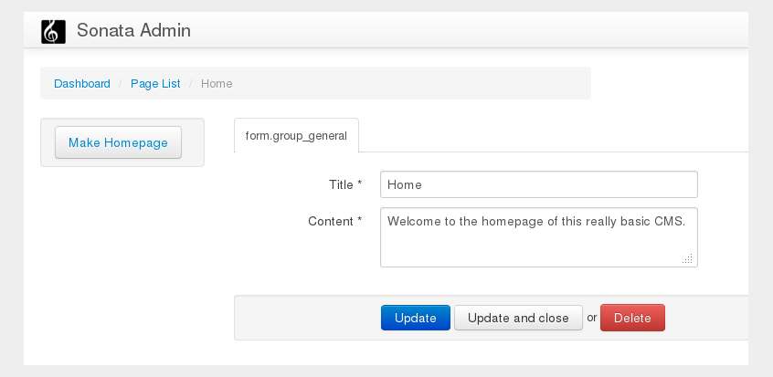

The Site Document and the Homepage
----------------------------------

All of your content should now be available at various URLs but your homepage
(http://localhost:8000) still shows the default Symfony Standard Edition
index page.

In this section you will add a side menu to Sonata Admin which will make
enable the user to make a specified page act as the homepage of your CMS.

.. note::

    This is just one of many strategies for routing the homepage. For example,
    another option would be put a `RedirectRoute` document at `/cms/routes`.

Storing the Data
~~~~~~~~~~~~~~~~

You need a document which can store data about your CMS - this will be known
as the site document and it will contain a reference to the ``Page`` document
which will act as the homepage.

Create the site document::

    // src/Acme/BasicCmsBundle/Document/Site.php
    namespace Acme\BasicCmsBundle\Document;

    use Doctrine\ODM\PHPCR\Mapping\Annotations as PHPCR;

    /**
     * @PHPCR\Document()
     */
    class Site
    {
        /**
         * @PHPCR\Id()
         */
        protected $id;

        /**
         * @PHPCR\ReferenceOne(targetDocument="Acme\BasicCmsBundle\Document\Page")
         */
        protected $homepage;

        public function getHomepage() 
        {
            return $this->homepage;
        }
        
        public function setHomepage($homepage)
        {
            $this->homepage = $homepage;
        }
    }

Initializing the Site Document
~~~~~~~~~~~~~~~~~~~~~~~~~~~~~~

Where should this site doument belong? Our document hierarchy currently looks
like this:

.. code-block:: text

    ROOT/
        cms/
           pages/
           routes/
           posts/

There is one ``cms`` node, and this node contains all the children nodes of
our site. This node is therefore the logical position of our ``Site``
document.

Earlier you used the ``GenericInitializer`` to initialize the base paths of
our project, including the ``cms`` node. The nodes created by the
``GenericInitializer`` have no PHPCR-ODM mapping however.

You can *replace* the ``GenericInitializer`` with a custom initializer which
will create the necessary paths **and** assign a document class to the ``cms``
node::

    // src/Acme/BasicCmsBundle/Intializer/SiteIntializer.php
    namespace Acme\BasicCmsBundle\Initializer;

    use Doctrine\Bundle\PHPCRBundle\Initializer\InitializerInterface;
    use PHPCR\Util\NodeHelper;
    use Doctrine\Bundle\PHPCRBundle\ManagerRegistry;

    class SiteInitializer implements InitializerInterface
    {
        public function getName()
        {
            return 'My sites initializer';
        }

        public function init(ManagerRegistry $registry)
        {
            $session = $registry->getConnection();

            // create the 'cms', 'pages', and 'posts' nodes
            NodeHelper::createPath($session, '/cms/pages');
            NodeHelper::createPath($session, '/cms/posts');
            NodeHelper::createPath($session, '/cms/routes');
            $session->save();

            // map a document to the 'cms' node
            $cms = $session->getNode('/cms');
            $cms->setProperty(
                'phpcr:class',  'Acme\BasicCmsBundle\Document\Site'
            );

            $session->save();
        }
    }

.. note::

    It should be noted that modifying the ``phpcr:class`` property (which is
    private to PHPCR-ODM) is not recommended - in the future there will be a
    special way to intialize documents instead of PHPCR nodes.

Now modify the existing service configuration for ``GenericInitializer`` as
follows:

.. configuration-block::
    
    .. code-block:: yaml

        # src/Acme/BasicCmsBundle/Resources/config/config.yml
        services:
            # ...
            acme.phpcr.initializer.site:
                class: Acme\BasicCmsBundle\Initializer\SiteInitializer
                tags:
                    - { name: doctrine_phpcr.initializer }

    .. code-block:: xml

        <!-- src/Acme/BasicCmsBUndle/Resources/config/config.php
        <?xml version="1.0" encoding="UTF-8" ?>
        <container xmlns="http://symfony.com/schema/dic/services"
            xmlns:xsi="http://www.w3.org/2001/XMLSchema-instance"
            xmlns:acme_demo="http://www.example.com/symfony/schema/"
            xsi:schemaLocation="http://symfony.com/schema/dic/services 
                 http://symfony.com/schema/dic/services/services-1.0.xsd">

            <!-- ... -->
            <services>
                <!-- ... -->
                <service id="acme.phpcr.initializer.site"
                    class="Acme\BasicCmsBundle\Initializer\SiteInitializer">
                    <tag name="doctrine_phpcr.initializer"/>
                </service>
            </services>

        </container>

    .. code-block:: php

        // src/Acme/BasicCmsBundle/Resources/config/config.php

        //  ... 
        $container
            ->register(
                'acme.phpcr.initializer.site',
                'Acme\BasicCmsBundle\Initializer\SiteInitializer'
            )
            ->addTag('doctrine_phpcr.initializer', array('name' => 'doctrine_phpcr.initializer')
        ;

Now reinitialize your repository:

.. code-block:: bash

    $ php app/console doctrine:phpcr:repository:init

and verify that the ``cms`` node has been updated by using the
``doctrine:phpcr:node:dump`` command with the ``props`` flag:

.. code-block:: bash

    $ php app/console doctrine:phpcr:node:dump --props
    ROOT:
      cms:
        - jcr:primaryType = nt:unstructured
        - phpcr:class = Acme\BasicCmsBundle\Document\Site
        ...

.. note::

    Why use an initializer instead of a data fixture? In this instance the
    site object is a constant for your application. There is only one site
    object, new sites will not be created and the existing site document will
    not be removed. DataFixtures are intended to provide sample data, not
    data which is integral to the functioning of your site.

.. note::

    Instead of *replacing* the ``GenericIntializer`` you could simply add
    another initializer which takes the ``cms`` node created in the
    ``GenericInitializer`` and maps the document class to it. The minor
    disadvantage then is that there are two places where initialization
    choices take place - do whatever you prefer.

As noted earlier, currently when data fixtures are loaded they will erase the
workspace, including the paths created by the initializers. This means that
each time you load your data fixtures you must also reinitialize the
repository.

Create the Make Homepage Button
~~~~~~~~~~~~~~~~~~~~~~~~~~~~~~~

You will need a way to allow the administrator of your site to select which
page should act as the homepage. You will modify the ``PageAdmin`` class so
that a "Make Homepage" button will appear when editing a page. You will
achieve this by adding a "side menu".

Firstly though you will need to create an action which will do the work of
making a given page the homepage. Add the following to the existing
``DefaultController``::

    // src/Acme/BasicCmsBundle/Controller/DefaultController.php

    // ...
    class DefaultController extends Controller
    {
        // ...

        /**
         * @Route(
         *   name="make_homepage", 
         *   pattern="/_cms/make_homepage/{id}", 
         *   requirements={"id": ".+"}
         * )
         */
        public function makeHomepageAction($id)
        {
            $dm = $this->get('doctrine_phpcr')->getManager();

            $site = $dm->find(null, '/cms');
            if (!$site) {
                throw $this->createNotFoundException('Could not find /cms document!');
            }

            $page = $dm->find(null, $id);

            $site->setHomepage($page);
            $dm->persist($page);
            $dm->flush();

            return $this->redirect($this->generateUrl('admin_acme_basiccms_page_edit', array( 
                'id' => $page->getId()
            )));
        }
    }

.. note::

    You have specified a special requirement for the ``id`` parameter of the
    route, this is because by default routes will not allow forward slashes "/"
    in route parameters and our "id" is a path.

Now modify the ``PageAdmin`` class to add the button in a side-menu::

    // src/Acme/BasicCmsBundle/Admin/PageAdmin

    // ...
    use Knp\Menu\ItemInterface;
    use Sonata\AdminBundle\Admin\AdminInterface;

    class PageAdmin extends Admin
    {
        // ... 
        protected function configureSideMenu(ItemInterface $menu, $action, AdminInterface $childAdmin = null)
        {
            if ('edit' !== $action) {
                return;
            }

            $page = $this->getSubject();

            $menu->addChild('make-homepage', array(
                'label' => 'Make Homepage',
                'attributes' => array('class' => 'btn'),
                'route' => 'make_homepage',
                'routeParameters' => array(
                    'id' => $page->getId(),
                ),
            ));
        }
    }

The two arguments which concern you here are:

* ``$menu``: This will be a root menu item to which you can add new menu items
  (this is the same menu API you worked with earlier);
* ``$action``: Indicates which kind of page is being configured;

If the action is not ``edit`` it returns early and no side-menu is created. Now
that it knows the edit page is requested, it retrieves the *subject* from the admin
class which is the ``Page`` currently being edited, it then adds a menu item to
the menu.

Routing the Homepage
~~~~~~~~~~~~~~~~~~~~

Now that you have enabled the administrator to designate a page to be used as
a homepage you need to actually make the CMS use this information to render
the designated page.

This is easily accomplished by modifying the ``indexAction`` action of the
``DefaultController`` to forward requests matching the route pattern ``/`` to
the page action::

    // src/Acme/BasicCmsBundle/Controller/DefaultController.php

    // ...
    class DefaultController extends Controller
    {
        // ...

        /**
         * @Route("/")
         */
        public function indexAction()
        {
            $dm = $this->get('doctrine_phpcr')->getManager();
            $site = $dm->find('Acme\BasicCmsBundle\Document\Site', '/cms');
            $homepage = $site->getHomepage();

            if (!$homepage) {
                throw $this->createNotFoundException('No homepage configured');
            }

            return $this->forward('AcmeBasicCmsBundle:Default:page', array(
                'contentDocument' => $homepage
            ));
        }
    }

.. note::

    In contrast to previous examples you specify a class when calling ``find`` -
    this is because you need to be *sure* that the returned document is of class
    ``Site``.

Now test it out, visit: http://localhost:8000
