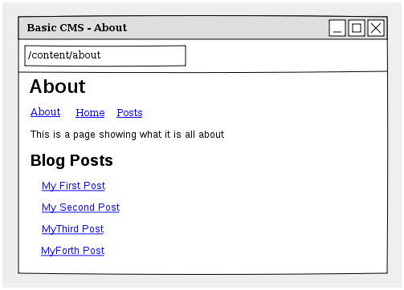

.. index::
    single: Tutorial, Creating a CMS, RoutingAuto, PHPCR-ODM
    single: MenuBundle, SonataAdmin, SonataDoctrineAdminBundle

************************************************
Creating a basic CMS using the RoutingAutoBundle
************************************************

This three part article will show you how to create a basic CMS from scratch using the following bundles:

* :doc:`../bundles/routing_auto`;
* :doc:`../bundles/phpcr_odm`;
* :doc:`../bundles/menu/index`;
* `SonataDoctrinePhpcrAdminBundle`_.

It is assumed that you have:

* A working knowledge of the Symfony 2 framework;

The CMS will have two types of content:

* **Pages**: HTML content accessed at, for example ``/page/home``, ``/page/about``, etc.
* **Posts**: Blog posts accessed as ``/blog/2012/10/23/my-blog-post``.

The auto routing integration will automatically create and update the routes (effectively the
URLs with which you can access the content) for the page and post content documents. In addition each
page content document will double up as a menu item.

.. note::

    The SimpleCmsBundle combines the route, menu and content into a single document and uses a custom
    router. This approach will combine only the menu and content into a single document and the routes
    will be managed automatically and the native CMF ``DynamicRouter`` will be used.

Part 1 - Getting Started
========================

Initializing the Project
------------------------

Create a New Project
~~~~~~~~~~~~~~~~~~~~

Get started by installing the following PHPCR ODM based Symfony distribution:

.. code-block:: bash

    $ composer create-project --stablitiy=dev dantleech/symfony-doctrine-phpcr-edition basic-cms

.. note::

    The `PHPCR ODM Symfony distribution`_ above is the same as the `Symfony Standard Edition`_ except
    that the Doctrine ORM is replaced by the PHPCR-ODM.

PHP 5.4 features an in-built web server. You can use this throughout the
tutorial, run it as follows:

.. code-block:: bash

    $ php app/console server:run

and go to http://localhost:8000 to verify that everything is working.

.. note::

    You could also use the `Symfony CMF Standard Edition`_. The CMF Standard Edition is also based
    on the Symfony Standard Edition and replaces the ORM with the PHPCR-ODM, however it also includes
    the entire CMF stack and some other dependencies which are not required for this tutorial.

Install Additional Bundles
~~~~~~~~~~~~~~~~~~~~~~~~~~

This tutorial requires the following packages:

* `symfony-cmf/routing-auto-bundle`;
* `sonata-project/doctrine-phpcr-admin-bundle`;
* `doctrine/data-fixtures`.

Update ``composer.json`` to require them:

.. code-block:: javascript

    require: {
        ...
        "symfony-cmf/routing-auto-bundle": "dev-master",
        "sonata-project/doctrine-phpcr-admin-bundle": "dev-master",
        "doctrine/data-fixtures": "1.0.0"
    },

add the packages to the kernel::

    class AppKernel extends Kernel
    {
        public function registerBundles()
        {
            $bundles = array(
                // ...
                new Symfony\Cmf\Bundle\RoutingBundle\CmfRoutingBundle(),
                new Symfony\Cmf\Bundle\RoutingAutoBundle\CmfRoutingAutoBundle(),
            );

            // ...
        }
    }

Initialize the Database
~~~~~~~~~~~~~~~~~~~~~~~

If you have used the default settings, then you are using the `Doctrine DBAL Jackalope`_ PHPCR backend
with MySQL and you will need to create the MySQL database:

.. code-block:: bash

    $ mysqladmin create basic-cms -u root

The Doctrine DBAL backend needs to be initialized:

.. code-block:: bash

    $ php app/console doctrine:phpcr:dbal:init

This command will create the MySQL schema required to store the hierarchical
node content of the PHPCR content repository.

.. note::

    The `Apache Jackrabbit`_ implementation is the reference java based backend and does not
    require such initialization. It does however require the use of Java.

Now you can generate the bundle in within which you will write most of your
code:

.. code-block:: bash

    $ php app/console generate:bundle --namespace=Acme/BasicCmsBundle --no-interaction

The Documents
~~~~~~~~~~~~~

You will create two document classes, one for the pages and one for the posts. These two documents
share much of the same logic, so lets create a ``trait`` to reduce code duplication::

    // src/Acme/BasicCmsBundle/Document/ContentTrait.php

    namespace Acme\BasicCmsBundle\Document;

    trait ContentTrait
    {
        /**
         * @PHPCRODm\Id()
         */
        protected $id;

        /**
         * @PHPCR\ParentDocument()
         */
        protected $parent;

        /**
         * @PHPCR\NodeName()
         */
        protected $title;

        /**
         * @PHPCR\String(nullable=true)
         */
        protected $content;

        /**
         * @PHPCR\Referrers(referringDocument="Symfony\Cmf\Bundle\RoutingBundle\Doctrine\Phpcr\Route", referencedBy="content")
         */
        protected $routes;

        public function getParent() 
        {
            return $this->parent;
        }
        
        public function setParent($parent)
        {
            $this->parent = $parent;
        }
        
        public function getTitle() 
        {
            return $this->title;
        }
        
        public function setTitle($title)
        {
            $this->title = $title;
        }

        public function getContent() 
        {
            return $this->content;
        }
        
        public function setContent($content)
        {
            $this->content = $content;
        }

        public function getRoutes()
        {
            return $this->routes;
        }
    }

.. note::

    Traits are only available as of PHP 5.4. If you are running a lesser
    version of PHP you may copy the above code into each class to have the
    same effect. You may not, however, use extension, as this will cause
    unintended behavior in the admin integration later on.

The ``Page`` class is therefore nice and simple::

    // src/Acme/BasicCmsBundle/Document/Page.php

    namespace Acme\BasicCmsBundle\Document;

    use Doctrine\ODM\PHPCR\Mapping\Annotations as PHPCRODM;

    /**
     * @PHPCR\Document(referenceable=true)
     */
    class Page implements RouteReferrersReadInterface
    {
        use ContentTrait;
    }

The ``Post`` class will automatically set the date if it has not been
explicitly set using the `pre persist lifecycle event`_::

    // src/Acme/BasicCms/Document/Post.php

    namespace Acme\BasicCmsBundle\Document;

    use Doctrine\ODM\PHPCR\Mapping\Annotations as PHPCRODM;
    use Symfony\Cmf\Component\Routing\RouteReferrersReadInterface;

    /**
     * @PHPCR\Document(referenceable=true)
     */
    class Post implements RouteReferrersReadInterface
    {
        use ContentTrait;

        /**
         * @PHPCR\Date()
         */
        protected $date;

        /**
         * @PHPCR\PrePersist()
         */
        public function updateDate()
        {
            if (!$this->date) {
                $this->date = new \DateTime();
            }
        }

        public function getDate()
        {
            return $this->date;
        }

        public function setDate($date)
        {
            $this->date = $date;
        }
    }

Both the ``Post`` and ``Page`` classes implement the ``RouteReferrersReadInterface`` which 
enables the `DynamicRouter to generate URLs`_. (for example with ``{{ path(content) }}`` in Twig).

Repository Initializer
----------------------

`Repository initializers`_ enable you to initialize required paths within your content repository, for example
we will need the paths ``/cms/pages`` and ``/cms/posts``. We can use the register a ``GenericInitializer`` class:

.. code-block:: xml

    <service id="acme.basiccms.phpcr.initializer" class="Doctrine\Bundle\PHPCRBundle\Initializer\GenericInitializer">
        <argument type="collection">
            <argument>/cms/pages</argument>
            <argument>/cms/posts</argument>
        </argument>
        <tag name="doctrine_phpcr.initializer"/>
    </service>

And run the initializer:

.. code-block:: bash

    $ php app/console doctrine:phpcr:repository:init

Create Data Fixtures
--------------------

Create a page for your CMS::

    // src/Acme/BasicCmsBundle/DataFixtures/PHPCR/LoadPageData.php

    namespace Acme\BasicCmsBundle\DataFixtures\PHPCR;

    use Doctrine\Common\DataFixtures\FixtureInterface;
    use Doctrine\Common\Persistence\ObjectManager;
    use Acme\BasicCmsBundle\Document\Page;
    use PHPCR\Util\NodeHelper;

    class LoadPageData implements FixtureInterface
    {
        public function load(ObjectManager $dm)
        {
            NodeHelper::createPath($dm->getPhpcrSession(), '/cms/pages');
            $parent = $dm->find(null, '/cms/pages');

            $page = new Page();
            $page->setTitle('Home');
            $page->setParent($parent);
            $page->setContent(<<<HERE
    Welcome to the homepage of this really basic CMS.
    HERE
            );

            $dm->persist($page);
            $dm->flush();
        }
    }

and add some posts::

    // src/Acme/BasicCmsBundle/DataFixtures/PHPCR/LoadPostData.php

    namespace Acme\BasicCmsBundle\DataFixtures\Phpcr;

    use Doctrine\Common\DataFixtures\FixtureInterface;
    use Doctrine\Common\Persistence\ObjectManager;
    use Acme\BasicCmsBundle\Document\Post;
    use PHPCR\Util\NodeHelper;

    class LoadPostData implements FixtureInterface
    {
        public function load(ObjectManager $dm)
        {
            NodeHelper::createPath($dm->getPhpcrSession(), '/cms/posts');
            $parent = $dm->find(null, '/cms/posts');

            foreach (array('First', 'Second', 'Third', 'Forth') as $title) {
                $post = new Post();
                $post->setTitle(sprintf('My %s Post', $title));
                $post->setParent($parent);
                $post->setContent(<<<HERE
    This is the content of my post.
    HERE
                );

                $dm->persist($post);
            }

            $dm->flush();
        }
    }

and:

.. code-block:: bash

    $ php app/console doctrine:phpcr:fixtures:load

You should now have some data in your content repository.

.. note::

    The classes above use ``NodeHelper::createPath`` to create the paths ``/cms/posts`` and ``/cms/pages``,
    this is exactly what the initializer did -- why do the classes do it again? This is a known issue which
    is currently being worked on - the data fixtures loader will erase the database and it will **not** call
    the initializer, so when using data fixtures it is currently necessary to manually create the paths.

Part 2: Automatic Routing
=========================

The routes (URLs) to your content will be automatically created and updated using the RoutingAutoBundle. This
bundle is very powerful and somewhat complicated. For a full a full explanation refer to the
`RoutingAutoBundle documentation`_.

In summary, you will configure the auto routing system to create a new auto routing document in the routing tree for
every post or content created. The new route will be linked back to the target
content:

.. image:: ../_images/cookbook/basic-cms-objects.png

Enable the Dynamic Router
-------------------------

The RoutingAutoBundle uses the CMFs `RoutingBundle`_ which enables routes to be provided from a database (as opposed
to being provided from ``routing.[yml|xml|php]`` files for example).

Add the following to your application configuration:

.. code-block:: yaml

    # /app/config/config.yml
    cmf_routing:
        chain:
            routers_by_id:
                cmf_routing.dynamic_router: 20
                router.default: 100
        dynamic:
            enabled: true
            persistence:
                phpcr:
                    enabled: true
                    route_basepath: /cms/routes

This will:

#. Cause the default Symfony router to be replaced by the chain router.  The
   chain router enables you to have multiple routers in your application. You
   add the dynamic router (which can retrieve routes from the database) and
   the default symfony router (which retrieves routes from configuration
   files).  The number indicates the order of precedence - the router with the
   lowest number will be called first.;
#. Configure the **dynamic** router which you have added to the router chain.
   You specify that it should use the PHPCR backend and that the *root* route
   can be found at ``/cms/routes``.

Auto Routing Configuration
--------------------------

Create the following file in your applications configuration directory:

.. code-block:: yaml

    # app/config/routing_auto.yml

    cmf_routing_auto:
        auto_route_mapping:
            Acme\BasicCmsBundle\Document\Page:
                content_path:
                    pages:
                        provider:
                            name: specified
                            path: /cms/routes/page
                        exists_action:
                            strategy: use
                        not_exists_action:
                            strategy: create
                content_name:
                    provider:
                        name: content_method
                        method: getTitle
                    exists_action:
                        strategy: auto_increment
                        pattern: -%d
                    not_exists_action:
                        strategy: create

            Acme\BasicCmsBundle\Document\Post:
                content_path:
                    blog_path:
                        provider:
                            name: specified
                            path: /cms/routes/post
                        exists_action:
                            strategy: use
                        not_exists_action:
                            strategy: create
                    date:
                        provider:
                            name: content_datetime
                            method: getDate
                            
                            strategy: use
                        not_exists_action:
                            strategy: create
                content_name:
                    provider:
                        name: content_method
                        method: getTitle
                    exists_action:
                        strategy: auto_increment
                        pattern: -%d
                    not_exists_action:
                        strategy: create

This will configure the routing auto system to automatically create and update
route documents for both the ``Page`` and ``Post`` documents. 

In summary:

* The ``content_path`` key represents the parent path of the content, e.g.
  ``/if/this/is/a/path`` then the ``content_path``
  represents ``/if/this/is/a``;
  * Each element under ``content_path`` represents a section of the URL.
  * The first element ``block_path`` uses a *provider* which *specifies* a
    path. If that path exists then we will do nothing (i.e. we will *use* 
    it).
  * The second element uses the ``content_datetime`` provider, which will
    use a ``DateTime`` object returned from the specified method on the
    content object (the ``Post``) and create a path from it, e.g.
    ``2013/10/13``.
* The ``content_name`` key represents the last part of the path, e.g. ``path`` from ``/if/this/is/a/path``.

Now we will need to include this configuration:

.. code-block:: yaml

    # app/config/config.yml
    imports:
        # ...
        - { resource: routing_auto.yml }

Now reload the fixtures:

.. code-block:: bash

    $ php app/console doctrine:phpcr:fixtures:load

Have a look at what you have::

    $ php app/console doctrine:phpcr:node:dump
    ROOT:
      cms:
        pages:
          1076584180:
        routes:
          page:
            home:
          post:
            2013:
              10:
                12:
                  my-first-post:
                  my-second-post:
                  my-third-post:
                  my-forth-post:
        posts:
          390445918:
          1584076545:
          168754307:
          1970620640:

The routes have been automatically created!

.. note::

    What are those numbers? These are node names which have been created automatically by the PHPCR-ODM. Normally
    you would assign a descriptive name (e.g. ``my-first-post``).

Part 3 - The Backend
====================

The `SonataAdminBundle`_ bundle will provide our administration interface.

Configure Sonata
----------------

Enable the Sonata related bundles to your kernel::

    // app/AppKernel.php

    class AppKernel extends Kernel
    {
        public function registerBundles()
        {
            $bundles = array(
                // ...
                new Sonata\BlockBundle\SonataBlockBundle(),
                new Sonata\jQueryBundle\SonatajQueryBundle(),
                new Knp\Bundle\MenuBundle\KnpMenuBundle(),
                new Sonata\DoctrinePHPCRAdminBundle\SonataDoctrinePHPCRAdminBundle(),
                new Sonata\AdminBundle\SonataAdminBundle(),
            );

            // ...
        }
    }

and publish your assets (omit ``--symlink`` if you use Windows!):

.. code-block:: bash

    $ php app/console assets:install --symlink web/

Sonata requires the ``sonata_block`` bundle to be configured in your main configuration:

.. code-block:: yaml

    # app/config/config.yml
    # ...
    sonata_block:
        default_contexts: [cms]
        blocks:
            # Enable the SonataAdminBundle block
            sonata.admin.block.admin_list:
                contexts:   [admin]

and it needs the following entries in your routing file:

.. code-block:: yaml

    # app/config/routing.yml
    admin:
        resource: '@SonataAdminBundle/Resources/config/routing/sonata_admin.xml'
        prefix: /admin

    _sonata_admin:
        resource: .
        type: sonata_admin
        prefix: /admin

Great, now have a look at http://localhost:8000/admin/dashboard

No translations? Uncomment the translator in the configuration file::

    translator:      { fallback: %locale% }

Notice that the routing bundles administration class has been automatically registered - since your
routes will be handled automatically disable this:

.. code-block:: yaml

    # app/config/config.yml

    cmf_routing:
        # ...
        dynamic:
            # ...
            persistence:
                phpcr:
                    # ...
                    use_sonata_admin: false

Creating the Admin Classes
--------------------------

Create the following admin classes, first for the ``Page`` document::

    // src/Acme/BasicCmsBundle/Admin/PageAdmin.php

    namespace Acme\BasicCmsBundle\Admin;

    use Sonata\DoctrinePHPCRAdminBundle\Admin\Admin;
    use Sonata\AdminBundle\Datagrid\DatagridMapper;
    use Sonata\AdminBundle\Datagrid\ListMapper;
    use Sonata\AdminBundle\Form\FormMapper;

    class PageAdmin extends Admin
    {
        protected function configureListFields(ListMapper $listMapper)
        {
            $listMapper
                ->addIdentifier('title', 'text')
            ;
        }

        protected function configureFormFields(FormMapper $formMapper)
        {
            $formMapper
                ->with('form.group_general')
                ->add('title', 'text')
                ->add('content', 'textarea')
            ->end();
        }

        public function prePersist($document)
        {
            $parent = $this->getModelManager()->find(null, '/cms/pages');
            $document->setParent($parent);
        }

        protected function configureDatagridFilters(DatagridMapper $datagridMapper)
        {
            $datagridMapper->add('title', 'doctrine_phpcr_string');
        }

        public function getExportFormats()
        {
            return array();
        }
    }

and then for the ``Post`` document - as you have already seen this document is almost identical to the ``Page`` document,
so it extends the ``PageAdmin`` class to avoid code duplication::

    // src/Acme/BasicCmsBundle/Admin/PostAdmin.php

    namespace Acme\BasicCmsBundle\Admin;

    use Sonata\DoctrinePHPCRAdminBundle\Admin\Admin;
    use Sonata\AdminBundle\Datagrid\DatagridMapper;
    use Sonata\AdminBundle\Datagrid\ListMapper;
    use Sonata\AdminBundle\Form\FormMapper;

    class PostAdmin extends PageAdmin
    {
        protected function configureFormFields(FormMapper $formMapper)
        {
            parent::configureFormFields($formMapper);

            $formMapper
                ->with('form.group_general')
                ->add('date', 'date')
            ->end();
        }
    }

Now you just need to register these classes in the dependency injection container configuration:

.. code-block:: xml

        <!-- src/Acme/BasicCmsBundle/Resources/services.xml -->

        <service id="acme.basiccms.admin.page" class="Acme\BasicCmsBundle\Admin\PageAdmin">

            <call method="setRouteBuilder">
                <argument type="service" id="sonata.admin.route.path_info_slashes" />
            </call>

            <tag
                name="sonata.admin"
                manager_type="doctrine_phpcr"
                group="Basic CMS"
                label="Page"
            />
            <argument/>
            <argument>Acme\BasicCmsBundle\Document\Page</argument>
            <argument>SonataAdminBundle:CRUD</argument>
        </service>

        <service id="acme.basiccms.admin.post" class="Acme\BasicCmsBundle\Admin\PostAdmin">

            <call method="setRouteBuilder">
                <argument type="service" id="sonata.admin.route.path_info_slashes" />
            </call>

            <tag
                name="sonata.admin"
                manager_type="doctrine_phpcr"
                group="Basic CMS"
                label="Blog Posts"
            />
            <argument/>
            <argument>Acme\BasicCmsBundle\Document\Post</argument>
            <argument>SonataAdminBundle:CRUD</argument>
        </service>

Check it out at http://localhost:8000/admin/dashboard

.. image:: ../_images/cookbook/basic-cms-sonata-admin.png

Part 4 - The Frontend
=====================

Mapping Content to Controllers
------------------------------

Go to the URL http://localhost:8000/page/home in your browser - this should be
your page, but it says that it cannot find a controller. In other words it has
found the *page referencing route* for your page but Symfony does not know what
to do with it.

You can map a default controller for all instances of ``Page``:

.. code-block:: yaml

        controllers_by_class:
            Acme\BasicCmsBundle\Document\Page: Acme\BasicCmsBundle\Controller\BasicController::pageAction

This will cause requests to be forwarded to this controller when the route
which matches the incoming request is provided by the dynamic router **and**
the content document that that route references is of class
``Acme\BasicCmsBundle\Document\Page``

Now create the action in the default controller - you can pass the ``Page``
object and all the ``Posts`` to the view::

    // src/Acme/BasicCmsBundle/Controller/DefaultController.php
    //..
    class DefaultController extends Controller
    {
        // ...

        /**
         * @Template()
         */
        public function pageAction($contentDocument)
        {
            $dm = $this->get('doctrine_phpcr')->getManager();
            $posts = $dm->getRepository('Acme\BasicCmsBundle\Document\Post')->findAll();

            return array('page' => $contentDocument);
        }
    }

The ``Page`` object is passed automatically as ``$contentDocument``.

Add a corresponding twig template:

.. code-block:: jinja

    {# src/Acme/BasicCmsBundle/Resources/Default/page.html.twig #}

    <h1>{{ page.title }}</h1>
    
{{ page.content|raw }}

    <h2>Our Blog Posts</h2>
    <ul>
        
            <li><a href="{{ path(post) }}">{{ post.title }}</a></li>
        
    </ul>

Now have another look at: http://localhost:8000/page/home

Notice what is happening with the post routes - you pass the ``Post`` object to
the ``path`` helper and because it implements the
``RouteReferrersReadInterface`` it find the dynamic routes in our database and
generate the URL.

Click on a ``Post`` and you will have the same error that you had before when
viewing the page at ``/home``.

You should now have enough knowledge to finish this off as you like, try the
following:

* Add the ``Post`` class to the ``controllers_by_type configuration`` setting in
  the configuration and route it to a new action in the controller;
* Create a new template for the ``Post``;
* Create a layout and make everything look good.

Creating a Menu
---------------

In this section you will modify our application so that the ``Page`` document
acts as a menu node which can be rendered using the twig helper of the `KnpMenuBundle`_.

Modify the Page Document
~~~~~~~~~~~~~~~~~~~~~~~~

The menu document has to implement the ``NodeInterface`` provided by the
KnpMenuBundle::

    // src/Acme/BasicCmsBundle/Document/Page.php

    namespace Acme\BasicCmsBundle\Document;

    // ...
    use Knp\Menu\NodeInterface;

    // ...
    class Page implements RouteReferrersReadInterface, NodeInterface
    {
        // ...

        /**
         * @PHPCR\Children()
         */
        protected $children;

        public function getName()
        {
            return $this->title;
        }

        public function getChildren()
        {
            return $this->children;
        }

        public function getOptions()
        {
            return array(
                'label' => $this->title,
                'content' => $this,

                'attributes' => array(),
                'childrenAttributes' => array(),
                'displayChildren' => true,
                'linkAttributes' => array(),
                'labelAttributes' => array(),
            );
        }
    }

Menus are hierarchical, PHPCR-ODM is also hierarchical, what a good fit! Here
you add an additional mapping to enable us to get the children of this node and
fulfil the ``NodeInterface`` contract. 

The options are the options used by KnpMenu system when rendering the menu.
The menu URL is inferred from the ``content`` option (note that you added the
``RouteReferrersReadInterface`` to ``Page`` earlier). 

The attributes apply to the HTML elements. See the `KnpMenu`_ documentation
for more information.

Modify the Data Fixtures
~~~~~~~~~~~~~~~~~~~~~~~~

The menu system expects to be able to find a root item which contains the
first level of child items. Modify your fixtures to declare a root element
to which you will add the existing ``Home`` page and an additional ``About`` page::

    // src/Acme/BasicCmsBundle/DataFixtures/Phpcr/LoadPageData.php

    // ...
    class LoadPageData implements FixtureInterface
    {
        public function load(ObjectManager $dm)
        {
            // ...
            $rootPage = new Page();
            $rootPage->setTitle('main');
            $rootPage->setParent($parent);
            $dm->persist($rootPage);

            $page = new Page();
            $page->setTitle('Home');
            $page->setParent($rootPage);
            $page->setContent(<<<HERE
    Welcome to the homepage of this really basic CMS.
    HERE
            );
            $dm->persist($page);

            $page = new Page();
            $page->setTitle('About');
            $page->setParent($rootPage);
            $page->setContent(<<<HERE
    This page explains what its all about.
    HERE
            );
            $dm->persist($page);

            $dm->flush();
        }
    }

Load the fixtures again:

.. code-block:: bash

    $ php app/console doctrine:phpcr:fixtures:load

Register the Menu Provider
~~~~~~~~~~~~~~~~~~~~~~~~~~

First you will need to add the CMF `MenuBundle`_ and its dependency, `CoreBundle`_, to your
applications kernel::

    class AppKernel extends Kernel
    {
        public function registerBundles()
        {
            $bundles = array(
                // ...
                new Symfony\Cmf\Bundle\CoreBundle\CmfCoreBundle(),
                new Symfony\Cmf\Bundle\MenuBundle\CmfMenuBundle(),
            );

            // ...
        }
    }

Now you can register the PhpcrMenuProvider from the menu bundle in the service container
configuration:

.. code-block:: xml

    <service
        id="acme.basiccms.menu_provider"
        class="Symfony\Cmf\Bundle\MenuBundle\Provider\PhpcrMenuProvider">
        <argument type="service" id="cmf_menu.factory"/>
        <argument type="service" id="doctrine_phpcr"/>
        <argument>/cms/pages</argument>
        <tag name="knp_menu.provider" />
        <tag name="cmf_request_aware"/>
    </service>

and enable the twig rendering functionality of the KnpMenu bundle:

.. code-block:: yaml

    # app/config/config.yml
    knp_menu:
        twig: true

and finally lets render the menu!

.. code-block:: jinja
    
    {# src/Acme/BasicCmsBundle/Resources/views/Default/page.html.twig #}

    {# ... #}
    {{ knp_menu_render('main') }}

Note that `main` refers to the name of the root page you added in the data
fixtures.

Conclusion
==========

And thats it! Well done. You have created a very minimum but functional
CMS which can act as a good foundation for larger projects!

You can checkout the completed CMS on Github:

* https://github.com/dantleech/tutorial-basic-cms

Things we should improve
------------------------

Sonata:

- Having to set the route builder manually sucks
- Having to call ``prePersist`` to set parent -- we could add some mechanisim to file
  documents automatically where setting a deep tree position is not required. See next section.
- Setting the document name - we should provide a mechanisim to slugify the name from something else,
  perhaps with the AutoId thingy?
- MenuBundle is dependent on CoreBundle -- requires PWF checker for factory

PHPCR-ODM
~~~~~~~~~

- Having to do PathHelper::createPath in fixtures is not nice
- Initializer should be configurable from config.yml -- why force user to create a service?

.. _`phpcr odm symfony distribtion`: https://packagist.org/packages/dantleech/symfony-doctrine-phpcr-edition
.. _`symfony standard edition`: https://packagist.org/packages/symfony/framework-standard-edition
.. _`symfony cmf standard edition`: https://packagist.org/packages/symfony-cmf/standard-edition
.. _`apache jackrabbit`: http://jackrabbit.apache.or
.. _`pre persist lifecycle event`: http://docs.doctrine-project.org/projects/doctrine-phpcr-odm/en/latest/reference/events.html#lifecycle-events
.. _`dynamicrouter to generate urls`: http://symfony.com/doc/current/cmf/bundles/routing/dynamic.html#url-generation-with-the-dynamicrouterA
.. _`repository initializers`: http://symfony.com/doc/current/cmf/bundles/phpcr_odm.html#repository-initializers
.. _`routingautobundle documentation`: http://symfony.com/doc/current/cmf/bundles/routing_auto.html
.. _`symfony-cmf/routing-auto-bundle`: https://packagist.org/packages/symfony-cmf/routing-auto-bundle
.. _`sonata-project/doctrine-phpcr-admin-bundle`: https://packagist.org/packages/sonata-project/doctrine-phpcr-admin-bundle
.. _`doctrine/data-fixtures`: https://packagist.org/packages/doctrine/data-fixtures
.. _`routingbundle`: http://symfony.com/doc/master/cmf/bundles/routing/index.html
.. _`knpmenubundle`: https://github.com/KnpLabs/KnpMenuBundle
.. _`knpmenu`: https://github.com/KnpLabs/KnpMenu
.. _`doctrine dbal jackalope`: https://github.com/jackalope/jackalope-doctrine-dbal
.. _`SonataDoctrinePhpcrAdminBundle`: https://github.com/sonata-project/SonataDoctrinePhpcrAdminBundle
.. _`SonataAdminBundle`: http://sonata-project.org/bundles/admin
