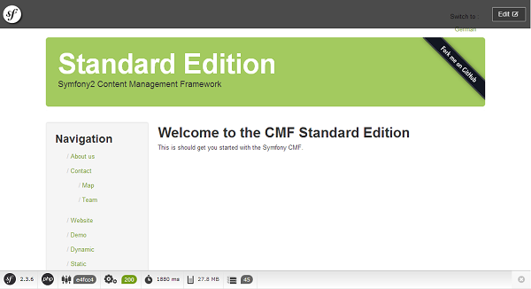

.. index::
    single: The Big Picture; Quick Tour

The Big Picture
===============

Start using the Symfony CMF in 10 minutes! This quick tour will walk you through
the base concepts of the Symfony CMF and get you started with it.

It's important to know that the Symfony CMF is a collection of bundles which
provide common functionality needed when building a CMS with the Symfony
Framework. Before you read further, you should at least have a basic knowledge
of the Symfony Framework. If you don't know Symfony, start by reading the
`Symfony Framework Quick Tour`_.

Solving the Framework versus CMS Dilemma
----------------------------------------

Before starting a new project, there is a difficult decision on whether it
will be based on a framework or on a CMS. When choosing to use a framework,
you need to spend much time creating CMS features for the project. On the
other hand, when choosing to use a CMS, it's more difficult to build custom
application functionality. It is impossible or at least very hard to customize
the core parts of the CMS.

The Symfony CMF is created to solve this framework versus CMS dilemma. It
provides Symfony bundles to easily add CMS features to your project. Yet, as
you're still using the Symfony framework, you can build any custom functionality
you can think of. This flexibility is called a `decoupled CMS`_.

The bundles provided by the Symfony CMF can work together, but they are also
able to work standalone. This means that you don't need to add all bundles, you
can decide to only use one of them (e.g. only the RoutingBundle).

Downloading the Symfony CMF Sandbox
-----------------------------------

To explore the CMF, it is best to download the Symfony CMF Sandbox. The sandbox
contains demonstrations for many of the CMF features and is a good playground
to familiarize yourself with the CMF.

When you want to start an actual project with the CMF, best download the
Symfony CMF Standard Edition. The Symfony CMF Standard Edition is similar to
the `Symfony Standard Edition`_, but contains and configures essential Symfony
CMF bundles.

The best way to download the Symfony CMF Sandbox is using Composer_:

.. code-block:: bash

    $ composer create-project symfony-cmf/sandbox cmf-sandbox

Setting up the Database
~~~~~~~~~~~~~~~~~~~~~~~

Now, the only thing left to do is setting up the database. This is not
something you are used to doing when creating Symfony applications, but the
Symfony CMF needs a database in order to make a lot of things configurable
using an admin interface.

To quickly get started, it is expected that you have enabled the sqlite PHP
extension. After that, run these commands:

.. code-block:: bash

    $ cd cmf-sandbox
    $ cp app/config/phpcr_doctrine_dbal.yml.dist app/config/phpcr.yml
    # Or when you're on a Windows PC:
    # $ copy app\config\phpcr_doctrine_dbal.yml.dist app\config\phpcr.yml

    $ php bin/console doctrine:database:create
    $ php bin/console doctrine:phpcr:init:dbal --force
    $ php bin/console doctrine:phpcr:repository:init
    $ php bin/console doctrine:phpcr:fixtures:load -n

.. tip::

    You are going to learn more about the Database layer of the Symfony CMF
    :doc:`in the next chapter of the Quick Tour <the_model>`.

.. seealso::

    For a complete installation guide, see the ":doc:`../book/installation`"
    chapter of the Book.

The Request Flow
----------------

.. tip::

    Use the ``server:run`` command to run a local server for the demo. If you
    use a web server like Nginx or Apache, you need to prefix the URLs
    in this document with ``app_dev.php/`` (and the path to the ``web`` folder
    inside the Symfony project, if that is not already the root folder of your
    server).

Now, the Sandbox is ready to use. Navigate to the homepage
(``http://localhost:8000/``) to see the demo:

You see that we already have a complete website in our demo. Let's take a
closer look at the request flow for a Symfony CMF application:

.. image:: ../_images/quick_tour/request_flow.png

First of all, you see a typical Symfony request flow following the white
blocks. It creates a ``Request`` object which will be passed to a router,
which executes the controller and that controller uses models to generate a
view to put in the response.

On top of this, the CMF adds the green blocks. In the coming sections, you'll
learn more about these separately.

The Model
~~~~~~~~~

Before creating the CMF, the team had done a lot of research on which database
to use. They ended up finding JCR_, a Content Repository for Java. Together
with some other developers they created PHPCR_, a PHP port of the JCR
specification.

PHPCR uses a directory-like structure. It stores elements in a big tree.
Elements have a parent and can have children.

.. note::

    Although PHPCR is the first choice of the CMF team, the bundles are not
    tied to a specific storage system. Some bundles also provide ORM
    integration and you can also add your own models easily.

The Router
~~~~~~~~~~

In Symfony, the routes are stored in a configuration file. This means only a
developer can change routes. In a CMS, you want the admin to change the
routes of their site. This is why the Symfony CMF introduces a DynamicRouter.

The DynamicRouter loads some routes which possibly match the request from the
database and then tries to find an exact match. The routes in the database can
be edited, deleted and created using an admin interface, so everything is
fully under the control of the admin.

Because you may also want other Routers, like the normal Symfony router, the
CMF also provides a ``ChainRouter``. A chain router contains a chain of other
routers and executes them in a given order to find a match.

Using a database to store the routes makes it also possible to reference other
documents from the route. This means that a route can have a Content
object.

.. note::

    You'll learn more about the router :doc:`further in the Quick Tour <the_router>`.

The Controller
~~~~~~~~~~~~~~

When a Route matches, a Controller is executed. This Controller normally just
gets the Content object from the Route and renders it. Because it is almost
always the same, the CMF uses a generic Controller which it will execute. This
can be overridden by setting a specific controller for a Route or Content
object.

The View
~~~~~~~~

Using the RoutingBundle, you can configure which Content objects are rendered
by a specific template or controller. The generic controller will then render
this template.

A view also uses a Menu, provided by the KnpMenuBundle_, and it can have
integration with Create.js, for live editing.

The Fixtures
------------

Now you know the request flow, you can start editing content. While the normal
usage will be to edit content through a web interface, the CMF sandbox also
supports loading content from static files. This is mainly useful for testing
purposes.

The fixtures are loaded with the ``doctrine:phpcr:fixtures:load`` command. To
edit the home page, edit the first entry in
``src/AppBundle/Resources/data/page.yml`` to say something different. Then, run
the ``doctrine:phpcr:fixtures:load`` command to get the changes into the
content repository. After refreshing the browser, you can see your
modifications!

Don't worry, editing fixture files is only done for developing and testing. The
CMF comes with a Sonata admin integration for convenient online editing, or you
can build your own editing systems.

Final Thoughts
--------------

Congratulations! You've come to the end of your first introduction into the
Symfony CMF. There is a lot more to discover, but you should already see how
the Symfony CMF tries to make your life as a developer better by providing
some CMS bundles. If you want to discover more, you can dive into the next
section: ":doc:`the_model`".

.. _`decoupled CMS`: http://decoupledcms.org
.. _`Symfony Framework Quick Tour`: https://symfony.com/doc/current/quick_tour/the_big_picture.html
.. _`Symfony Standard Edition`: https://github.com/symfony/symfony-standard
.. _JCR: https://en.wikipedia.org/wiki/Content_repository_API_for_Java
.. _PHPCR: http://phpcr.github.io/
.. _KnpMenuBundle: http://knpbundles.com/KnpLabs/KnpMenuBundle
.. _Composer: https://getcomposer.org/
.. _`Create.js`: http://createjs.org/
.. _CreatePHP: http://demo.createphp.org/
