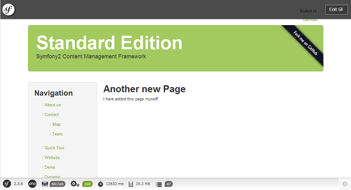

.. index::
    single: The Model; Quick Tour

The Model
=========

You decided to continue reading 10 more minutes about the Symfony CMF? That's
great news! In this part, you will learn more about the default database layer
of the CMF.

.. note::

    Again, this chapter is talking about the PHPCR storage layer. But the CMF
    is storage agnosticly created, meaning it is not tied to specific storage
    system.

Getting Familiar with PHPCR
---------------------------

PHPCR_ stores all data into one big tree structure. You can compare this to a
filesystem where each file and directory contains data. This means that all
data stored with PHPCR has a relationship with at least one other data: its
parent. The inverse relation also exists, you can also get the children of a
data element.

Let's take a look at the dump of the tree of the Standard Edition you
downloaded in the previous chapter. Go to your directory and execute the
following command:

.. code-block:: bash

    $ php app/console doctrine:phpcr:node:dump

The result will be the PHPCR tree:

.. code-block:: text

    ROOT:
      cms:
        simple:
          about:
          contact:
            map:
            team:
          quick_tour:
          dynamic:
          docs:
          demo:
          demo_redirect:
          hardcoded_dynamic:
          hardcoded_static:

Each data is called a *node* in PHPCR. In this tree, there are 13 nodes and
one ROOT node (created by PHPCR). You may have already seen the document you
created in the previous section, it's called ``quick_tour`` (and it's path is
``/cms/simple/quick_tour``). When using the SimpleCmsBundle, all nodes are
stored in the ``/cms/simple`` path.

Each node has properties, which contain the data. The content, title and label
you set for your page are saved in such properties for the ``quick_tour``
node. You can view these properties by adding the ``--props`` switch to the
dump command.

.. note::

    Previously, the PHPCR tree was compared with a Filesystem. While this
    gives you a good image of what happens, it's not the truth. You can
    better compare it to an XML file, where each node is an element and its
    properties are attributes.

Doctrine PHPCR-ODM
------------------

The Symfony CMF uses the `Doctrine PHPCR-ODM`_ to interact with PHPCR.
Doctrine allows a user to create objects (called *documents*) which are
directly persisted into and retrieved from the PHPCR tree. This is similair to
the Doctrine ORM used by the Symfony2 Framework, but then for PHPCR.

Creating a Page with code
-------------------------

Now you know a little bit more about PHPCR and you know the tool to interact
with it, you can start using it yourself. In the previous chapter, you created
a page by using a yaml file which was parsed by the SimpleCmsBundle. This
time, you'll create a page by doing it yourself.

First, you have to create a new DataFixture to add your new page. You do this
by creating a new class in the AcmeDemoBundle::

    // src/Acme/DemoBundle/DataFixtures/PHPCR/LoadPageData.php
    namespace Acme\DemoBundle\DataFixtures\PHPCR;

    use Doctrine\Common\Persistence\ObjectManager;
    use Doctrine\Common\DataFixtures\FixtureInterface;
    use Doctrine\Common\DataFixtures\OrderedFixtureInterface;

    class LoadPageData implements FixtureInterface, OrderedFixtureInterface
    {
        public function getOrder()
        {
            // refers to the order in which the class' load function is called
            // (lower return values are called first)
            return 10;
        }

        public function load(ObjectManager $documentManager)
        {
        }
    }

The ``$documentManager`` is the object which will persist the document to
PHPCR. But first, you have to create a new Page document::

    use Doctrine\ODM\PHPCR\DocumentManager;
    use Symfony\Cmf\Bundle\SimpleCmsBundle\Doctrine\Phpcr\Page;

    // ...
    public function load(ObjectManager $documentManager)
    {
        if (!$documentManager instanceof DocumentManager) {
            $class = get_class($documentManager);
            throw new \RuntimeException("Fixture requires a PHPCR ODM DocumentManager instance, instance of '$class' given.");
        }

        $page = new Page(); // create a new Page object (document)
        $page->setName('new_page'); // the name of the node
        $page->setLabel('Another new Page');
        $page->setTitle('Another new Page');
        $page->setBody('I have added this page myself!');
    }

Each document needs a parent. In this case, the parent should just be the root
node. To do this, we first retrieve the root document from PHPCR and then set
it as its parent::

    // ...
    public function load(ObjectManager $documentManager)
    {
        if (!$documentManager instanceof DocumentManager) {
            $class = get_class($documentManager);
            throw new \RuntimeException("Fixture requires a PHPCR ODM DocumentManager instance, instance of '$class' given.");
        }

        // ...

        // get root document (/cms/simple)
        $simpleCmsRoot = $documentManager->find(null, '/cms/simple');

        $page->setParentDocument($simpleCmsRoot); // set the parent to the root
    }

And at last, we have to tell the Document Manager to persist our Page
document using the Doctrine API::

    // ...
    public function load(ObjectManager $documentManager)
    {
        if (!$documentManager instanceof DocumentManager) {
            $class = get_class($documentManager);
            throw new \RuntimeException("Fixture requires a PHPCR ODM DocumentManager instance, instance of '$class' given.");
        }

        // ...
        $documentManager->persist($page); // add the Page in the queue
        $documentManager->flush(); // add the Page to PHPCR
    }

Now you need to execute the ``doctrine:phpcr:fixtures:load`` command again and
then you can visit your website again. You'll see your new page you added!

.. seealso::

    See ":doc:`../book/database_layer`" if you want to know more about using
    PHPCR in a Symfony application.

Final Thoughts
--------------

PHPCR is a powerfull way to store your pages in a CMS. But, if you're not
comfortable with it, you can always
:doc:`switch to another storage layer <../cookbook/database/choosing_storage_layer>`.

When looking back at these 20 minutes, you should have learned how to work
with a new storage layer and you have added 2 new pages. Do you see how easy
the CMF works when making your application editable? It provides most of the
things you previously had to do yourself.

But you have now only seen a small bit of the CMF, there is much more to learn
about and many other bundles are waiting for you. Before you can do all this,
you should meet the backbone of the CMF: The routing system. You can read
about that in :doc:`the next chapter <the_router>`. Ready for another 10
minutes?

.. _PHPCR: http://phpcr.github.io/
.. _`Doctrine PHPCR-ODM`: http://docs.doctrine-project.org/projects/doctrine-phpcr-odm/en/latest/
