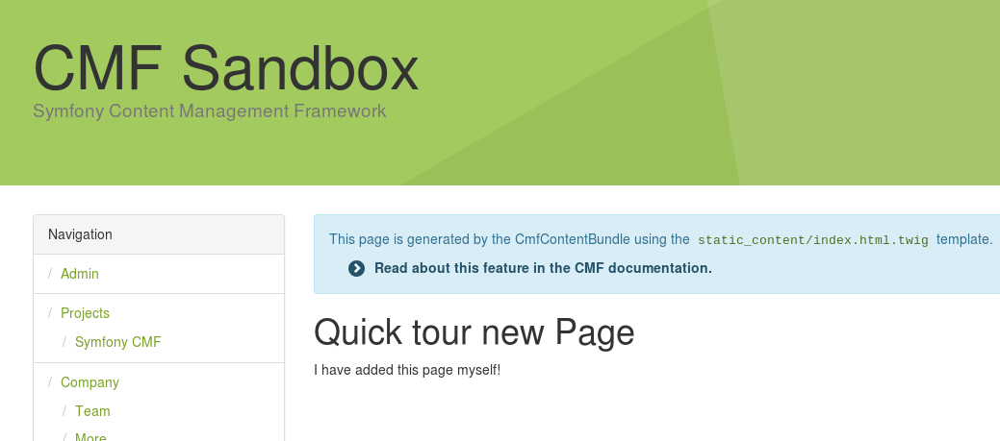

.. index::
    single: The Router; Quick Tour

The Router
==========

Welcome at the third part of the Quick Tour. Well done, making it this far!
And that's a good thing, as you will learn about the backbone of the CMF in
this chapter: The Router.

The Backbone of the CMF
-----------------------

The router is central to the CMF. To understand this, let us
look at what a CMS tries to do. In a normal Symfony application, a route
refers to a controller which can handle a specific entity. Another route
refers to another controller which can handle another entity. This way, a
route is tied to a controller. In fact, using the Symfony core you are also
limited by this pattern.

But if you look at the base of a CMS, it only needs to handle one type of
entity: The Content. So most of the routes don't have to be tied to a
controller anymore, as only one controller is needed. The Route has to be tied
to a specific Content object, which - on its side - may need a specific
template and controller.

Other parts of the CMF are also related to the Router. Two examples: The
menu is created by generating specific routes using the Router and the blocks
are displayed to specific routes (as they are related to a template).

Loading Routes from the PHPCR tree
----------------------------------

In the first chapter, you have already learned that routes are loaded from the
database using a special ``DynamicRouter``. This way, not all routes need to
be loaded each request.

Matching routes from a PHPCR is straightforward: The router takes the request
path and looks for a document with that path. Some examples:

.. code-block:: text

    /cms
        /routes
            /en            # /en Route
                /company   # /en/company Route
                    /team  # /en/company/team Route
                /about     # /en/about Route
            /de            # /de Route
                /ueber     # /de/ueber Route

OK, you got it? The only thing the Router has to do is prefix the route with a
specific path prefix and load that document. In the case of the RoutingBundle,
all routes are prefixed with ``/cms/routes``.

You see that a route like ``/company/team``, which consist of two "path units",
has two documents in the PHPCR tree: ``company`` and ``team``.

Creating a new Route
--------------------

Now you know the basics of routing, you can add a new route to the tree using
Doctrine::

    // src/AppBundle/DataFixtures/PHPCR/LoadQuickTourData.php
    namespace AppBundle\DataFixtures\PHPCR;

    use Doctrine\Common\Persistence\ObjectManager;
    use Doctrine\Common\DataFixtures\FixtureInterface;
    use Doctrine\Common\DataFixtures\OrderedFixtureInterface;
    use Doctrine\ODM\PHPCR\DocumentManager;
    use PHPCR\Util\NodeHelper;
    use Symfony\Cmf\Bundle\RoutingBundle\Doctrine\Phpcr\Route;

    class LoadQuickTourData implements FixtureInterface, OrderedFixtureInterface
    {
        public function load(ObjectManager $documentManager)
        {
            // static content from model chapter, resulting in $content being defined
            // ...

            $routesRoot = $documentManager->find(null, '/cms/routes');
            $route = new Route();
            // set $routesRoot as the parent and 'new-route' as the node name,
            // this is equal to:
            // $route->setName('new-route');
            // $route->setParentDocument($routesRoot);
            $route->setPosition($routesRoot, 'new-route');

            $route->setContent($content);

            $documentManager->persist($route); // put $route in the queue
            $documentManager->flush(); // save it
        }
    }

Now execute the ``doctrine:phpcr:fixtures:load`` command again.

This creates a new node called ``/cms/routes/new-route``, which will display
our ``quick_tour`` page when you go to ``/new-route``.

Chaining multiple Routers
-------------------------

Usually, you want to use both the ``DynamicRouter`` for the editable routes,
but also the static routing files from Symfony for your custom logic. To be
able to do that, the CMF provides a ``ChainRouter``. This router tries each
registered router and stops on the first router that returns a match.

By default, the ``ChainRouter`` overrides the Symfony router and only has the
core and dynamic router in its chain. You can add more routers to the chain in the
configuration or by tagging the router services with ``cmf_routing.router``.

Final Thoughts
--------------

Now you reached the end of this article, you can say you really know the
basics of the Symfony CMF. First, you have learned about the Request flow and
quickly learned each new step in this process. After that, you have learned
more about the default storage layer and the routing system.

The Routing system is created together with some developers from Drupal 8. In
fact, Drupal 8 uses the Routing component of the Symfony CMF. The Symfony CMF
also uses some 3rd party bundles from others and integrated them into PHPCR.
In :doc:`the next chapter <the_third_party_bundles>` you'll learn more about
those bundles and other projects the Symfony CMF is helping.
