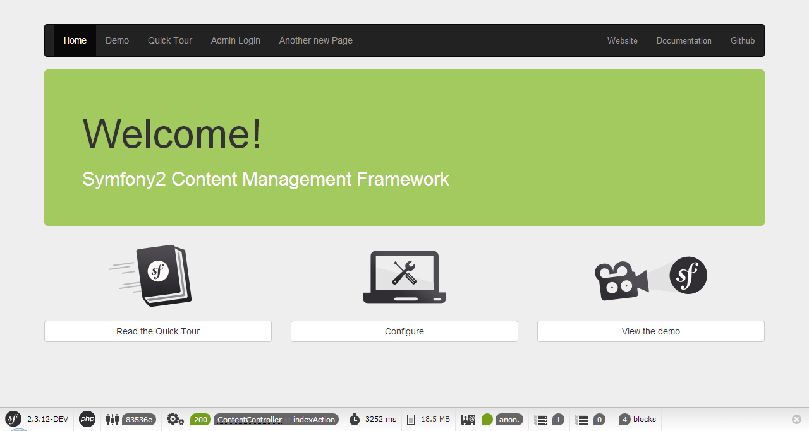

.. index::
    single: The Community; Quick Tour

The Third Party Bundles
=======================

You're still here? You already learned the basics of the Symfony CMF and you
just wanted to learn more and more? Then you can read this chapter! This
chapter will walk you quickly through some other CMF bundles. Most of the
other bundles are based on the shoulders of some giants, like the KnpMenuBundle_
or SonataAdminBundle_.

The MenuBundle
--------------

Let's start with the MenuBundle. If you visit the page, you can see a nice
menu. You can find the rendering of this menu in the layout view in the
AcmeDemoBundle:

.. code-block:: html+jinja

    <!-- src/Acme/DemoBundle/Resources/views/layout.html.twig -->

    <!-- ... -->
    <nav class="navbar  navbar-inverse  page__nav" role="navigation">
        

            {{ knp_menu_render('simple', {'template': 'AcmeDemoBundle:Menu:bootstrap.html.twig', 'currentClass': 'active'}) }}

            <!-- ... -->
        

    </nav>

As you can see, the menu is rendered by the ``knp_menu_render`` tag. This
seems a bit a strange, we are talking about the CmfMenuBundle and not the
KnpMenuBundle, aren't we? That's correct, but as a matter of facts the
CmfMenuBundle is just a tiny layer on top of the KnpMenuBundle.

Normally, the argument of ``knp_menu_render()`` is the menu name to render,
but when using the CmfMenuBundle, it's a node id. In this case, the menu
contains all items implementing the ``NodeInterface`` inside the
``/cms/simple`` (since the basepath in the Standard Edition is ``/cms``).

.. note::

    Apart from including a PHPCR menu provider, the CmfMenuBundle also
    provides Admin classes. See the section about `Sonata Admin`_ to learn
    more about this.

The CreateBundle
----------------

You've already seen this bundle in the first chapter. This bundle integrates
the CreatePHP_ library (which uses the `Create.js`_ library) into Symfony2
using the FOSRestBundle_.

The Create.js library works using a REST layer. All elements on a page get
`RDFa Mappings`_, which tells Create.js how to map the element to the document.
When you save the page, the new content is passed to the REST api and saved in
the database.

Rendering content with RDFa mappings can be very easy, as you can see in the
Standard Edition:

.. code-block:: html+jinja

    
    
    {{ rdf|raw }}
    
    

This will output the content object using `
` elements. You can also
customize this completely by using the ``createphp_*`` functions.

The BlockBundle
---------------

If you visit the homepage of the Standard Edition, you'll see three blocks:

These blocks can be edited and used on their own. These blocks are provided by
the BlockBundle, which is a tiny layer on top of the SonataBlockBundle_. It
provides the ability to store the blocks using PHPCR and it adds some commonly
used blocks.

The three blocks in the Standard Edition are custom blocks. A block is handled
by a block service. You can find this service in the
``Acme\DemoBundle\Block\UnitBlockService`` class. Since the blocks are
persisted using PHPCR, it also needs a block document, which is located in
``Acme\DemoBundle\Document\UnitBlock``.

The SeoBundle
-------------

There is also a SeoBundle. This bundle is build on top of the
SonataSeoBundle_. It provides a way to extract SEO information from a document
and to make SEO information editable using an admin.

To integrate the SeoBundle into the Standard Edition, you need to include it in
your project with ``composer require symfony-cmf/seo-bundle`` and then register
both the CMF and the Sonata bundle in the ``AppKernel``::

    // app/AppKernel.php

    // ...
    public function registerBundles()
    {
        $bundles = array(
            // ...
            new Sonata\SeoBundle\SonataSeoBundle(),
            new Symfony\Cmf\Bundle\SeoBundle\CmfSeoBundle(),
        );
        // ...
    }

Now, you can configure a standard title. This is the title that is used when
the CmfSeoBundle can extract the title from a content object:

.. code-block:: yaml

    # app/config/config.yml
    cmf_seo:
        title: "%%content_title%% | Standard Edition"

The ``%%content_title%%`` will be replaced by the title extracted from the
content object. The last thing you need to do is using this title as the title
element. To do this, replace the ``<title>`` tag line in the
``src/Acme/DemoBundle/Resources/views/layout.html.twig`` template with this:

.. code-block:: html+jinja

    {{ sonata_seo_title() }}

When you visit the new website, you can see nice titles for each page!

Some pages, like the login page, don't use content objects. In these cases,
you can configure a default title:

.. code-block:: yaml

    # app/config/config.yml
    sonata_seo:
        page:
            title: Standard Edition

.. caution::

    The *default title* is configured under the ``sonata_seo`` extension, while
    the *standard title* is configured under the ``cmf_seo`` extension.

The title is just one feature of the SeoBundle, it can extract and process a lot
more SEO information.

.. _quick-tour-third-party-sonata:

Sonata Admin
------------

We have explained you that the CMF is based on a database, in order to make it
editable by an admin without changing the code. But we haven't told you how
that admin will be able to maintain the website. Now it's time to reveal how
to do that: Using the SonataAdminBundle_. All the CMF bundles that define
editable elements also provide integration to make those elements editable in
Sonata Admin.

By default, all Admin classes in the CMF bundles will be activated when the
SonataDoctrinePHPCRAdminBundle_ is installed. You can switch off the Admin
class in the configuration. For instance, to disable the MenuBundle Admin
classes, you would do:

.. code-block:: yaml

    # app/config/config.yml
    cmf_menu:
        persistence:
            phpcr:
                use_sonata_admin: false

You can also disable/enable all CMF Admin classes by configuring this on the
``cmf_core`` bundle:

.. code-block:: yaml

    # app/config/config.yml
    cmf_core:
        persistence:
            phpcr:
                use_sonata_admin: false

When the Admin classes are activated, the admin can go to ``/admin`` (if you
installed the SonataAdminBundle correctly) and find the well-known admin
dashboard with all they need:

.. image:: ../_images/quick_tour/3rd-party-bundles-sonata-admin.png

As you can see on the left, the admin uses the
:doc:`TreeBrowserBundle <../bundles/tree_browser/introduction>` to display a
live admin tree, where the admin can click on the nodes to edit, remove or
move them.

Final Thoughts
--------------

You made it! Let's summarize what you've learned in the Quick Tour:

* The Symfony CMF is build for highly customized Content Management Systems;
* The Symfony CMF team creates bundles with a specific CMS feature, which can
  be used both together and standalone;
* The Symfony CMF uses the database in order to make a lot of things editable
  by an Admin, however the configuration is kept in the filesystem to keep
  deployments simple and support version control;
* The PHP Content Repository (PHPCR) is a great database build for CMS
  systems, but you can use any other storage system for the Symfony CMF too;
* Instead of binding controllers to routes, the routes are bound to content
  objects.
* The Symfony CMF took care not to reinvent the wheel. That resulted in a lot
  of bundles integrating commonly known Symfony2 bundles.

I can't tell you more about the architecture and bundles of the Symfony CMF,
but there is much much more to explore. Take a look at
:doc:`the book <../book/index>` and get started with your first project using
the Symfony CMF!

.. _KnpMenuBundle: https://github.com/KnpLabs/KnpMenuBundle
.. _SonataBlockBundle: https://sonata-project.org/bundles/block/master/doc/index.html
.. _SonataSeoBundle: https://sonata-project.org/bundles/seo/master/doc/index.html
.. _CreatePHP: http://demo.createphp.org/
.. _`Create.js`: http://createjs.org/
.. _FOSRestBundle: https://github.com/friendsofsymfony/FOSRestBundle
.. _SonataAdminBundle: https://sonata-project.org/bundles/admin/master/doc/index.html
.. _SonataDoctrinePHPCRAdminBundle: https://sonata-project.org/bundles/doctrine-phpcr-admin/master/doc/index.html
.. _`RDFa Mappings`: https://en.wikipedia.org/wiki/RDFa
