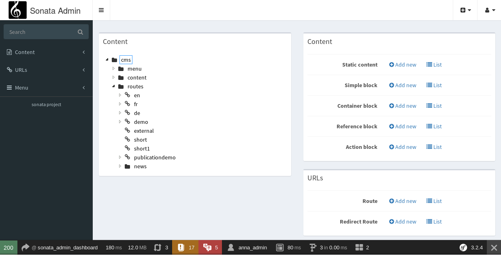

.. index::
    single: The Community; Quick Tour

The Third Party Bundles
=======================

You're still here? You already learned the basics of the Symfony CMF and you
just wanted to learn more and more? Then you can read this chapter! This
chapter will walk you quickly through some other CMF bundles. Most of the
other bundles are based on the shoulders of some giants, like the KnpMenuBundle_
or SonataBlockBundle_.

The MenuBundle
--------------

Let's start with the MenuBundle. If you visit the page, you can see a nice
menu in the sidebar. You can find the layout view in the AcmeMainBundle.
Somewhere in the middle of the document, you find this code:

.. code-block:: html+jinja

    <!-- src/Acme/MainBundle/Resources/views/layout.html.twig -->

    <!-- ... -->
    

        

            

                

                    

                        
                            <h2>Navigation</h2>
                            {{ knp_menu_render('simple') }}
                        
                    

                

                <!-- ... -->
            

        

    

As you can see, the menu is rendered by the ``knp_menu_render`` tag. This
seems a bit a strange, we are talking about the CmfMenuBundle and not the
KnpMenuBundle, aren't we? That's correct, but as a matter of facts the
CmfMenuBundle is just a tiny layer on top of the KnpMenuBundle.

Normally, the argument of ``knp_menu_render()`` is the menu name to render,
but when using the CmfMenuBundle, it's a node id. In this case, the menu
contains all items implementing the ``NodeInterface`` inside the
``/cms/simple`` (since the basepath in the Standard Edition is ``/cms``).

.. note::

    Apart from including a PHPCR menu provider, the CmfMenuBundle also
    provides Admin classes. See the section about `Sonata Admin`_ to learn
    more about this.

The CreateBundle
----------------

You've already seen this bundle in the first chapter. This bundle integrates
the CreatePHP_ library (which uses the `Create.js`_ library) into Symfony2
using the FOSRestBundle_.

.. todo put an example in the SE?

Sonata Admin
------------

We have explained you that the CMF is based on a database, in order to make it
editable by an admin without changing the code. But we haven't told you how
that admin will be able to maintain the website. Now it's time to reveal how
to do that: Using the SonataAdminBundle_. All the CMF bundles that define
editable elements also provide integration to make those elements editable in
Sonata Admin.

By default, all Admin classes in the CMF bundles will be activated when the
SonataDoctrinePHPCRAdminBundle_ is installed. You can switch off the Admin
class in the configuration. For instance, to disable the MenuBundle Admin
classes, you would do:

.. code-block:: yaml

    # app/config/config.yml
    cmf_menu:
        persistence:
            phpcr:
                use_sonata_admin: false

You can also disable/enable all CMF Admin classes by configuring this on the
``cmf_core`` bundle:

.. code-block:: yaml

    # app/config/config.yml
    cmf_core:
        persistence:
            phpcr:
                use_sonata_admin: false

When the Admin classes are activated, the admin can go to ``/admin`` (if you
installed the SonataAdminBundle correctly) and find the well-known admin
dashboard with all they need:

As you can see on the left, the admin uses the
:doc:`TreeBrowserBundle <../bundles/tree_browser/introduction>` to display a
live admin tree, where the admin can click on the nodes to edit, remove or
move them.

Final Thoughts
--------------

You made it! Let's summarize what you've learned in the Quick Tour:

* The Symfony CMF is build for highly customized Content Management Systems;
* The Symfony CMF team creates bundles with a specific CMS feature, which can
  be used both together and standalone;
* The Symfony CMF uses the database in order to make a lot of things editable
  by an Admin, however the configuration is kept in the filesystem to keep
  deployments simple and support version control;
* The PHP Content Repository (PHPCR) is a great database build for CMS
  systems, but you can use any other storage system for the Symfony CMF too;
* Instead of binding controllers to routes, the routes are bound to content
  objects.
* The Symfony CMF took care not to reinvent the wheel. That resulted in a lot
  of bundles integrating commonly known Symfony2 bundles.

I can't tell you more about the architecture and bundles of the Symfony CMF,
but there is much much more to explore. Take a look at
:doc:`the book <../book/index>` and get started with your first project using
the Symfony CMF!

.. _KnpMenuBundle: https://github.com/KnpLabs/KnpMenuBundle
.. _SonataBlockBundle: http://sonata-project.org/bundles/block/master/doc/index.html
.. _CreatePHP: http://demo.createphp.org/
.. _`Create.js`: http://createjs.org/
.. _FOSRestBundle: https://github.com/friendsofsymfony/FOSRestBundle
.. _SonataAdminBundle: http://sonata-project.org/bundles/admin/master/doc/index.html
.. _SonataDoctrinePHPCRAdminBundle: http://sonata-project.org/bundles/doctrine-phpcr-admin/master/doc/index.html
