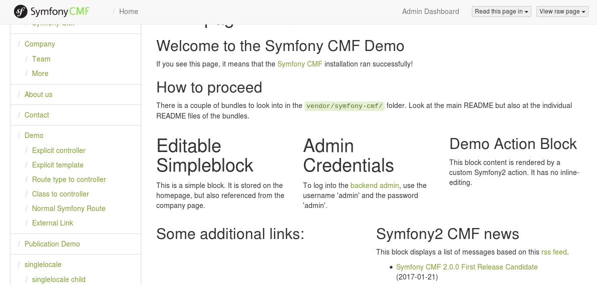

.. index::
    single: The Community; Quick Tour

The Third Party Bundles
=======================

You're still here? You already learned the basics of the Symfony CMF and you
want to learn more and more? Then you can read this chapter! This
chapter will walk you quickly through some other CMF bundles. Most of the
other bundles are integrations of great existing bundles like the KnpMenuBundle_
or SonataAdminBundle_.

The MenuBundle
--------------

Let's start with the MenuBundle. If you visit the page, you can see a nice
menu. You can find the rendering of this menu in the base view:

.. code-block:: html+jinja

    <!-- app/Resources/views/base.html.twig -->

    <!-- ... -->
    

        
Navigation

        {{ knp_menu_render('main', { template: 'includes/main_menu.html.twig' }) }}
    

As you can see, the menu is rendered by the ``knp_menu_render`` function. This
seems a bit a strange, we are talking about the CmfMenuBundle and not the
KnpMenuBundle, aren't we? That's correct, but the CmfMenuBundle is just a tiny
layer on top of the KnpMenuBundle.

Normally, the argument of ``knp_menu_render()`` is the menu name to render, but
when using the CmfMenuBundle, it's a node name. In this case, the menu contains
all items implementing the ``NodeInterface`` inside the ``/cms/menu/main`` path
(since the basepath in the CMF Sandbox is ``/cms/menu``).

Creating a new Menu Entry
~~~~~~~~~~~~~~~~~~~~~~~~~

To add our quick tour page to the menu, we need to add a menu entry.
The menu object references the content, which in turn is referenced
by the route so that the URL can be created::

    // src/AppBundle/DataFixtures/PHPCR/LoadQuickTourData.php
    namespace AppBundle\DataFixtures\PHPCR;

    use Doctrine\Common\Persistence\ObjectManager;
    use Doctrine\Common\DataFixtures\FixtureInterface;
    use Doctrine\Common\DataFixtures\OrderedFixtureInterface;
    use Doctrine\ODM\PHPCR\DocumentManager;
    use PHPCR\Util\NodeHelper;
    use Symfony\Cmf\Bundle\RoutingBundle\Doctrine\Phpcr\Route;

    class LoadQuickTourData implements FixtureInterface, OrderedFixtureInterface
    {
        public function load(ObjectManager $documentManager)
        {
            // static content from model chapter, resulting in $content being defined
            // ...

            $menuMain = $documentManager->find(null, '/cms/menu/main');
            $menu = new MenuNode();
            $menu->setParentDocument($menuMain);
            $menu->setName('quick-tour');
            $menu->setLabel('Quick Tour');
            $menu->setContent($content);

            $documentManager->persist($menu);
            $documentManager->flush();
        }
    }

Re-run the fixtures loading command and then refresh the web site. The
menu entry is added at the bottom of the menu!

The BlockBundle
---------------

If you visit the homepage of the Sandbox, you'll see five blocks:

These blocks can be edited and used on their own. These blocks are provided by
the BlockBundle, which is a tiny layer on top of the SonataBlockBundle_. It
provides the ability to store the blocks using PHPCR and it adds some commonly
used blocks.

The SeoBundle
-------------

There is also a SeoBundle. This bundle is build on top of the
SonataSeoBundle_. It provides a way to extract SEO information from a document
and to make SEO information editable using an admin.

To integrate the SeoBundle into the Sandbox, you need to include it in
your project with ``composer require symfony-cmf/seo-bundle`` and then register
both the CMF and the Sonata bundle in the ``AppKernel``::

    // app/AppKernel.php

    // ...
    public function registerBundles()
    {
        $bundles = [
            // ...
            new Sonata\SeoBundle\SonataSeoBundle(),
            new Symfony\Cmf\Bundle\SeoBundle\CmfSeoBundle(),
        ];
        // ...
    }

Now, you can configure a standard title. This is the title that is used when
the CmfSeoBundle can extract the title from a content object:

.. code-block:: yaml

    # app/config/config.yml
    cmf_seo:
        title: "%%content_title%% | CMF Sandbox"

The ``%%content_title%%`` will be replaced by the title extracted from the
content object. The last thing you need to do is using this title as the title
element. To do this, replace the ``<title>`` tag line in the
``src/AppBundle/Resources/views/layout.html.twig`` template with this:

.. code-block:: html+jinja

    {{ sonata_seo_title() }}

When you visit the new website, you can see nice titles for each page!

Some pages, like the login page, don't use content objects. In these cases,
you can configure a default title:

.. code-block:: yaml

    # app/config/config.yml
    sonata_seo:
        page:
            title: CMF Sandbox

.. caution::

    The *default title* is configured under the ``sonata_seo`` extension, while
    the *standard title* is configured under the ``cmf_seo`` extension.

The title is just one feature of the SeoBundle, it can extract and process a lot
more SEO information.

.. _quick-tour-third-party-sonata:

Sonata Admin
------------

We have explained you that the CMF is based on a database, in order to make it
editable by editor users without changing the code. But we haven't told you yet
how an editor is able to maintain the website. Now it's time to reveal how
to do that: Using the SonataAdminBundle_. The CmfSonataPhpcrAdminIntegrationBundle
provides admin classes for all documents provided by the core CMF bundles.

By default, the Admin classes are all deactivated. Activate them for the bundles
that you need admins for. For instance, to enable the MenuBundle Admin classes,
you would do:

.. code-block:: yaml

    # app/config/config.yml
    cmf_sonata_phpcr_admin_integration:
        bundles:
            menu:
                enabled: true

When the Admin classes are activated, the admin can go to ``/admin`` (if you
installed the SonataAdminBundle correctly) and find the well-known admin
dashboard with all they need:

.. image:: ../_images/quick_tour/3rd-party-bundles-sonata-admin.png

As you can see on the left, the admin uses the
:doc:`TreeBrowserBundle <../bundles/tree_browser/introduction>` to display a
live admin tree, where the admin can click on the nodes to edit, remove or
move them.

See the :doc:`Sonata Admin Integration Documentation <../bundles/sonata_phpcr_admin_integration/introduction>`
to learn about the configuration options for each admin.

Final Thoughts
--------------

You made it! Let's summarize what you've learned in the Quick Tour:

* The Symfony CMF is build for highly customized Content Management Systems;
* The Symfony CMF team creates bundles with a specific CMS feature, which can
  be used both together and standalone;
* The Symfony CMF uses the database in order to make a lot of things editable
  by an Admin, however the configuration is kept in the filesystem to keep
  deployments simple and support version control;
* The PHP Content Repository (PHPCR) is a great database build for CMS
  systems, but you can use any other storage system for the Symfony CMF too;
* Instead of binding controllers to routes, the routes are bound to content
  objects.
* The Symfony CMF took care not to reinvent the wheel. That resulted in a lot
  of bundles integrating commonly known Symfony2 bundles.

I can't tell you more about the architecture and bundles of the Symfony CMF,
but there is much much more to explore. Take a look at
:doc:`the book <../book/index>` and get started with your first project using
the Symfony CMF!

.. _KnpMenuBundle: https://github.com/KnpLabs/KnpMenuBundle
.. _SonataBlockBundle: https://sonata-project.org/bundles/block/master/doc/index.html
.. _SonataSeoBundle: https://sonata-project.org/bundles/seo/master/doc/index.html
.. _CreatePHP: http://demo.createphp.org/
.. _`Create.js`: http://createjs.org/
.. _FOSRestBundle: https://github.com/friendsofsymfony/FOSRestBundle
.. _SonataAdminBundle: https://sonata-project.org/bundles/admin/master/doc/index.html
.. _SonataDoctrinePHPCRAdminBundle: https://sonata-project.org/bundles/doctrine-phpcr-admin/master/doc/index.html
.. _`RDFa Mappings`: https://en.wikipedia.org/wiki/RDFa
