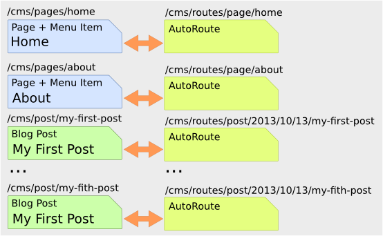

Routing and Automatic Routing
=============================

The routes (URIs) to your content will be automatically created and updated
using the RoutingAutoBundle. This bundle uses a configuration language to
specify automatic creation of routes, which can be a bit hard to grasp the
first time you see it.

For a full explanation refer to the
:doc:`RoutingAutoBundle <../bundles/routing_auto/introduction>`.

In summary, you will configure the auto routing system to create a new auto
routing document in the routing tree for every post or content created. The
new route will be linked back to the target content:

The paths above represent the path in the PHPCR-ODM document tree. In the next
section you will define ``/cms/routes`` as the base path for routes, and subsequently
the contents will be available at the following URIs:

* **Home**: ``http://localhost:8000/page/home``
* **About**: ``http://localhost:8000/page/about``
* etc.

Installation
------------

Ensure that you installed the RoutingAutoBundle package as detailed in the
:ref:`gettingstarted_installadditionbundles` section.

Enable the routing bundles to your kernel::

    class AppKernel extends Kernel
    {
        public function registerBundles()
        {
            $bundles = array(
                // ...
                new Symfony\Cmf\Bundle\RoutingBundle\CmfRoutingBundle(),
                new Symfony\Cmf\Bundle\RoutingAutoBundle\CmfRoutingAutoBundle(),
            );

            // ...
        }
    }

.. note:: 

    The `symfony-cmf/routing-bundle` package is installed automatically as
    `symfony-cmf/routing-auto-bundle` depends on it.

Enable the Dynamic Router
-------------------------

The RoutingAutoBundle uses the CMF `RoutingBundle`_ which enables routes to
be provided from a database (in addition to being provided from
the routing configuration files as in core Symfony 2).

Add the following to your application configuration:

.. configuration-block::

    .. code-block:: yaml

        # /app/config/config.yml
        cmf_routing:
            chain:
                routers_by_id:
                    cmf_routing.dynamic_router: 20
                    router.default: 100
            dynamic:
                enabled: true
                persistence:
                    phpcr:
                        route_basepath: /cms/routes

    .. code-block:: xml

        <!-- app/config/config.xml -->
        <container xmlns="http://symfony.com/schema/dic/services">
            <config xmlns="http://cmf.symfony.com/schema/dic/routing">
                <chain>
                    <router-by-id id="cmf_routing.dynamic_router">20</router-by-id>
                    <router-by-id id="router.default">100</router-by-id>
                </chain>
                <dynamic>
                    <persistence>
                        <phpcr route-basepath="/cms/routes" />
                    </persistence>
                </dynamic>
            </config>
       </container>

    .. code-block:: php

        // app/config/config.php
        $container->loadFromExtension('cmf_routing', array(
            'dynamic' => array(
                'persistence' => array(
                    'phpcr' => array(
                        'enabled' => true,
                        'route_basepath' => '/cms/routes',
                    ),
                ),
            ),
        ));

This will:

#. Cause the default Symfony router to be replaced by the chain router. The
   chain router enables you to have multiple routers in your application. You
   add the dynamic router (which can retrieve routes from the database) and
   the default Symfony router (which retrieves routes from configuration
   files). The number indicates the order of precedence - the router with the
   lowest number will be called first;
#. Configure the **dynamic** router which you have added to the router chain.
   You specify that it should use the PHPCR backend and that the *root* route
   can be found at ``/cms/routes``.

Auto Routing Configuration
--------------------------

First you need to configure the auto routing bundle:

.. configuration-block::

    .. code-block:: yaml

        # app/config/config.yml
        cmf_routing_auto:
            persistence:
                phpcr:
                    enabled: true

    .. code-block:: xml

        <!-- app/config/config.xml -->
        <container xmlns="http://symfony.com/schema/dic/services">
            <config xmlns="http://cmf.symfony.com/schema/dic/routing_auto">
                <persistence>
                    <phpcr />
                </persistence>
            </config>
       </container>

    .. code-block:: php

        // app/config/config.php
        $container->loadFromExtension('cmf_routing_auto', array(
            'persistence' => array(
                'phpcr' => array(
                    'enabled' => true,
                ),
            ),
        ));

The above configures the RoutingAutoBundle to work with PHPCR-ODM.

You can now proceed to mapping your documents, create the following in your
*bundles* configuration directory:

.. configuration-block::

    .. code-block:: yaml

        # src/Acme/BasicCmsBundle/Resources/config/cmf_routing_auto.yml
        Acme\BasicCmsBundle\Document\Page:
            uri_schema: /page/{title}
            token_providers:
                title: [content_method, { method: getTitle }]

        Acme\BasicCmsBundle\Document\Post:
            uri_schema: /post/{date}/{title}
            token_providers:
                date: [content_datetime, { method: getDate }]
                title: [content_method, { method: getTitle }]

    .. code-block:: xml

        <!-- src/Acme/BasicCmsBundle/Resources/config/cmf_routing_auto.xml -->
        <auto-mapping xmlns="http://cmf.symfony.com/schema/routing_auto">
            <mapping class="Acme\BasicCmsBundle\Document\Page"
                uri-schema="/page/{title}">

                <token-provider token="title" name="content_method">
                    <option name="method">getTitle</option>
                </token-provider>
            </mapping>

            <mapping class="Acme\BasicCmsBundle\Document\Post"
                extend="Acme\BasicCmsBundle\Document\Page"
                uri-schema="/post/{date}/{title}">

                <token-provider token="date" name="content_datetime">
                    <option name="method">getDate</option>
                </token-provider>
            </mapping>
        </auto-mapping>

.. note::

    RoutingAutoBundle mapping bundles are registered automatically when they are named
    as above, you may alternatively explicitly declare from where the mappings should be loaded,
    see the :doc:`../bundles/routing_auto/introduction` documentation for more information.

This will configure the routing auto system to automatically create and update
route documents for both the ``Page`` and ``Post`` documents. 

In summary, for each class:

* We defined a ``uri_schema`` which defines the form of the URI which will be
  generated.
  * Within the schema you place ``{tokens}`` - placeholders for values provided by...
* Token providers provide values which will be substituted into the URI. Here
  you use two different providers - ``content_datetime`` and ``content_method``.
  Both will return dynamic values from the subject object itself.

Now reload the fixtures:

.. code-block:: bash

    $ php app/console doctrine:phpcr:fixtures:load

Have a look at what you have:

.. code-block:: bash

    $ php app/console doctrine:phpcr:node:dump
    ROOT:
      cms:
        pages:
          Home:
        routes:
          page:
            home:
          post:
            2013:
              10:
                12:
                  my-first-post:
                  my-second-post:
                  my-third-post:
                  my-forth-post:
        posts:
          My First Post:
          My Second Post:
          My Third Post:
          My Forth Post:

The routes have been automatically created!

.. _`routingautobundle documentation`: http://symfony.com/doc/current/cmf/bundles/routing_auto.html
.. _`SonataDoctrinePhpcrAdminBundle`: https://github.com/sonata-project/SonataDoctrinePhpcrAdminBundle
.. _`routingbundle`: http://symfony.com/doc/master/cmf/bundles/routing/index.html
