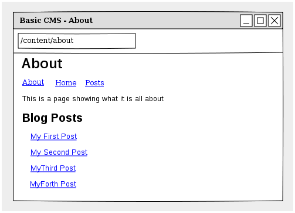

.. index::
    single: Tutorial, Creating a CMS, RoutingAuto, PHPCR-ODM
    single: MenuBundle, SonataAdmin, SonataDoctrineAdminBundle

Creating a Basic CMS using the RoutingAutoBundle
================================================

This series of articles will show you how to create a basic CMS from scratch
using the following bundles:

* :doc:`../bundles/routing_auto/introduction`;
* :doc:`../bundles/phpcr_odm/introduction`;
* :doc:`../bundles/menu/introduction`;
* SonataDoctrinePHPCRAdminBundle_.

It is assumed that you have:

* A working knowledge of the Symfony 2 framework;
* Basic knowledge of PHPCR-ODM.

The CMS will have two types of content:

* **Pages**: HTML content accessed at, for example ``/page/home``, ``/page/about``, etc.
* **Posts**: Blog posts accessed as ``/blog/2012/10/23/my-blog-post``.

The auto routing integration will automatically create and update the routes
(effectively the URLs with which you can access the content) for the page and
post content documents. In addition each page content document will double up
as a menu item.

.. note::

    There exists a bundle called :doc:`../bundles/simple_cms/index` which
    provides a similar solution to the one proposed in this tutorial. It
    combines the route, menu and content into a single document and uses a
    custom router. The approach taken in this tutorial will combine only the menu
    and content into a single document, the routes will be managed
    automatically and the native CMF ``DynamicRouter`` will be used.

.. _SonataDoctrinePHPCRAdminBundle: https://github.com/sonata-project/SonataDoctrinePhpcrAdminBundle
