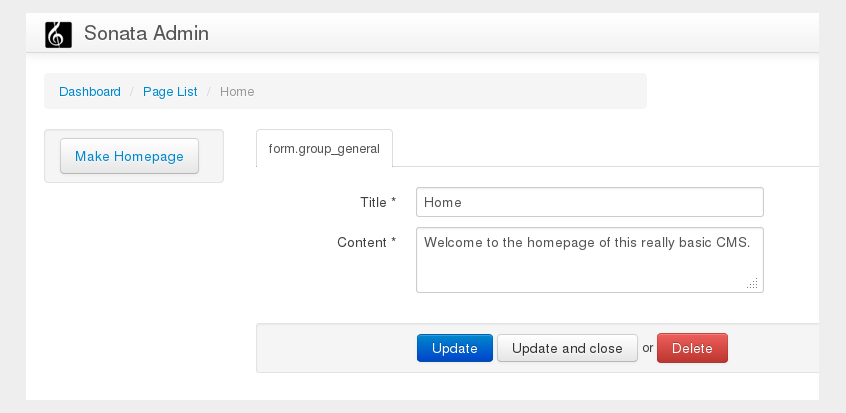

The Site Document and the Homepage
==================================

All of your content should now be available at various URLs but your homepage
(http://localhost:8000) still shows the default Symfony Standard Edition
index page.

In this section you will add a side menu to Sonata Admin which
allows the user to mark a ``Page`` to act as the homepage of your CMS.

.. note::

    This is just one of many strategies for routing the homepage. For example,
    another option would be put a ``RedirectRoute`` document at ``/cms/routes``.

Storing the Data
----------------

You need a document which can store data about your CMS - this will be known
as the site document and it will contain a reference to the ``Page`` document
which will act as the homepage.

Create the site document::

    // src/AppBundle/Document/Site.php
    namespace AppBundle\Document;

    use Doctrine\ODM\PHPCR\Mapping\Annotations as PHPCR;

    /**
     * @PHPCR\Document()
     */
    class Site
    {
        /**
         * @PHPCR\Id()
         */
        protected $id;

        /**
         * @PHPCR\ReferenceOne(targetDocument="AppBundle\Document\Page")
         */
        protected $homepage;

        public function getHomepage()
        {
            return $this->homepage;
        }

        public function setHomepage($homepage)
        {
            $this->homepage = $homepage;
        }

        public function setId($id)
        {
            $this->id = $id;
        }
    }

Initializing the Site Document
------------------------------

Where does the ``Site`` document belong? The document hierarchy currently
looks like this:

.. code-block:: text

    ROOT/
        cms/
           pages/
           routes/
           posts/

There is one ``cms`` node, and this node contains all the children nodes of
our site. This node is therefore the logical position of your ``Site``
document.

Earlier, you used the ``GenericInitializer`` to initialize the base paths of
our project, including the ``cms`` node. The nodes created by the
``GenericInitializer`` have no PHPCR-ODM mapping however.

You can *replace* the ``GenericInitializer`` with a custom initializer which
will create the necessary paths **and** assign a document class to the ``cms``
node::

    // src/AppBundle/Initializer/SiteInitializer.php
    namespace AppBundle\Initializer;

    use Doctrine\Bundle\PHPCRBundle\Initializer\InitializerInterface;
    use PHPCR\Util\NodeHelper;
    use Doctrine\Bundle\PHPCRBundle\ManagerRegistry;
    use AppBundle\Document\Site;

    class SiteInitializer implements InitializerInterface
    {
        private $basePath;

        public function __construct($basePath = '/cms')
        {
            $this->basePath = $basePath;
        }

        public function init(ManagerRegistry $registry)
        {
            $dm = $registry->getManager();
            if ($dm->find(null, $this->basePath)) {
                return;
            }

            $site = new Site();
            $site->setId($this->basePath);
            $dm->persist($site);
            $dm->flush();

            $session = $registry->getConnection();

            // create the 'cms', 'pages', and 'posts' nodes
            NodeHelper::createPath($session, $this->basePath . '/pages');
            NodeHelper::createPath($session, $this->basePath . '/posts');
            NodeHelper::createPath($session, $this->basePath . '/routes');

            $session->save();
        }

        public function getName()
        {
            return 'My site initializer';
        }
    }

.. versionadded:: 1.1
    Since version 1.1, the ``init`` method receives the ``ManagerRegistry``
    rather than the PHPCR ``SessionInterface``. This allows the creation of
    documents in initializers. With 1.0, you would need to manually set the
    ``phpcr:class`` property to the right value.

Now:

1. *Remove* the initializer service that you created in the
   :doc:`getting-started` chapter (``app.phpcr.initializer``).
2. Register your new site initializer:

.. configuration-block::

    .. code-block:: yaml

        # src/AppBundle/Resources/config/services.yml
        services:
            # ...
            app.phpcr.initializer.site:
                class: AppBundle\Initializer\SiteInitializer
                tags:
                    - { name: doctrine_phpcr.initializer, priority: 50 }

    .. code-block:: xml

        <!-- src/AppBundle/Resources/config/services.xml
        <?xml version="1.0" encoding="UTF-8" ?>
        <container xmlns="http://symfony.com/schema/dic/services"
            xmlns:xsi="http://www.w3.org/2001/XMLSchema-instance"
            xmlns:app="http://www.example.com/symfony/schema/"
            xsi:schemaLocation="http://symfony.com/schema/dic/services
                 http://symfony.com/schema/dic/services/services-1.0.xsd">

            <!-- ... -->
            <services>
                <!-- ... -->
                <service id="app.phpcr.initializer.site"
                    class="AppBundle\Initializer\SiteInitializer">
                    <tag name="doctrine_phpcr.initializer" priority="50"/>
                </service>
            </services>

        </container>

    .. code-block:: php

        // src/AppBundle/Resources/config/services.php

        //  ...
        $container
            ->register(
                'app.phpcr.initializer.site',
                'AppBundle\Initializer\SiteInitializer'
            )
            ->addTag('doctrine_phpcr.initializer', array('name' => 'doctrine_phpcr.initializer', 'priority' => 50)
        ;

.. note::

    You may have noticed that you have set the priority of the initializer.
    Initializers with high priorities will be called before initializers with
    lower priorities. Here it is necessary to increase the priority of your
    listener to prevent other initializers creating the `cms` node first.

Now empty your repository, reinitialize it and reload your fixtures:

.. code-block:: bash

    $ php app/console doctrine:phpcr:fixtures:load

and verify that the ``cms`` node has been created correctly, using the
``doctrine:phpcr:node:dump`` command with the ``props`` flag:

.. code-block:: bash

    $ php app/console doctrine:phpcr:node:dump --props
    ROOT:
      cms:
        - jcr:primaryType = nt:unstructured
        - phpcr:class = AppBundle\Document\Site
        ...

.. note::

    Why use an initializer instead of a data fixture? In this instance, the
    site object is a constant for your application. There is only one site
    object, new sites will not be created and the existing site document will
    not be removed. DataFixtures are intended to provide sample data, not
    data which is integral to the functioning of your site.

.. note::

    Instead of *replacing* the ``GenericInitializer`` you could simply add
    another initializer which is run first and create the ``/cms`` document
    with the right class. The drawback then is that there are two places where
    initialization choices take place - do whatever you prefer.

Reconfigure the Admin Tree
--------------------------

If you look at your admin interface now, you will notice that the tree has
gone!

You need to tell the admin tree about the new ``Site`` document which is now
the root of your websites content tree:

.. configuration-block::

    .. code-block:: yaml

        sonata_doctrine_phpcr_admin:
            # ...
            document_tree:
                # ...
                AppBundle\Document\Site:
                    valid_children:
                        - all

    .. code-block:: xml

        <?xml version="1.0" encoding="UTF-8" ?>
        <container xmlns="http://symfony.com/schema/dic/services">

            <config xmlns="http://sonata-project.org/schema/dic/doctrine_phpcr_admin" />

                <!-- ... -->

                <document-tree class="AppBundle\Document\Site">
                    <valid-child>all</valid-child>
                </document-tree>
            </config>
        </container>

    .. code-block:: php

        $container->loadFromExtension('sonata_doctrine_phpcr_admin', array(
            // ...
            'document_tree' => array(
                'AppBundle\Document\Site' => array(
                    'valid_children' => array(
                        'all',
                    ),
                ),
                // ...
        ));

If you check your admin interface you will see that the ``Site`` document is
now being displayed, however it has no children. You need to map the children on the
``Site`` document, modify it as follows::

    // src/AppBundle/Document/Site.php

    // ...

    /**
     * @PHPCR\Document()
     */
    class Site
    {
        /**
         * @PHPCR\Children()
         */
        protected $children;

        // ...

        public function getChildren()
        {
            return $this->children;
        }
    }

The tree should now again show your website structure.

Create the Make Homepage Button
-------------------------------

You will need a way to allow the administrator of your site to select which
page should act as the homepage. You will modify the ``PageAdmin`` class so
that a "Make Homepage" button will appear when editing a page. You will
achieve this by adding a "side menu".

Firstly though you will need to create an action which will do the work of
making a given page the homepage. Add the following to the existing
``DefaultController``::

    // src/AppBundle/Controller/DefaultController.php

    use Sensio\Bundle\FrameworkExtraBundle\Configuration\Route;
    use Sensio\Bundle\FrameworkExtraBundle\Configuration\Method;

    // ...
    class DefaultController extends Controller
    {
        // ...

        /**
         * @Route(
         *   name="make_homepage",
         *   pattern="/admin/make_homepage/{id}",
         *   requirements={"id": ".+"}
         * )
         * @Method({"GET"})
         */
        public function makeHomepageAction($id)
        {
            $dm = $this->get('doctrine_phpcr')->getManager();

            $site = $dm->find(null, '/cms');
            if (!$site) {
                throw $this->createNotFoundException('Could not find /cms document!');
            }

            $page = $dm->find(null, $id);

            $site->setHomepage($page);
            $dm->persist($page);
            $dm->flush();

            return $this->redirect($this->generateUrl('admin_app_page_edit', array(
                'id' => $page->getId()
            )));
        }
    }

.. note::

    You have specified a special requirement for the ``id`` parameter of the
    route, this is because by default routes will not allow forward slashes "/"
    in route parameters and our "id" is a path.

Now modify the ``PageAdmin`` class to add the button in a side-menu::

    // src/AppBundle/Admin/PageAdmin

    // ...
    use Knp\Menu\ItemInterface;
    use Sonata\AdminBundle\Admin\AdminInterface;

    class PageAdmin extends Admin
    {
        // ...
        protected function configureSideMenu(ItemInterface $menu, $action, AdminInterface $childAdmin = null)
        {
            if ('edit' !== $action) {
                return;
            }

            $page = $this->getSubject();

            $menu->addChild('make-homepage', array(
                'label' => 'Make Homepage',
                'attributes' => array('class' => 'btn'),
                'route' => 'make_homepage',
                'routeParameters' => array(
                    'id' => $page->getId(),
                ),
            ));
        }
    }

The two arguments which concern you here are:

* ``$menu``: This will be a root menu item to which you can add new menu items
  (this is the same menu API you worked with earlier);
* ``$action``: Indicates which kind of page is being configured;

If the action is not ``edit`` it returns early and no side-menu is created. Now
that it knows the edit page is requested, it retrieves the *subject* from the admin
class which is the ``Page`` currently being edited, it then adds a menu item to
the menu.

Routing the Homepage
--------------------

Now that you have enabled the administrator to designate a page to be used as
a homepage you need to actually make the CMS use this information to render
the designated page.

This is easily accomplished by modifying the ``indexAction`` action of the
``DefaultController`` to forward requests matching the route pattern ``/`` to
the page action::

    // src/AppBundle/Controller/DefaultController.php

    // ...
    use Sensio\Bundle\FrameworkExtraBundle\Configuration\Route;

    class DefaultController extends Controller
    {
        // ...

        /**
         * Load the site definition and redirect to the default page.
         *
         * @Route("/")
         */
        public function indexAction()
        {
            $dm = $this->get('doctrine_phpcr')->getManager();
            $site = $dm->find('AppBundle\Document\Site', '/cms');
            $homepage = $site->getHomepage();

            if (!$homepage) {
                throw $this->createNotFoundException('No homepage configured');
            }

            return $this->forward('AppBundle:Default:page', array(
                'contentDocument' => $homepage
            ));
        }
    }

.. note::

    In contrast to previous examples you specify a class when calling ``find`` -
    this is because you need to be *sure* that the returned document is of class
    ``Site``.

Now test it out, visit: http://localhost:8000
