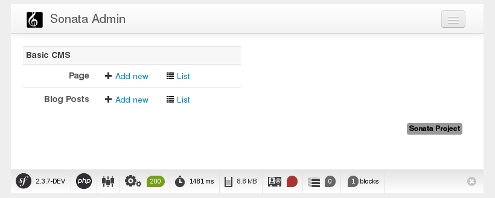

The Backend - Sonata Admin
==========================

In this chapter you will build an administration interface with the help
of the SonataDoctrinePHPCRAdminBundle_.

For the setup, follow the instructions in :doc:`../bundles/sonata_admin_integration/introduction`.

Configuration
-------------

Now start a local webserver:

.. code-block:: bash

    $ php bin/console server:run

That works? Great, now have a look at http://127.0.0.1:8000/admin/dashboard

No translations? Uncomment the translator in the configuration file:

.. configuration-block::

    .. code-block:: yaml

        # app/config/config.yml

        # ...
        framework:
            # ...
            translator:      { fallback: "%locale%" }

    .. code-block:: xml

        <!-- app/config/config.xml -->
        <?xml version="1.0" encoding="UTF-8" ?>
        <container xmlns="http://symfony.com/schema/dic/services"
            xmlns:xsi="http://www.w3.org/2001/XMLSchema-instance"
            xmlns:framework="http://symfony.com/schema/dic/symfony"
            xsi:schemaLocation="http://symfony.com/schema/dic/services http://symfony.com/schema/dic/services/services-1.0.xsd
                                http://symfony.com/schema/dic/symfony http://symfony.com/schema/dic/symfony/symfony-1.0.xsd">

            <config xmlns="http://symfony.com/schema/dic/symfony">
                <!-- ... -->
                <translator fallback="%locale%" />
            </config>
        </container>

    .. code-block:: php

        // app/config/config.php
        $container->loadFromExtension('framework', array(
            // ...
            'translator' => array(
                'fallback' => '%locale%',
            ),
        ));

.. tip::

    See :ref:`book_handling-multilang_sonata-admin` for more information
    on Sonata Admin and multi-language.

When looking at the admin dashboard, you will notice that there is an entry
to administrate Routes. The administration class of the RoutingBundle has
been automatically registered. However, you do not need this in your
application as the routes are managed by the RoutingAutoBundle and not the
administrator. You can disable the RoutingBundle admin:

.. configuration-block::

    .. code-block:: yaml

        # app/config/config.yml
        cmf_routing:
            # ...
            dynamic:
                # ...
                persistence:
                    phpcr:
                        # ...
                        use_sonata_admin: false

    .. code-block:: xml

        <!-- app/config/config.xml -->
        <?xml version="1.0" encoding="UTF-8" ?>
        <container xmlns="http://symfony.com/schema/dic/services">
            <config xmlns="http://cmf.symfony.com/schema/dic/routing">
                <dynamic>
                    <!-- ... -->
                    <persistence>
                        <phpcr use-sonata-admin="false"/>
                    </persistence>
                </dynamic>
            </config>
        </container>

    .. code-block:: php

        // app/config/config.php
        $container->loadFromExtension('cmf_routing', array(
            // ...
            'dynamic' => array(
                'persistence' => array(
                    'phpcr' => array(
                        // ...
                        'use_sonata_admin' => false,
                    ),
                ),
            ),
        ));

.. tip::

    All Sonata Admin aware CMF bundles have such a configuration option and it
    prevents the admin class (or classes) from being registered.

Creating the Admin Classes
--------------------------

Create the following admin classes, first for the ``Page`` document::

    // src/AppBundle/Admin/PageAdmin.php
    namespace AppBundle\Admin;

    use Sonata\DoctrinePHPCRAdminBundle\Admin\Admin;
    use Sonata\AdminBundle\Datagrid\DatagridMapper;
    use Sonata\AdminBundle\Datagrid\ListMapper;
    use Sonata\AdminBundle\Form\FormMapper;

    class PageAdmin extends Admin
    {
        protected function configureListFields(ListMapper $listMapper)
        {
            $listMapper
                ->addIdentifier('title', 'text')
            ;
        }

        protected function configureFormFields(FormMapper $formMapper)
        {
            $formMapper
                ->with('form.group_general')
                    ->add('title', 'text')
                    ->add('content', 'textarea')
                ->end()
            ;
        }

        public function prePersist($document)
        {
            $parent = $this->getModelManager()->find(null, '/cms/pages');
            $document->setParentDocument($parent);
        }

        protected function configureDatagridFilters(DatagridMapper $datagridMapper)
        {
            $datagridMapper->add('title', 'doctrine_phpcr_string');
        }

        public function getExportFormats()
        {
            return array();
        }
    }

and then for the ``Post`` document - as you have already seen this document is
almost identical to the ``Page`` document, so extend the ``PageAdmin`` class
to avoid code duplication::

    // src/AppBundle/Admin/PostAdmin.php
    namespace AppBundle\Admin;

    use Sonata\DoctrinePHPCRAdminBundle\Admin\Admin;
    use Sonata\AdminBundle\Datagrid\DatagridMapper;
    use Sonata\AdminBundle\Datagrid\ListMapper;
    use Sonata\AdminBundle\Form\FormMapper;

    class PostAdmin extends PageAdmin
    {
        protected function configureFormFields(FormMapper $formMapper)
        {
            parent::configureFormFields($formMapper);

            $formMapper
                ->with('form.group_general')
                    ->add('date', 'date')
                ->end()
            ;
        }
    }

.. note::

    In the ``prePersist`` method of the ``PageAdmin`` you hard-code the
    parent path. You may want to modify this behavior to enable pages
    to be structured (for example to have nested menus).

Now you just need to register these classes in the dependency injection
container configuration:

.. configuration-block::

    .. code-block:: yaml

            # src/AppBundle/Resources/config/services.yml
            services:
                app.admin.page:
                    class: AppBundle\Admin\PageAdmin
                    arguments:
                        - ''
                        - AppBundle\Document\Page
                        - 'SonataAdminBundle:CRUD'
                    tags:
                        - { name: sonata.admin, manager_type: doctrine_phpcr, group: 'Basic CMS', label: Page }
                    calls:
                        - [setRouteBuilder, ['@sonata.admin.route.path_info_slashes']]
                app.admin.post:
                    class: AppBundle\Admin\PostAdmin
                    arguments:
                        - ''
                        - AppBundle\Document\Post
                        - 'SonataAdminBundle:CRUD'
                    tags:
                        - { name: sonata.admin, manager_type: doctrine_phpcr, group: 'Basic CMS', label: 'Blog Posts' }
                    calls:
                        - [setRouteBuilder, ['@sonata.admin.route.path_info_slashes']]

    .. code-block:: xml

        <!-- src/AppBundle/Resources/config/services.yml -->
        <?xml version="1.0" encoding="UTF-8" ?>
        <container xmlns="http://symfony.com/schema/dic/services"
            xmlns:xsi="http://www.w3.org/2001/XMLSchema-instance"
            xsi:schemaLocation="http://symfony.com/schema/dic/services
                http://symfony.com/schema/dic/services/services-1.0.xsd">

            <!-- ... -->
            <services>
                <!-- ... -->
                <service id="aüü.admin.page"
                    class="AppBundle\Admin\PageAdmin">

                    <call method="setRouteBuilder">
                        <argument type="service" id="sonata.admin.route.path_info_slashes" />
                    </call>

                    <tag
                        name="sonata.admin"
                        manager_type="doctrine_phpcr"
                        group="Basic CMS"
                        label="Page"
                    />
                    <argument/>
                    <argument>AppBundle\Document\Page</argument>
                    <argument>SonataAdminBundle:CRUD</argument>
                </service>

                <service id="app.admin.post"
                    class="AppBundle\Admin\PostAdmin">

                    <call method="setRouteBuilder">
                        <argument type="service" id="sonata.admin.route.path_info_slashes" />
                    </call>

                    <tag
                        name="sonata.admin"
                        manager_type="doctrine_phpcr"
                        group="Basic CMS"
                        label="Blog Posts"
                    />
                    <argument/>
                    <argument>AppBundle\Document\Post</argument>
                    <argument>SonataAdminBundle:CRUD</argument>
                </service>
            </services>
        </container>

    .. code-block:: php

            // src/AppBundle/Resources/config/services.php
            use Symfony\Component\DependencyInjection\Reference;
            // ...

            $container->register('app.admin.page', 'AppBundle\Admin\PageAdmin')
              ->addArgument('')
              ->addArgument('AppBundle\Document\Page')
              ->addArgument('SonataAdminBundle:CRUD')
              ->addTag('sonata.admin', array(
                  'manager_type' => 'doctrine_phpcr',
                  'group' => 'Basic CMS',
                  'label' => 'Page'
              )
              ->addMethodCall('setRouteBuilder', array(
                  new Reference('sonata.admin.route.path_info_slashes'),
              ))
            ;
            $container->register('app.admin.post', 'AppBundle\Admin\PostAdmin')
              ->addArgument('')
              ->addArgument('AppBundle\Document\Post')
              ->addArgument('SonataAdminBundle:CRUD')
              ->addTag('sonata.admin', array(
                   'manager_type' => 'doctrine_phpcr',
                   'group' => 'Basic CMS',
                   'label' => 'Blog Posts'
              )
              ->addMethodCall('setRouteBuilder', array(
                  new Reference('sonata.admin.route.path_info_slashes'),
              ))
            ;

.. note::

    In the XML version of the above configuration you specify ``manager_type``
    (with an underscore). This should be ``manager-type`` (with a hyphen) and
    is fixed in Symfony version 2.4.

Check it out at http://localhost:8000/admin/dashboard

Configure the Admin Tree on the Dashboard
-----------------------------------------

Sonata admin provides a useful tree view of your whole content. You can
click items on the tree to edit them, right-click to delete them or add
children and drag and drop to reorganize your content.

Enable the CmfTreeBundle and the FOSJsRoutingBundle in your kernel::

    // app/AppKernel.php
    class AppKernel extends Kernel
    {
        // ...

        public function registerBundles()
        {
            $bundles = array(
                // ...
                new FOS\JsRoutingBundle\FOSJsRoutingBundle(),
                new Symfony\Cmf\Bundle\TreeBrowserBundle\CmfTreeBrowserBundle(),
            );

            // ...
        }
    }

Now publish your assets again:

.. code-block:: bash

    $ php bin/console assets:install --symlink web/

Routes used by the tree in the frontend are handled by the FOSJsRoutingBundle.
The relevant routes are tagged with the ``expose`` flag, they are available
automatically. However, you need to load the routes of the TreeBundle
and the FOSJsRoutingBundle:

.. configuration-block::

    .. code-block:: yaml

        # app/config/routing.yml
        cmf_tree:
            resource: .
            type: 'cmf_tree'

        fos_js_routing:
            resource: "@FOSJsRoutingBundle/Resources/config/routing/routing.xml"

    .. code-block:: xml

        <!-- app/config/routing.xml -->
        <?xml version="1.0" encoding="UTF-8" ?>
        <routes xmlns="http://symfony.com/schema/routing"
            xmlns:xsi="http://www.w3.org/2001/XMLSchema-instance"
            xsi:schemaLocation="http://symfony.com/schema/routing
                http://symfony.com/schema/routing/routing-1.0.xsd">

            <import resource="." type="cmf_tree" />

            <import resource="@FOSJsRoutingBundle/Resources/config/routing/routing.xml" />

        </routes>

    .. code-block:: php

        // app/config/routing.php
        use Symfony\Component\Routing\RouteCollection;

        $collection = new RouteCollection();

        $collection->addCollection($loader->import('.', 'cmf_tree'));

        $collection->addCollection($loader->import(
            "@FOSJsRoutingBundle/Resources/config/routing/routing.xml"
        ));

        return $collection;

Add the tree block to the ``sonata_block`` configuration and tell sonata
admin to display the block (be careful to *add* to the existing configuration and
not to create another section!):

.. configuration-block::

    .. code-block:: yaml

        # app/config/config.yml

        # ...
        sonata_block:
            blocks:
                # ...
                sonata_admin_doctrine_phpcr.tree_block:
                    settings:
                        id: '/cms'
                    contexts: [admin]

        sonata_admin:
            dashboard:
                blocks:
                    - { position: left, type: sonata_admin_doctrine_phpcr.tree_block }
                    - { position: right, type: sonata.admin.block.admin_list }

    .. code-block:: xml

        <!-- app/config/config.xml -->
        <?xml version="1.0" encoding="UTF-8" ?>
        <container xmlns="htp://symfony.com/schema/dic/services">

            <config xmlns="http://sonata-project.org/schema/dic/block">
                <! ... -->
                <block id="sonata_admin_doctrine_phpcr.tree_block">
                    <setting id="id">/cms</setting>
                    <context>admin</context>
                </block>
            </config>

            <config xmlns="http://sonata-project.org/schema/dic/admin">
                <dashboard>
                    <block position="left" type="sonata_admin_doctrine_phpcr.tree_block"/>
                    <block position="right" type="sonata.admin.block.admin_list"/>
                </dashboard>
            </config>

        </container>

    .. code-block:: php

        // app/config/config.php
        $container->loadFromExtension('sonata_block', array(
            'blocks' => array(
                // ...
                'sonata_admin_doctrine_phpcr.tree_block' => array(
                    'settings' => array(
                        'id' => '/cms',
                    ),
                    'contexts' => array('admin'),
                ),
            ),
        ));

        $container->loadFromExtension('sonata_admin', array(
            'dashboard' => array(
                'blocks' => array(
                    array('position' => 'left', 'type' => 'sonata_admin_doctrine_phpcr.tree_block'),
                    array('position' => 'right', 'type' => 'sonata.admin.block.admin_list'),
                ),
            ),
        ));

To see your documents on the tree in the admin dashboard tree, you need
to tell sonata about them:

.. configuration-block::

    .. code-block:: yaml

        sonata_doctrine_phpcr_admin:
            document_tree_defaults: [locale]
            document_tree:
                Doctrine\ODM\PHPCR\Document\Generic:
                    valid_children:
                        - all
                AppBundle\Document\Page:
                    valid_children:
                        - AppBundle\Document\Post
                AppBundle\Document\Post:
                    valid_children: []
                # ...

    .. code-block:: xml

        <?xml version="1.0" encoding="UTF-8" ?>
        <container xmlns="http://symfony.com/schema/dic/services">

            <config xmlns="http://sonata-project.org/schema/dic/doctrine_phpcr_admin" />

                <document-tree-default>locale</document-tree-default>

                <document-tree class="Doctrine\ODM\PHPCR\Document\Generic">
                    <valid-child>all</valid-child>
                </document-tree>

                <document-tree class="AppBundle\Document\Post">
                    <valid-child>AppBundle\Document\Post</valid-child>
                </document-tree>

                <document-tree class="AppBundle\Document\Post" />

                <!-- ... -->
            </config>
        </container>

    .. code-block:: php

        $container->loadFromExtension('sonata_doctrine_phpcr_admin', array(
            'document_tree_defaults' => array('locale'),
            'document_tree' => array(
                'Doctrine\ODM\PHPCR\Document\Generic' => array(
                    'valid_children' => array(
                        'all',
                    ),
                ),
                'AppBundle\Document\Post' => array(
                    'valid_children' => array(
                        'AppBundle\Document\Post',
                    ),
                ),
                'AppBundle\Document\Post' => array(
                    'valid_children' => array(),
                ),
                // ...
        ));

.. tip::

    To have a document show up in the tree, it needs its own entry. You
    can allow all document types underneath it by having the ``all`` child.
    But if you explicitly list allowed children, the right click context
    menu will propose only those documents. This makes it easier for your
    users to not make mistakes.

.. _SonataDoctrinePHPCRAdminBundle: https://sonata-project.org/bundles/doctrine-phpcr-admin/master/doc/index.html
