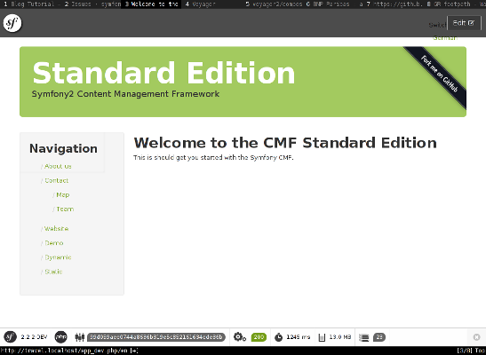
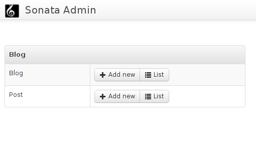
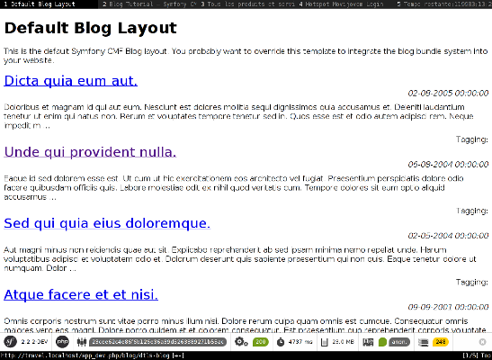

Blog Tutorial
=============

This tutorial will show you how to create a simple blog application in the Symfony CMF
using the ``BlogBundle``.

Getting Started
---------------

Setting up the Project
~~~~~~~~~~~~~~~~~~~~~~

First of all you need to create a new project. The easiest way to do this is
to use composer as follows:

.. code-block:: bash

    $ php composer create-project --stability dev symfony-cmf/standard-edition /path/to/project

Replace ``path/to/project`` with the directory where you want your blog
application to live.

Now add the blog bundle and the sensio generator bundle to
``composer.json``, this can be achieved most easily using the ``require``
command:

.. code-block:: bash

    $ php composer.phar require sensio/generator-bundle "2.2.*" symfony-cmf/blog-bundle "dev-auto_route"

This command will add the specified packages to ``composer.json`` and install
them. If you make a mistake you can edit the ``composer.json`` file manually and
perform a ``composer update package/name``.

.. note::
    
    Why require the sensio generator bundle? It takes care of generating things
    like Bundles, it will come in useful later on.

Next add the blog and generator bundles to ``app/AppKernel.php``::

    <?php
    class AppKernel
    {
        // ...
        $bundles = array(
            // ...
            new Symfony\Cmf\Bundle\BlogBundle\SymfonyCmfBlogBundle(),
            new Sensio\Bundle\GeneratorBundle\SensioGeneratorBundle(),
            // ...
    }

Now try invoking the symfony command line console to ensure that
things work:

.. code-block:: bash

    $ ./app/console
    Symfony version 2.2.2-DEV - app/dev/debug
    [...]

and setup a virtual host in apache.

First edit your hosts file:

.. code-block:: bash

    $ sudo nano /etc/hosts

Add:

.. code-block:: bash

    127.0.0.1       myblog.localhost

And now setup a virtual host in apache::

    <VirtualHost 127.0.0.1:80>
        DocumentRoot /path/to/project/web
        ServerName myblog.localhost
        ServerAlias myblog.localhost
    </VirtualHost>

Now open http://myblog.localhost/app_dev.php in your browser and
you should see the something like the following:

Create the Application Bundle
~~~~~~~~~~~~~~~~~~~~~~~~~~~~~

The main bundle is where all your application specific code will go, 
create it using the sensio generator bundle as follows:

.. code-block:: bash

    $ ./app/console generate:bundle --namespace=DTL\\BlogBundle --dir=src --format=annotation --no-interaction

This will create a new bundle called ``BlogBundle`` in ``src/DTL``, using
annotations as the configuration format. Replace ``DTL`` with your vendor
name, this could be your companies name or your github username, or whatever
you like.

.. note::

    Try running this command without any arguments to create the bundle interactively.

Creating Fixtures
-----------------

Fixtures make developing an application easier. Here you will create the
fixtures using the doctrine fixtures and, optionally, the excellent faker
library which can generate test data for you.

The doctrine fixtures bundle is included in the standard distribution, meaning
that you already have it. The faker library can be installed as follows:

.. code-block:: bash

    $ composer require fzaninotto/faker "dev-master"

.. note::

    The faker library is nice but optional. You can ommit this step and create the
    fixtures manually.

Now create the directory ``src/DTL/BlogBundle/DataFixtures/PHPCR`` and create
the file ``LoadBlogData.php`` inside of it::

    <?php
    namespace DTL\BlogBundle\DataFixtures\PHPCR;

    use Doctrine\Common\Persistence\ObjectManager;
    use Doctrine\Common\DataFixtures\FixtureInterface;
    use Doctrine\Common\DataFixtures\OrderedFixtureInterface;
    use Symfony\Cmf\Bundle\BlogBundle\Document\Blog;
    use Symfony\Cmf\Bundle\BlogBundle\Document\Post;
    use Symfony\Component\DependencyInjection\ContainerAware;
    use PHPCR\Util\NodeHelper;

    class LoadBlogData extends ContainerAware implements FixtureInterface, OrderedFixtureInterface
    {
        public function getOrder()
        {
            return 10;
        }

        public function load(ObjectManager $dm)
        {
            $session = $dm->getPhpcrSession();

            // The /cms/content path is where our blogs will go.
            // this line will create the path if it doesn't
            // already exist.
            NodeHelper::createPath($session, '/cms/content');

            $root = $dm->find(null, $basepath);

            $this->faker = \Faker\Factory::create();

            $blog = new Blog;
            $blog->setName('DTLs Blog');
            $blog->setParent($root);
            $dm->persist($blog);

            // Create 20 posts ...
            for ($i = 1; $i <= 20; $i++) {
                $p = new Post;
                $p->setTitle($this->faker->text(30));
                $p->setDate(new \DateTime($this->faker->date));
                $p->setBody($this->faker->text(500));
                $p->setBlog($blog);
                $dm->persist($p);
            }

            $dm->flush();
        }
    }

Now load the fixtures:

.. code-block:: bash

    $ php app/console doctrine:phpcr:load:fixtures

Oh dear that didn't seem to work!

.. code-block:: bash

   [PHPCR\RepositoryException]                                                                        
   SQLSTATE[HY000]: General error: 1 no such table: phpcr_workspaces 

You will need to initialize the database:

.. code-block:: bash

    $ php app/console doctrine:phpcr:init:dbal
    $ php app/console doctrine:phpcr:register-system-node-types

The standard edition is pre-configured to work out-of-the-box with an sqlite
database which can be found in ``app/app.sqlite``.

Have a look inside the database with the ``sqlite3`` command line tool:

.. code-block:: bash

    $ sqlite3 app/app.sqlite
    > .tables
    > .exit

OK. Now you can load the fixtures

.. code-block:: bash

    $ php app/console doctrine:phpcr:load:fixtures

And inspect the contents of the database with a JCR-SQL2 query.

.. code-block:: bash

    $ php app/console doctrine:phpcr:query "SELECT * FROM nt:unstructured WHERE phpcr:class=\"Symfony\Cmf\Bundle\BlogBundle\Document\Post\""
    Executing, language: JCR-SQL2
    Results:

    1. Row (Path: /cms/content/DTLs Blog/earum-quis-dolores-iste-quia, Score: 0):
           jcr:createdBy: NULL
           jcr:created: NULL
           jcr:primaryType: 'nt:unstructured'

    2. Row (Path: /cms/content/DTLs Blog/et-nulla-sit-molestiae-ipsum, Score: 0):
           jcr:createdBy: NULL
           jcr:created: NULL
           jcr:primaryType: 'nt:unstructured'

    [...]

Now you have some fixtures, the next step could be to create an admin
interface.

The Admin Interface
-------------------

Here you will use the sonata admin bundle to create an administration
interface for the blog. The Sonata project provides an implementation
specifically for PHPCR-ODM, you can install it as follows:

.. code-block:: bash

    $ composer require sonata-project/doctrine-phpcr-admin-bundle "1.0.*"

You also need to enable the ``SecurityBundle`` which is disabled by default in the
standard distribution, but which is part of the symfony package - so you
already have it.

Add these bundles to ``AppKernel``::

    <?php
    class AppKernel
    {
        // ...
        $bundles = array(
            // ...
            new Symfony\Bundle\SecurityBundle\SecurityBundle(),
            new Sonata\AdminBundle\SonataAdminBundle(),
            // ...
        );
    }

And publish the assets so that all the admin CSS and images are available:

.. code-block:: bash

    $ php app/console assets:install --symlink web

.. note::

    We use ``--symlink`` here because otherwise the assets are *copied* to the
    web directory.  This is fine if you don't want to modify them, but makes
    things difficult if you do.  Windows users do not have this option.

Now add the admin routes to ``app/config/routing.yml``:

.. code-block:: yaml

    admin:
        resource: "@SonataAdminBundle/Resources/config/routing/sonata_admin.xml"
        prefix: /admin

    sonata_admin:
        resource: .
        type: sonata_admin
        prefix: /admin

You will be able to access the admin dashboard at
http://myblog.localhost/app_dev.php/admin/dashboard but wait! it doesn't work!

If you access this URL now you will get an
:class:`Symfony\Component\Config\Definition\Exception\InvalidConfigurationException`
which will say ``"The child node "default_contexts" at path "sonata_block"
must be configured"``.

You can add that configuration as follows:

.. code-block:: yaml

    sonata_block:
        default_contexts: [cms]
        blocks:
            sonata.admin.block.admin_list:
                contexts:   [admin]

And you also need to add some minimal security configuration to trigger the
loading of the security twig extensions, otherwise you will receive the
following error::

    The function "is_granted" does not exist

So create the file ``app/config/security.yml`` with the following contents:

.. code-block:: yaml

    security:
        encoders:
            Symfony\Component\Security\Core\User\User: plaintext

        role_hierarchy:
            ROLE_ADMIN:       ROLE_USER
            ROLE_SUPER_ADMIN: [ROLE_USER, ROLE_ADMIN, ROLE_ALLOWED_TO_SWITCH]

        providers:
            in_memory:
                memory:
                    users:
                        user:  { password: userpass, roles: [ 'ROLE_USER' ] }
                        admin: { password: adminpass, roles: [ 'ROLE_ADMIN' ] }

        firewalls:
            dev:
                pattern:  ^/(_(profiler|wdt)|css|images|js)/
                security: false

            main:
                pattern: ^/
                anonymous: ~
                http_basic:
                    realm: "Secured Demo Area"

And *import* it into the main ``config.yml`` file:

.. code-block:: yaml

    imports:
        [...]
        - { resource: security.yml }

Now you should be able to access the dashboard, but wait, what are the
"Content" and "Routing" boxes doing there? These are not needed for the blog.
You can remove them by adding the following to ``app/config/config.yml``

.. code-block:: yaml

    sonata_admin:
        dashboard:
            blocks:
                - 
                    position: left
                    title: "Blog Administration"
                    type: sonata.admin.block.admin_list
                    settings: 
                        groups: ['dashboard.group_blog']

        groups:
            dashboard.group_blog:
                label: Blogs

This needs some explaining. The default configuration has one block of
type ``sonata.admin.block.admin_list`` which lists *all* admin blocks,
including those in the CMF's ``ContentBundle`` and ``RoutingExtraBundle``. 
You have specified the same block but instructed it to only show the
``dashboard.group_blog`` group of the ``BlogBundle``.

You have also specified the label for this group to be "Blogs".

Now you should see something like this:

The Front End
-------------

Here you will create the frontend containing a home page with the latest
blog post, a page listing all the blog posts and the page which will display
a given blog post.

Auto Routing
~~~~~~~~~~~~

The ``BlogBundle`` has default controllers for the blog index and for
displaying a blog post, but at the moment your application doesn't know how to
route the request to these controllers. We will need to create routes and the
blog bundle is intended to work with the one-route-per-content routing model.

In the one-route-per-content model one ``Route`` document (as provided by
``SymfonyCmfRoutingExtraBundle`` should be created for each document (i.e.
each blog, each post).

This process can be automated using the automatic routing system. A default
configuration is provided in the ``BlogBundle``, import it into
``config.yml``:

.. code-block:: yaml

    imports:
        [...]
        - { resource: @SymfonyCmfBlogBundle/Resources/config/routing/autoroute_default.yml }

Have a look at this file::

    vendor/symfony-cmf/blog-bundle/Symfony/Cmf/Bundle/BlogBundle/Resources/config/routing/autoroute_default.yml``
    
Don't worry too much about what it does, but notice that for each document,
``Blog`` and ``Post``, we define a set of rules which are used to
automatically create routes when new documents are created. You can use this
file as a base for your own auto routing schemas.

As these routes are created only when we create or update documents you will
need to reload the fixtures again:

.. code-block:: bash

    $ php app/console doctrine:phpcr:fixtures:load

But that won't work::

    [Symfony\Cmf\Bundle\RoutingAutoBundle\AutoRoute\Exception\CouldNotFindRouteException]  
    Could not find route component at path "/cms/routes".                                  

The default auto route schema specifies that blog routes should be placed
in ``/cms/routes`` and that if this path doesn't exist that an exception
should be thrown.

For now lets just create this path in the fixtures, add the following to your
fixtures file::

    <?php
    // src/DTL/BlogBundle/DataFixtures/PHPCR/LoadBlogData

    // add this after createPath($session, '/cms/content');
    NodeHelper::createPath($session, '/cms/routes');

.. note::

    This problem is currently being delt with in two ways -- @dbu's phpcr:init
    functionality, and maybe the auto routing basepath provider - which would
    pick up the base path from routing extra.

Now load the fixtures again:

.. code-block:: bash

    $ php app/console doctrine:phpcr:fixtures:load

And inspect the contents of the PHPCR tree using the ``dump`` command::

    $ php app/console doctrine:phpcr:dump
    ROOT:
      cms:
        simple:
          [...]
        content:
          [...]
        routes:  
            blog:
              dtls-blog:
                1976-05-06:
                  hic-qui-voluptas-nulla:
                1981-04-30:
                  quis-eos-illo-error:
                2001-08-15:
                  corporis-eius-est-voluptatem:
                1984-09-24:
                  a-dolorum-porro-tempore-et:
                2000-04-12:
                  et-est-suscipit-qui-aut:
                2004-05-02:
                  sed-qui-quia-eius-doloremque:
                1995-02-01:
                  rerum-et-ipsa-est-quia:
                1993-03-18:
                  est-ut-maxime-quae-est:
                [...]

Note that you will use the node ``/cms/routes`` as the root of all the dynamic
URL's in the system, i.e. the first blog posts URL will be::

    http://myblog.localhost/blog/dtls-blog/1976-05-06/hic-qui-voluptas-nulla

But it will not work yet, we need to configure ``RoutingExtraBundle``.

Configuring Routing Extra
~~~~~~~~~~~~~~~~~~~~~~~~~

First we need to tell the routing system to include the *dynamic* router in the
router chain. Otherwise it will only use the default symfony router and none of 
the dynamic routes will be found.

.. code-block:: yaml

    symfony_cmf_routing_extra:
        chain:
            routers_by_id:
                symfony_cmf_routing_extra.dynamic_router: 200
                router.default: 100

Note that we include both the dynamic router and the default symfony router in
the router chain and that the dynamic router has a *higher priority* meaning
that it will be the first to deal with incoming routing requests.

Next you need to tell the ``RoutingExtraBundle`` where the defaut route
repository can find the routes. By default this is set to ``/cms``, you need
to change it to reflect the route location of your application. As you have
already seen the blog bundle expects the routes to go in ``/cms/routes``. So
change the default root path in config.yml as follows:

.. code-block:: yaml

    symfony_cmf_routing_extra:
        chain:
            # ...
        dynamic:
            enabled: true
            routing_repositoryroot: /cms/routes

Now try and access the URL of your blog::

    http://myblog.localhost/app_dev.php/blog/dtls-blog

You should see an exception message::

    Unable to find the controller for path "/blog/dtls-blog". Maybe you forgot to
    add the matching route in your routing configuration?

The system has found the route, but it doesn't know which controller to
forward the request to. The ``RoutingExtraBundle`` allows you to specify
controllers by content class. So, for example, all ``Routes`` which reference
a ``Blog`` should forward requests to the blog controller.

Here you will configure ``Blog`` and ``Post`` routes to forward requests to
the default ``BlogBundle`` controllers:

.. code-block:: yaml

    symfony_cmf_routing_extra:
        chain:
            # ...
        dynamic:
            enabled: true
            routing_repositoryroot: /cms/routes
            controllers_by_class:
                Symfony\Cmf\Bundle\BlogBundle\Document\Blog: symfony_cmf_blog.blog_controller:listAction
                Symfony\Cmf\Bundle\BlogBundle\Document\Post: symfony_cmf_blog.blog_controller:viewPostAction

.. note::

    This is just one way to do this, we can also put the ``_controller``
    parameter in the route documents defaults or we can store a "key" in the
    route which can be mapped to a controller. See the routing extra and
    routing auto documentation for more information.

You should see something like the following:

